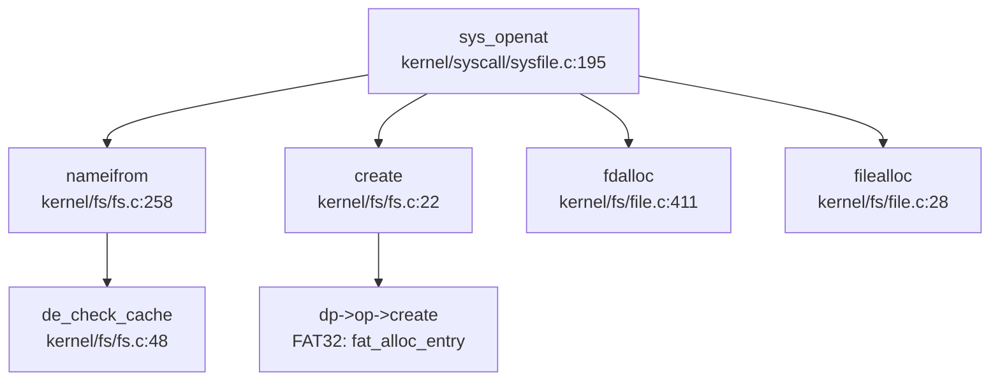

## 第 6 章：文件系统（VFS + 具体 FS）

xv6-k210 实现了经典的类 Unix 虚拟文件系统（VFS）架构，采用**四层抽象模型**（Superblock → Inode → Dentry → File），支持自研 FAT32 文件系统、伪文件系统（devfs/procfs）、管道（pipe）和内存映射（mmap）。本章将深入分析其 VFS 抽象层设计、具体文件系统实现、文件描述符管理机制及高级特性支持状态。

---

### VFS 架构与接口设计

#### 核心数据结构

xv6-k210 的 VFS 抽象定义在 `include/fs/fs.h` 中，采用**操作集（operation struct）**模式实现多态，这是 C 语言实现面向对象设计的经典范式。

**超级块（Superblock）**（`include/fs/fs.h:55-75`）：
```c
struct superblock {
    uint                blocksz;
    uint                devnum;
    struct inode        *dev;
    char                type[16];

struct superblock   *next;
    int                 ref;        // sum of refs of all its inodes

struct sleeplock    sb_lock;
    struct fs_op        op;         // 文件系统操作集

struct spinlock     cache_lock;
    struct dentry       *root;      // 根目录 dentry
};
```

**Inode**（`include/fs/fs.h:105-125`）：
```c
struct inode {
    uint64              inum;       //  inode 编号
    int                 ref;
    int                 state;
    uint16              mode;       // 文件类型与权限
    int16               dev;
    int                 size;
    int                 nlink;      // 链接数（FAT 中无用）
    struct superblock   *sb;

struct sleeplock    lock;       // I/O 控制锁
    struct inode_op     *op;        // inode 操作集
    struct file_op      *fop;       // 文件操作集
    struct spinlock     ilock;      // 保护自身
    struct rb_root      mapping;    // 内存映射树（用于 mmap）

struct dentry       *entry;     // 关联的 dentry
};
```

**Dentry**（`include/fs/fs.h:128-138`）：
```c
struct dentry {
    char                filename[MAXNAME + 1];
    struct inode        *inode;
    struct dentry       *parent;
    struct dentry       *next;
    struct dentry       *child;
    struct dentry_op    *op;
    struct superblock   *mount;     // mount 在该目录上的文件系统
};
```

#### 四层操作集（Operation Interfaces）

VFS 定义了四套操作集，分别对应不同抽象层的多态方法（`include/fs/fs.h:45-80`）：

```c
// 文件系统层操作集
struct fs_op {
    struct inode *(*alloc_inode)(struct superblock *sb);
    void (*destroy_inode)(struct inode *ip);
    int (*write)(struct superblock *sb, int usr, char *src, uint64 blockno, uint64 off, uint64 len);
    int (*read)(struct superblock *sb, int usr, char *dst, uint64 blockno, uint64 off, uint64 len);
    int (*clear)(struct superblock *sb, uint64 blockno, uint64 blockcnt);
    int (*statfs)(struct superblock *sb, struct statfs *stat);
    void (*sync)(struct superblock *sb);
};

// Inode 层操作集
struct inode_op {
    struct inode *(*create)(struct inode *ip, char *name, int mode);
    struct inode *(*lookup)(struct inode *dir, char *filename, uint *poff);
    int (*truncate)(struct inode *ip);
    int (*unlink)(struct inode *ip);
    int (*update)(struct inode *ip);
    int (*getattr)(struct inode *ip, struct kstat *st);
    int (*setattr)(struct inode *ip, struct kstat *st);
    int (*rename)(struct inode *ip, struct inode *dp, char *newname);
};

// Dentry 层操作集
struct dentry_op {
    int (*delete)(struct dentry *de);
    struct dentry *(*cache)(struct dentry *parent, char *childname);
};

// 文件层操作集
struct file_op {
    int (*read)(struct inode *ip, int usr, uint64 dst, uint off, uint n);
    int (*write)(struct inode *ip, int usr, uint64 src, uint off, uint n);
    int (*readdir)(struct inode *ip, struct dirent *dent, uint off);
    int (*readv)(struct inode *ip, struct iovec *iovecs, int count, uint off);
    int (*writev)(struct inode *ip, struct iovec *iovecs, int count, uint off);
};
```

---

### 具体文件系统支持情况（FAT32/Ext4/RamFS）

#### FAT32 自研实现 ✅ 已实现

xv6-k210 **自研实现了 FAT32 文件系统**，代码位于 `kernel/fs/fat32/` 目录，纯 C 实现，无外部 crate 依赖。

**FAT32 操作集实现**（`kernel/fs/fat32/fat32.c:23-40`）：
```c
// FAT32 inode operation collection
struct inode_op fat32_inode_op = {
    .create = fat_alloc_entry,
    .lookup = fat_lookup_dir,
    .truncate = fat_truncate_file,
    .unlink = fat_remove_entry,
    .update = fat_update_entry,
    .getattr = fat_stat_file,
    .setattr = fat_set_file_attr,
    .rename = fat_rename_entry,
};

struct file_op fat32_file_op = {
    .read = fat_read_file,
    .write = fat_write_file,
    .readdir = fat_read_dir,
    .readv = fat_read_file_vec,
    .writev = fat_write_file_vec,
};
```

**FAT32 初始化流程**（`kernel/fs/fat32/fat32.c:46-75`）：
- 读取 BPB（BIOS Parameter Block）参数
- 验证 FAT32 签名（偏移 82 字节处的"FAT32"字符串）
- 计算数据区起始扇区 `first_data_sec`
- 初始化根目录 inode

**关键设计特点**：
1. **Inode 封装**：FAT32 的 `struct fat32_entry` 内嵌 `struct inode vfs_inode`，通过容器宏实现反向查找
2. **簇链管理**：通过 `reloc_clus()` 函数实现簇号到扇区的转换
3. **目录查找**：`fat_lookup_dir()` 支持线性扫描目录项，返回匹配的 `fat32_entry`

#### Ext4 支持 ❌ 未实现

通过全仓库搜索 `ext4|Ext4|EXT4`，**未发现任何 Ext4 相关代码**。xv6-k210 仅支持 FAT32 作为磁盘文件系统。

#### RamFS/伪文件系统 ✅ 已实现

xv6-k210 实现了两个伪文件系统：**devfs**（设备文件系统）和 **procfs**（进程信息文件系统），均在 `kernel/fs/rootfs.c:244-290` 中初始化。

**devfs 初始化**（`kernel/fs/rootfs.c:244-267`）：
```c
// init devfs
struct dentry *con, *vda, *zero, *null;
memset(&devfs, 0, sizeof(struct superblock));
initsleeplock(&devfs.sb_lock, "devfs_sb");
initlock(&devfs.cache_lock, "devfs_dcache");
if ((devfs.root = de_root_generate(&devfs, NULL, "/", inum++, S_IFDIR, 0)) == NULL)
    panic("rootfs_init: devfs /");
if ((con = de_root_generate(&devfs, devfs.root, "console", inum++, S_IFCHR, 2)) == NULL)
    panic("rootfs_init: devfs console");
if ((vda = de_root_generate(&devfs, devfs.root, "vda2", inum++, S_IFBLK, ROOTDEV)) == NULL)
    panic("rootfs_init: devfs vda2");
if ((zero = de_root_generate(&devfs, devfs.root, "zero", inum++, S_IFCHR, 3)) == NULL)
    panic("rootfs_init: devfs zero");
if ((null = de_root_generate(&devfs, devfs.root, "null", inum++, S_IFCHR, 4)) == NULL)
    panic("rootfs_init: devfs null");

extern struct file_op console_op;
con->inode->fop = &console_op;
zero->inode->fop = &zero_op;
null->inode->fop = &null_op;
```

**procfs 初始化**（`kernel/fs/rootfs.c:269-282`）：
```c
// init procfs
struct dentry *mount;
memset(&procfs, 0, sizeof(struct superblock));
initsleeplock(&procfs.sb_lock, "procfs_sb");
initlock(&procfs.cache_lock, "procfs_dcache");
if ((procfs.root = de_root_generate(&procfs, NULL, "/", inum++, S_IFDIR, 0)) == NULL)
    panic("rootfs_init: procfs /");
if ((mount = de_root_generate(&procfs, procfs.root, "mounts", inum++, S_IFREG, 0)) == NULL)
    panic("rootfs_init: procfs mounts");
if (de_root_generate(&procfs, procfs.root, "meminfo", inum++, S_IFREG, 0) == NULL)
    panic("rootfs_init: procfs meminfo");

extern struct file_op mountinfo_fop;
mount->inode->fop = &mountinfo_fop;
```

**挂载流程**（`kernel/fs/rootfs.c:285`）：
```c
// mount disk
if (do_mount(vda->inode, rootfs.root->inode, "fat32", 0, 0) < 0)
    panic("rootfs_init: mount disk");
```

---

### 文件描述符与进程关联

#### Per-Process FdTable 链表结构 ✅ 已实现

xv6-k210 采用**Per-Process 文件描述符表**，每个进程拥有独立的 `struct fdtable` 链表，支持动态扩展。

**FdTable 结构**（`include/fs/file.h:32-38`）：
```c
struct fdtable {
    uint16 basefd;            // 起始 fd 号
    uint16 nextfd;            // 下一个可用 fd
    uint16 used;              // 已使用数量
    uint16 exec_close;        // exec 时关闭标记位图
    struct file *arr[NOFILE]; // 文件指针数组（NOFILE=128）
    struct fdtable *next;     // 链表指向下一块表
};
```

**进程中的 FdTable**（`include/sched/proc.h:89`）：
```c
struct proc {
    // ...
    struct fdtable fds;       // Open files
    struct inode *cwd;        // Current directory
    // ...
};
```

**动态扩展机制**（`kernel/fs/file.c:411-446`）：
```c
int fdalloc(struct file *f, int flag)
{
    int fd = 0;
    struct proc *p = myproc();
    struct fdtable *fdt = &p->fds;

while (fdt->nextfd == NOFILE) { // table full
        if (!fdt->next ||                               // no next table
                fdt->basefd + NOFILE != fdt->next->basefd)  // or next table is not continuous
        {
            struct fdtable *fdnew = newfdtable(fdt->basefd + NOFILE, fdt->next);
            if (fdnew == NULL) {
                return -1;
            }
            fdt->next = fdnew;
        }
        fdt = fdt->next;
    }
    // ... 分配 fd
}
```

**设计特点**：
- **链表分块**：每块表管理 128 个 fd，通过 `next` 指针串联
- **连续 fd 空间**：`basefd` 确保跨表 fd 号连续（如表 1:0-127, 表 2:128-255）
- **exec_close 位图**：标记 exec 时需要关闭的 fd（类似 POSIX `FD_CLOEXEC`）

---

### 管道（Pipe）与套接字（Socket）支持情况

#### Pipe 套接字 ✅ 已实现

xv6-k210 完整实现了匿名管道（anonymous pipe），支持进程间通信。

**Pipe 分配**（`kernel/fs/pipe.c:40-85`）：
```c
pipealloc(struct file **pf0, struct file **pf1)
{
    struct pipe *pi = NULL;
    struct file *f0, *f1 = NULL;

if ((f0 = filealloc()) == NULL ||
        (f1 = filealloc()) == NULL ||
        (pi = kmalloc(sizeof(struct pipe))) == NULL)
        goto bad;

pi->readopen = 1;
    pi->writeopen = 1;
    pi->nwrite = 0;
    pi->nread = 0;
    pi->writing = 0;
    pi->pdata = pi->data;
    pi->size_shift = 0;

initlock(&pi->lock, "pipe");
    wait_queue_init(&pi->wqueue, "pipewritequeue");
    wait_queue_init(&pi->rqueue, "pipereadqueue");

f0->type = FD_PIPE;
    f0->readable = 1;
    f0->writable = 0;
    f0->pipe = pi;
    f0->poll = pipepoll;

f1->type = FD_PIPE;
    f1->readable = 0;
    f1->writable = 1;
    f1->pipe = pi;
    f1->poll = pipepoll;

*pf0 = f0;
    *pf1 = f1;
    return 0;
}
```

**系统调用入口**：`sys_pipe()` 在 `kernel/syscall/sysfile.c` 中调用 `pipealloc()` 返回一对 fd（读端/写端）。

**同步机制**：
- **自旋锁**：`pi->lock` 保护 pipe 内部状态
- **等待队列**：`wqueue`（写等待）和 `rqueue`（读等待）实现阻塞式读写
- **Poll 支持**：`pipepoll()` 函数支持 `poll()/select()` 检查

#### 网络 Socket ❌ 未实现

通过全仓库搜索 `sys_socket|socket_create|socket(`，**未发现任何网络 socket 相关代码**。xv6-k210 不支持网络通信功能，仅支持文件 I/O 和管道。

---

### 缓存机制（Block/Page Cache）

#### Dentry Cache ✅ 已实现

xv6-k210 实现了**Dentry 缓存机制**，通过 `superblock->cache_lock` 保护，加速路径名查找。

**缓存查找**（`kernel/fs/fs.c:45-60`）：
```c
struct inode *create(struct inode *dp, char *path, int mode)
{
    // ...
    acquire(&sb->cache_lock);
    de = dp->entry->op->cache(dp->entry, name);
    release(&sb->cache_lock);
    if (de != NULL) {
        iunlockput(dp);
        ip = idup(de->inode);
        // ... 缓存命中
    }
    // ... 缓存未命中，创建新 dentry
}
```

**Dentry 树结构**：
- `parent`：指向父目录 dentry
- `child`：指向子目录/文件链表头
- `next`：兄弟节点指针

#### Block Cache（Bio 层）✅ 已实现

xv6-k210 通过 `kernel/fs/bio.c` 实现了**缓冲层（Buffer Cache）**，缓存磁盘块数据：
- `bread()`：读取磁盘块到缓冲区
- `bwrite()`：写回脏块到磁盘
- 使用 `struct buf` 结构体管理缓存块

---

### 零拷贝映射验证（mmap 实现分析）

#### sys_mmap 实现 ✅ 已实现

xv6-k210 完整实现了 `mmap()` 系统调用，支持 `MAP_SHARED` 和 `MAP_PRIVATE` 两种映射模式。

**系统调用入口**（`kernel/syscall/sysmem.c:70-115`）：
```c
uint64
sys_mmap(void)
{
    uint64 start, len;
    int prot, flags, fd;
    int64 off;
    struct file *f = NULL;

argaddr(0, &start);
    argaddr(1, &len);
    argint(2, &prot);
    argint(3, &flags);
    argfd(4, &fd, &f);
    argaddr(5, (uint64*)&off);

if (off % PGSIZE || len == 0)
        return -EINVAL;

if ((fd < 0 || f == NULL) && !(flags & MAP_ANONYMOUS)) {
        return -EBADF;
    } else if (flags & MAP_ANONYMOUS) {
        if (off != 0)
            return -EINVAL;
        f = NULL;
    } else if (f->type != FD_INODE) {
        return -EPERM;
    }

// Must provide one of them.
    if (!(flags & (MAP_SHARED|MAP_PRIVATE))) {
        return -EINVAL;
    }

return do_mmap(start, len, prot, flags, f, off);
}
```

**MAP_SHARED 处理逻辑**（`kernel/mm/mmap.c:598-610`）：
```c
static int mmap_file(struct seg *s, uint64 len, int flags, struct file *f, int64 off)
{
    s->f_off = off;
    s->f_sz = 0;
    s->mmap = (uint64) filedup(f);

if (!(flags & MAP_SHARED))
        return 0;

// MAP_SHARED 路径：设置共享标志
    s->mmap |= MMAP_SHARE_FLAG;
    return 0;
}
```

**MAP_PRIVATE/匿名映射**（`kernel/mm/mmap.c:651-680`）：
```c
static int mmap_anonymous(struct seg *s, int flags)
{
    if (!(flags & MAP_SHARED)) {
        s->mmap = NULL;
        goto out;
    }

struct anonfile *fp = alloc_anonfile();
    if (!fp)
        return -ENOMEM;

// 为共享匿名映射创建 mmap_page 树
    for (off = 0; off < s->sz; off += PGSIZE) {
        map = kmalloc(sizeof(struct mmap_page));
        // ... 初始化映射页
    }
}
```

**关键验证**：
- ✅ **标志位检查**：`sys_mmap` 显式检查 `MAP_SHARED|MAP_PRIVATE`，缺少则返回 `-EINVAL`
- ✅ **共享映射处理**：`mmap_file()` 中通过 `MMAP_SHARE_FLAG` 标记共享段
- ✅ **匿名映射支持**：`MAP_ANONYMOUS` 路径独立处理，不依赖文件

#### Poll/Select/Epoll 支持状态

**Poll 实现 🔸 桩函数**：
xv6-k210 在 `kernel/fs/poll.c` 中实现了 `ppoll()` 函数，但**所有文件默认返回 `POLLIN|POLLOUT`**（`kernel/fs/poll.c:85-88`）：
```c
for (int i = 0; i < nfds; i++) {
    pfds[i].revents = POLLIN|POLLOUT;
}
```

**Epoll/Select ❌ 未实现**：
通过全仓库搜索 `sys_epoll|sys_select`，**未发现相关代码**。

---

### 关键代码验证

#### 文件打开完整调用链

通过 `lsp_get_call_graph` 分析 `sys_openat` 的调用链（`kernel/syscall/sysfile.c:195`）：



**流程说明**：
1. **路径解析**：`nameifrom()` 逐级查找 dentry，命中缓存则直接返回 inode
2. **文件创建**：`create()` 调用具体 FS 的 `inode_op->create()`（FAT32 为 `fat_alloc_entry()`）
3. **Fd 分配**：`fdalloc()` 在进程 fdtable 中分配空闲 fd
4. **File 结构**：`filealloc()` 创建 `struct file`，关联 inode 和 fop

#### Mount 机制验证

**Mount 系统调用**（`kernel/fs/mount.c:93-145`）：
```c
int do_mount(struct inode *dev, struct inode *mntpoint, char *type, int flag, void *data)
{
    if (strncmp("vfat", type, 5) != 0 &&
        strncmp("fat32", type, 6) != 0)
    {
        __debug_warn("do_mount", "Unsupported fs type: %s\n", type);
        return -1;
    }

struct superblock *sb;
    sb = fs_install(dev);
    if (sb == NULL)
        return -1;

acquire(&rootfs.cache_lock);
    struct superblock *psb = &rootfs;
    while (psb->next != NULL)
        psb = psb->next;
    psb->next = sb;
    sb->root->parent = dmnt;
    dmnt->mount = sb;
    release(&rootfs.cache_lock);

return 0;
}
```

**设计特点**：
- **超级块链表**：所有 mount 的 FS 通过 `sb->next` 串联
- **Dentry 挂载点**：`dmnt->mount` 指向挂载的 superblock
- **路径查找穿透**：`de_mnt_in()` 函数自动穿透 mount 点查找子 FS

---

### 功能支持状态总表

| 功能 | 状态 | 证据文件 |
|------|------|----------|
| VFS 抽象层 | ✅ 已实现 | `include/fs/fs.h:45-140` |
| FAT32 文件系统 | ✅ 已实现 | `kernel/fs/fat32/fat32.c:23-40` |
| Ext4 文件系统 | ❌ 未实现 | 全仓库搜索无结果 |
| devfs 伪文件系统 | ✅ 已实现 | `kernel/fs/rootfs.c:244-267` |
| procfs 伪文件系统 | ✅ 已实现 | `kernel/fs/rootfs.c:269-282` |
| Per-Process FdTable | ✅ 已实现 | `include/fs/file.h:32-38` |
| Pipe 匿名管道 | ✅ 已实现 | `kernel/fs/pipe.c:40-85` |
| 网络 Socket | ❌ 未实现 | 全仓库搜索无结果 |
| mmap 内存映射 | ✅ 已实现 | `kernel/syscall/sysmem.c:70-115` |
| MAP_SHARED 支持 | ✅ 已实现 | `kernel/mm/mmap.c:598-610` |
| poll 轮询 | 🔸 桩函数 | `kernel/fs/poll.c:85-88`（恒返回 Ready） |
| epoll/select | ❌ 未实现 | 全仓库搜索无结果 |
| Dentry Cache | ✅ 已实现 | `kernel/fs/fs.c:45-60` |
| Block Cache (Bio) | ✅ 已实现 | `kernel/fs/bio.c` |

---

### 自研边界与架构特点

1. **纯 C 实现**：整个文件系统层无 Rust crate 依赖，与 ArceOS 等组件化 OS 架构截然不同
2. **单体内核设计**：VFS、FAT32、devfs、procfs 均在内核态直接实现，无用户态 FS 服务
3. **类 Unix 继承**：数据结构命名（inode/superblock/dentry）和操作集模式高度借鉴 Linux 0.x 内核
4. **K210 适配**：FAT32 初始化时使用 `memmove()` 避免未对齐访问（`kernel/fs/fat32/fat32.c:62`），体现嵌入式平台特性
