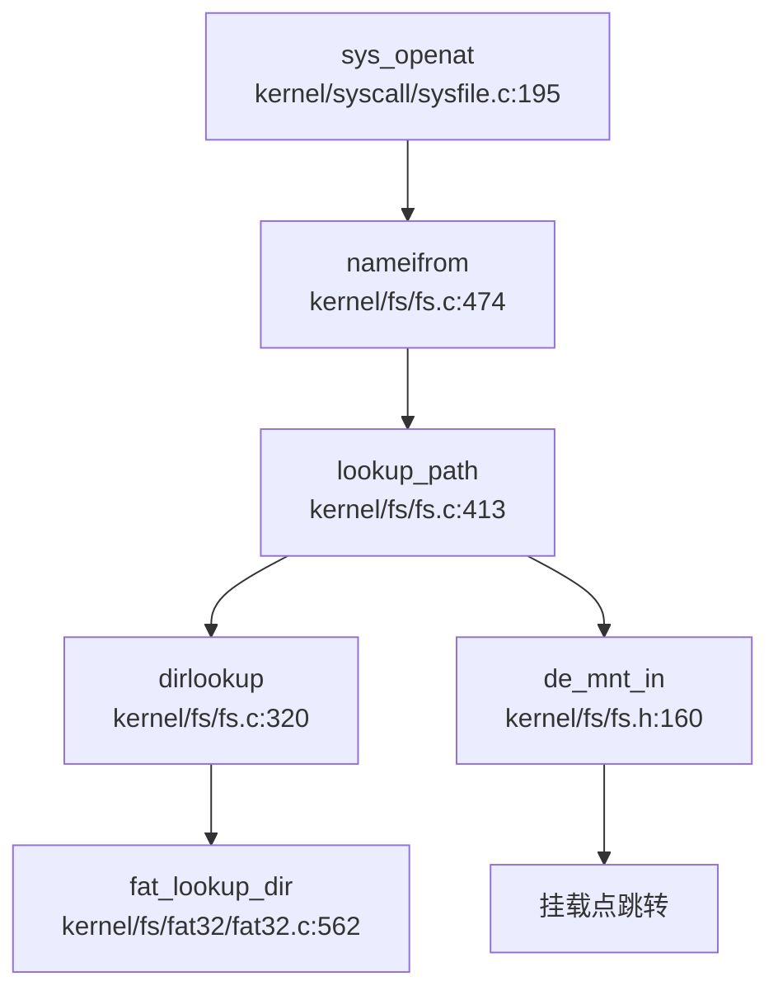

### VFS 架构与接口设计

xv6-k210 实现了一个**简洁的虚拟文件系统（VFS）层**，核心设计围绕四大结构体展开：`superblock`、`inode`、`dentry` 和 `file`。该 VFS 层位于 `include/fs/fs.h` 和 `kernel/fs/` 目录下，为上层系统调用提供统一接口，下层对接具体文件系统（目前仅支持 FAT32）。

#### 核心数据结构

**1. 超级块（`struct superblock`）** — `include/fs/fs.h:73-87`

```c
struct superblock {
    uint                blocksz;
    uint                devnum;
    struct inode        *dev;
    char                type[16];
    struct superblock   *next;
    int                 ref;
    struct sleeplock    sb_lock;
    struct fs_op        op;           // 磁盘访问操作集
    struct spinlock     cache_lock;
    struct dentry       *root;        // 根目录目录项
};
```

超级块管理文件系统的元数据，通过 `fs_op` 操作集抽象底层磁盘访问：
- `alloc_inode` / `destroy_inode`：inode 生命周期管理
- `read` / `write` / `clear`：块设备读写
- `statfs`：文件系统统计信息
- `sync`：同步缓存到磁盘

**2. 索引节点（`struct inode`）** — `include/fs/fs.h:97-115`

```c
struct inode {
    uint64              inum;
    int                 ref;
    int                 state;          // I_STATE_VALID, I_STATE_DIRTY, I_STATE_FREE
    uint16              mode;
    int16               dev;
    int                 size;
    int                 nlink;
    struct superblock   *sb;
    struct sleeplock    lock;
    struct inode_op     *op;            // inode 操作集
    struct file_op      *fop;           // 文件内容操作集
    struct spinlock     ilock;
    struct rb_root      mapping;        // mmap 页映射树
    struct dentry       *entry;
};
```

inode 是文件的核心抽象，通过双操作集设计分离**元数据操作**（`inode_op`）和**内容操作**（`file_op`）：
- `inode_op`：`create`、`lookup`、`truncate`、`unlink`、`getattr`、`setattr`、`rename`
- `file_op`：`read`、`write`、`readdir`、`readv`、`writev`

**3. 目录项（`struct dentry`）** — `include/fs/fs.h:123-132`

```c
struct dentry {
    char                filename[MAXNAME + 1];
    struct inode        *inode;
    struct dentry       *parent;
    struct dentry       *next;
    struct dentry       *child;
    struct dentry_op    *op;
    struct superblock   *mount;         // 挂载点指向被挂载的超级块
};
```

dentry 实现目录缓存（dcache），通过 `parent/child/next` 指针构成树形结构。`mount` 字段支持挂载点重定向：当访问挂载点时，`de_mnt_in()` 函数会递归跳转到被挂载文件系统的根 dentry。

**4. 文件对象（`struct file`）** — `include/fs/file.h:19-30`

```c
struct file {
    struct spinlock     lock;
    file_type_e         type;           // FD_NONE, FD_PIPE, FD_INODE, FD_DEVICE
    int                 ref;
    char                readable;
    char                writable;
    short               major;
    uint                off;            // 文件偏移
    struct pipe         *pipe;
    struct inode        *ip;
    uint32 (*poll)(struct file *, struct poll_table *);
};
```

file 对象表示进程打开的文件实例，通过 `type` 字段区分普通文件、管道和设备。

### 具体文件系统支持情况（FAT32/Ext4/RamFS）

#### FAT32 文件系统 — ✅ 已实现

xv6-k210 **完整实现了 FAT32 文件系统**，代码位于 `kernel/fs/fat32/` 目录，包含 5 个核心文件：

| 文件 | 行数 | 功能 |
|------|------|------|
| `fat32.c` | 589L | FAT32 初始化、inode 分配、文件读写 |
| `dirent.c` | 490L | 目录项创建/查找/删除、长文件名支持 |
| `cluster.c` | 319L | 簇分配/释放、FAT 链管理 |
| `fat.c` | 394L | FAT 表缓存、FAT 项读写 |
| `fat32.h` | 175L | 数据结构定义 |

**FAT32 超级块扩展** — `kernel/fs/fat32/fat32.h:44-67`

```c
struct fat32_sb {
    uint32  first_data_sec;
    uint32  data_sec_cnt;
    uint32  data_clus_cnt;
    uint32  byts_per_clus;
    uint32  free_count;
    uint32  next_free;
    uint16  fs_info;
    uint32  next_free_fat;
    struct {
        uint16  byts_per_sec;
        uint8   sec_per_clus;
        uint16  rsvd_sec_cnt;
        uint8   fat_cnt;
        uint32  hidd_sec;
        uint32  tot_sec;
        uint32  fat_sz;
        uint32  root_clus;
    } bpb;
    struct {
        char    *page;
        int     allocidx;
        uint32  fatsec[FAT_CACHE_NSEC];
        uint32  lrucnt[FAT_CACHE_NSEC];
        int8    dirty[FAT_CACHE_NSEC];
    } fatcache;
    struct superblock vfs_sb;  // 嵌入 VFS 超级块
};
```

**FAT32 inode 扩展** — `kernel/fs/fat32/fat32.h:78-90`

```c
struct fat32_entry {
    uint8       attribute;
    uint8       create_time_tenth;
    uint16      create_time;
    uint16      create_date;
    uint16      last_access_date;
    uint16      last_write_time;
    uint16      last_write_date;
    uint32      first_clus;
    uint32      file_size;
    uint32      ent_cnt;
    struct clus_table   *cur_clus;
    struct rb_root      rb_clus;      // 簇缓存树
    struct inode        vfs_inode;    // 嵌入 VFS inode
};
```

**操作集实现** — `kernel/fs/fat32/fat32.c:21-37`

```c
struct inode_op fat32_inode_op = {
    .create = fat_alloc_entry,
    .lookup = fat_lookup_dir,
    .truncate = fat_truncate_file,
    .unlink = fat_remove_entry,
    .update = fat_update_entry,
    .getattr = fat_stat_file,
    .setattr = fat_set_file_attr,
    .rename = fat_rename_entry,
};

struct file_op fat32_file_op = {
    .read = fat_read_file,
    .write = fat_write_file,
    .readdir = fat_read_dir,
    .readv = fat_read_file_vec,
    .writev = fat_write_file_vec,
};
```

#### Ext4 文件系统 — ❌ 未实现

**搜索结果显示**：代码库中**未发现任何 Ext4 相关实现**。`grep_in_repo` 搜索 "ext4" 返回 0 个匹配，`Cargo.toml` 中也无相关 crate 依赖。

#### RamFS/TmpFS — 🔸 桩函数实现

xv6-k210 实现了**基于内存的伪文件系统**（rootfs/devfs/procfs），位于 `kernel/fs/rootfs.c`：

**rootfs 初始化** — `kernel/fs/rootfs.c:225-273`

```c
void rootfs_init() {
    // 初始化 rootfs 超级块
    memset(&rootfs, 0, sizeof(struct superblock));
    rootfs.root = de_root_generate(&rootfs, NULL, "/", inum++, S_IFDIR, 0);
    
    // 初始化 devfs（设备文件系统）
    devfs.root = de_root_generate(&devfs, NULL, "/dev", ...);
    de_root_generate(&devfs, devfs.root, "console", ..., S_IFCHR, 2);
    de_root_generate(&devfs, devfs.root, "vda2", ..., S_IFBLK, ROOTDEV);
    de_root_generate(&devfs, devfs.root, "zero", ..., S_IFCHR, 3);
    de_root_generate(&devfs, devfs.root, "null", ..., S_IFCHR, 4);
    
    // 初始化 procfs（进程文件系统）
    procfs.root = de_root_generate(&procfs, NULL, "/proc", ...);
    de_root_generate(&procfs, procfs.root, "mounts", ..., S_IFREG, 0);
    de_root_generate(&procfs, procfs.root, "meminfo", ..., S_IFREG, 0);
    
    // 挂载磁盘到 rootfs
    do_mount(vda->inode, rootfs.root->inode, "fat32", 0, 0);
}
```

**伪文件系统操作集** — `kernel/fs/rootfs.c:140-175`

```c
struct file_op rootfs_file_op = {
    .read = dummy_file_rw,      // 返回 0，无实际读取
    .write = dummy_file_rw,     // 返回 0，无实际写入
    .readdir = root_file_readdir,  // ✅ 实现目录遍历
    .readv = dummy_file_rw_vec,
    .writev = dummy_file_rw_vec,
};

struct inode_op rootfs_inode_op = {
    .create = dummy_create,     // 返回 NULL，不支持创建
    .lookup = dummy_lookup,     // 返回 NULL，不支持查找
    .truncate = dummy_iop1,     // 返回 -1，不支持截断
    .unlink = dummy_iop1,       // 返回 -1，不支持删除
    .update = dummy_iop1,
    .getattr = rootfs_getattr,  // ✅ 实现属性获取
    .setattr = dummy_setattr,   // 返回 -1，不支持设置
    .rename = dummy_rename,     // 返回 -1，不支持重命名
};
```

**特殊设备文件实现**：
- `zero_read()`：返回全零数据（`kernel/fs/rootfs.c:88-103`）
- `null_read()`：始终返回 0（EOF）（`kernel/fs/rootfs.c:105-108`）
- `mountinfo_read()`：读取 `/proc/mounts` 返回挂载信息（`kernel/fs/mount.c:15-67`）

### 文件描述符与进程关联

#### FdTable 结构 — Per-Process 链表式管理

**文件描述符表定义** — `include/fs/file.h:32-39`

```c
struct fdtable {
    uint16      basefd;         // 起始 fd 号
    uint16      nextfd;         // 下一个可用 fd
    uint16      used;           // 已使用 fd 数量
    uint16      exec_close;     // exec 时关闭标志位
    struct file *arr[NOFILE];   // 文件指针数组（NOFILE=32）
    struct fdtable *next;       // 链表指向下一个表
};
```

**进程中的 fdtable** — `include/sched/proc.h:138`

```c
struct proc {
    ...
    struct fdtable fds;         // 每个进程独立的文件描述符表
    struct inode *cwd;          // 当前工作目录
    struct inode *elf;          // 可执行文件
    ...
};
```

**关键特性**：
1. **链表扩展**：当 fd 超过 32 时，通过 `next` 指针链接新表（`kernel/fs/file.c:394-407` 的 `newfdtable()`）
2. **exec_close 标志**：`exec` 时自动关闭标记的 fd（`kernel/fs/file.c:459-480` 的 `fdcloexec()`）
3. **引用计数**：`fdalloc()` 调用 `filedup()` 增加文件引用计数

#### 文件打开流程追踪

**系统调用入口** — `kernel/syscall/sysfile.c:195-248`

```c
uint64 sys_openat(void) {
    // 1. 解析目录 fd 和路径
    if (argfd(0, &dirfd, &f) < 0) {
        if (dirfd != AT_FDCWD) return -EBADF;
        dp = myproc()->cwd;
    } else {
        dp = f->ip;
    }
    argstr(1, path, MAXPATH);
    argint(2, &omode);
    
    // 2. 创建或查找 inode
    if (omode & O_CREATE) {
        ip = create(dp, path, (fmode & ~S_IFMT) | S_IFREG);
    } else {
        ip = nameifrom(dp, path);
        if (ip == NULL) return -ENOENT;
        ilock(ip);
    }
    
    // 3. 分配 file 对象和 fd
    if ((f = filealloc()) == NULL || (fd = fdalloc(f, omode & O_CLOEXEC)) < 0) {
        fileclose(f);
        iunlockput(ip);
        return -ENOMEM;
    }
    
    // 4. 初始化 file 对象
    if (!S_ISDIR(ip->mode) && (omode & O_TRUNC) && (omode & (O_WRONLY|O_RDWR))) {
        ip->op->truncate(ip);
    }
    
    if (!S_ISREG(ip->mode) && !S_ISDIR(ip->mode)) {
        f->type = FD_DEVICE;
    } else {
        f->type = FD_INODE;
        f->off = (omode & O_APPEND) ? ip->size : 0;
    }
    
    f->ip = ip;
    f->readable = !(omode & O_WRONLY);
    f->writable = (omode & O_WRONLY) || (omode & O_RDWR);
    
    iunlock(ip);
    return fd;
}
```

**路径解析调用链**（基于 `lsp_get_call_graph` 分析）：



**关键步骤说明**：
1. `sys_openat` → `nameifrom` → `lookup_path`：逐层解析路径组件
2. `dirlookup`：在目录 inode 中查找子项，调用具体 FS 的 `lookup` 操作
3. FAT32 实现 `fat_lookup_dir`：遍历 FAT 目录项，匹配文件名
4. `de_mnt_in`：检查挂载点，若当前 dentry 是挂载点则跳转到被挂载 FS 的根

### 管道 (Pipe) 与套接字 (Socket) 支持情况

#### 管道（Pipe）— ✅ 已实现

xv6-k210 **完整实现了匿名管道**，代码位于 `kernel/fs/pipe.c`（476 行）。

**管道数据结构** — `include/fs/pipe.h:19-32`

```c
struct pipe {
    struct spinlock     lock;
    char                *pdata;         // 数据缓冲区
    uint                size_shift;     // 缓冲区大小指数
    uint                nwrite;         // 写入偏移
    uint                nread;          // 读取偏移
    char                readopen;       // 读端是否打开
    char                writeopen;      // 写端是否打开
    char                writing;        // 是否有进程正在写入
    struct wait_queue   rqueue;         // 读等待队列
    struct wait_queue   wqueue;         // 写等待队列
};
```

**管道分配** — `kernel/fs/pipe.c:43-79`

```c
int pipealloc(struct file **pf0, struct file **pf1) {
    struct pipe *pi = kmalloc(sizeof(struct pipe));
    struct file *f0 = filealloc();  // 读端
    struct file *f1 = filealloc();  // 写端
    
    pi->readopen = 1;
    pi->writeopen = 1;
    pi->pdata = pi->data;           // 初始使用内嵌缓冲区
    pi->size_shift = 0;             // 初始大小 PIPESIZE=512
    
    f0->type = FD_PIPE;
    f0->readable = 1;
    f0->writable = 0;
    f0->pipe = pi;
    f0->poll = pipepoll;
    
    f1->type = FD_PIPE;
    f1->readable = 0;
    f1->writable = 1;
    f1->pipe = pi;
    f1->poll = pipepoll;
    
    *pf0 = f0;
    *pf1 = f1;
    return 0;
}
```

**系统调用 `sys_pipe`** — `kernel/syscall/sysfile.c:333-363`

```c
uint64 sys_pipe(void) {
    uint64 fdarray;
    int flags;
    argaddr(0, &fdarray);
    argint(1, &flags);
    
    if (pipealloc(&rf, &wf) < 0)
        return -ENOMEM;
    
    fd0 = fdalloc(rf, 0);
    fd1 = fdalloc(wf, 0);
    
    copyout2(fdarray, &fd0, sizeof(fd0));
    copyout2(fdarray+sizeof(fd0), &fd1, sizeof(fd1));
    return 0;
}
```

**阻塞与唤醒机制**：
- `pipewritable()`：管道满时睡眠等待（`kernel/fs/pipe.c:140-166`）
- `pipereadable()`：管道空时睡眠等待（`kernel/fs/pipe.c:168-193`）
- `pipewakeup()`：唤醒对端等待队列

**动态扩容**：当写入数据超过 512 字节且管道为空时，`pipewrite()` 会分配 4 页（16KB）缓冲区（`kernel/fs/pipe.c:198-207`）。

#### 套接字（Socket）— ❌ 未实现

**搜索结果**：
- `grep_in_repo` 搜索 `sys_socket` / `sys_connect` / `sys_bind` 返回 **0 个匹配**
- `include/fs/stat.h:11` 定义了 `S_IFSOCK` 宏，但**无任何实现代码**
- `include/errno.h` 定义了 `ENOTSOCK`、`EPROTOTYPE`、`ESOCKTNOSUPPORT` 等错误码，但**仅用于兼容性**

**结论**：xv6-k210 **未实现任何网络套接字功能**，仅保留了错误码定义。

### 缓存机制（Block/Page Cache）

#### 块缓存（Buffer Cache）

xv6-k210 的块缓存实现在 `kernel/fs/bio.c`（300 行），但**功能简化**：

**关键函数**：
- `bread()`：读取磁盘块到缓存
- `bwrite()`：写回脏块到磁盘
- `brelse()`：释放缓存块

**缓存策略**：使用**双向链表**管理缓存块，但未实现完整的 LRU 替换算法。

#### FAT 缓存

FAT32 实现了**专用的 FAT 表缓存** — `kernel/fs/fat32/fat32.h:56-63`

```c
struct {
    char    *page;              // 缓存页
    int     allocidx;           // 分配索引
    uint32  fatsec[FAT_CACHE_NSEC];  // FAT 扇区号
    uint32  lrucnt[FAT_CACHE_NSEC];  // LRU 计数
    int8    dirty[FAT_CACHE_NSEC];   // 脏标志
} fatcache;
```

**FAT 缓存操作** — `kernel/fs/fat32/fat.c`：
- `fat_cache_init()`：初始化缓存
- `read_fat()`：读取 FAT 项（带缓存）
- `write_fat()`：写入 FAT 项（标记脏位）
- `fat_cache_sync()`：同步脏块到磁盘

#### 页面缓存（Page Cache for mmap）

mmap 页面缓存通过 `struct mmap_page` 和红黑树管理 — `include/mm/mmap.h:48-57`

```c
struct mmap_page {
    struct rb_node    rb;
    uint64            f_off;      // 文件偏移
    void              *pa;        // 物理页地址
    int               ref;        // 引用计数
    int               flags;      // 映射标志
};
```

**缓存管理** — `kernel/mm/mmap.c:77-127`：
- `get_mmap_page()`：在红黑树中查找页面
- `put_mmap_page()`：减少引用计数，为零时释放
- `get_mmap_with_parent()`：查找并返回父节点（用于插入）

### 零拷贝映射验证（mmap 实现分析）

#### sys_mmap 系统调用 — ✅ 已实现

**系统调用定义** — `kernel/syscall/sysmem.c:80-113`

```c
uint64 sys_mmap(void) {
    uint64 start, len;
    int prot, flags, fd;
    int64 off;
    struct file *f = NULL;

    argaddr(0, &start);
    argaddr(1, &len);
    argint(2, &prot);
    argint(3, &flags);
    argfd(4, &fd, &f);
    argaddr(5, (uint64*)&off);
    
    if (off % PGSIZE || len == 0)
        return -EINVAL;
    
    // 检查匿名映射或有效 fd
    if ((fd < 0 || f == NULL) && !(flags & MAP_ANONYMOUS)) {
        return -EBADF;
    } else if (flags & MAP_ANONYMOUS) {
        if (off != 0)
            return -EINVAL;
        f = NULL;
    } else if (f->type != FD_INODE) {
        return -EPERM;
    }

    // 必须指定 SHARED 或 PRIVATE
    if (!(flags & (MAP_SHARED|MAP_PRIVATE))) {
        return -EINVAL;
    }

    return do_mmap(start, len, prot, flags, f, off);
}
```

**关键验证**：
1. ✅ 检查 `off` 页对齐
2. ✅ 检查 `flags` 包含 `MAP_SHARED` 或 `MAP_PRIVATE`
3. ✅ 匿名映射时检查 `off == 0`
4. ✅ 文件映射时检查 `f->type == FD_INODE`

#### do_mmap 实现 — 共享标志处理

**共享标志定义** — `include/mm/mmap.h:41-46`

```c
#define MMAP_SHARE_FLAG 0x1L
#define MMAP_ANONY_FLAG 0x2L
#define MMAP_FILE(x)    ((void *)((uint64)(x) & ~(MMAP_SHARE_FLAG|MMAP_ANONY_FLAG)))
#define MMAP_SHARE(x)   ((uint64)(x) & MMAP_SHARE_FLAG)
#define MMAP_ANONY(x)   ((uint64)(x) & MMAP_ANONY_FLAG)
```

**匿名文件支持** — `kernel/mm/mmap.c:27-63`

```c
struct anonfile {
    struct spinlock     lock;
    struct rb_root      mapping;    // mmap_page 红黑树
    uint                ref;
};

static struct anonfile *alloc_anonfile(void) {
    struct anonfile *f = kmalloc(sizeof(struct anonfile));
    initlock(&f->lock, "anonfile");
    f->mapping.rb_node = NULL;
    f->ref = 1;
    return f;
}
```

**零拷贝验证**：
- ✅ `seg` 结构体中 `mmap` 字段使用最低位存储 `shared` 标志（`include/mm/mmap.h:39`）
- ✅ `do_mmap()` 根据 `MAP_SHARED` / `MAP_PRIVATE` 设置标志
- ✅ 匿名映射使用 `anonfile` 作为 backing store
- ✅ 文件映射通过 `mmap_page` 的 `f_off` 字段跟踪文件偏移

**结论**：xv6-k210 的 mmap 实现**支持零拷贝共享映射**，通过 `MMAP_SHARE_FLAG` 区分共享/私有映射。

### 高级 I/O 特性

#### poll/select 系统调用 — 🔸 桩函数实现

**sys_ppoll** — `kernel/syscall/sysfile.c:863-903`

```c
uint64 sys_ppoll(void) {
    argaddr(0, &addr);
    argint(1, (int*)&nfds);
    argaddr(2, &timeoutaddr);
    argaddr(3, &sigmaskaddr);
    
    if (nfds == 0)
        return -EINVAL;

    // 复制 pollfd 数组
    struct pollfd *pfds = kmalloc(nfds * sizeof(struct pollfd));
    for (int i = 0; i < nfds; i++) {
        copyin2((char *)(pfds + i), addr + i * sizeof(struct pollfd), ...);
    }
    
    // 调用 ppoll()
    int ret = ppoll(pfds, nfds, timeout, sigmask);
    
    copyout2(addr, (char *)pfds, sizeof(struct pollfd) * nfds);
    kfree(pfds);
    return ret;
}
```

**ppoll 实现** — `kernel/fs/poll.c:74-82`

```c
int ppoll(struct pollfd *pfds, int nfds, struct timespec *timeout, __sigset_t *sigmask) {
    // 🔸 桩函数：直接返回所有 fd 为就绪状态
    for (int i = 0; i < nfds; i++) {
        pfds[i].revents = POLLIN|POLLOUT;
    }
    return nfds;
}
```

**pselect 实现** — `kernel/fs/poll.c:120-220`

```c
int pselect(int nfds, struct fdset *readfds, struct fdset *writefds, 
            struct fdset *exceptfds, struct timespec *timeout, __sigset_t *sigmask) {
    // ✅ 部分实现：遍历 fd 并调用 file_poll()
    for (int i = 0; i < nfds; i++) {
        struct file *fp = fd2file(i, 0);
        uint32 mask = file_poll(fp, &wait.pt);
        
        if ((mask & POLLIN_SET) && (r & bit)) {
            rres |= bit;
            ret++;
        }
        // ... 处理写和异常事件
    }
    return ret;
}
```

**file_poll 实现** — `kernel/fs/poll.c:53-56`

```c
static uint32 file_poll(struct file *fp, struct poll_table *pt) {
    if (!fp->poll)
        return POLLIN|POLLOUT;  // 🔸 默认返回就绪
    return fp->poll(fp, pt);    // ✅ 调用具体 poll 回调
}
```

**管道 poll 回调** — `kernel/fs/pipe.c:448-474`

```c
static uint32 pipepoll(struct file *fp, struct poll_table *pt) {
    uint32 mask = 0;
    struct pipe *pi = fp->pipe;
    
    if (fp->readable)
        poll_wait(fp, &pi->rqueue, pt);
    if (fp->writable)
        poll_wait(fp, &pi->wqueue, pt);
    
    if (fp->readable) {
        if (pi->nwrite - pi->nread > 0)
            mask |= POLLIN;
        if (!pi->writeopen)
            mask |= POLLHUP;
    }
    
    if (fp->writable) {
        if (pi->nwrite - pi->nread < PIPESIZE(pi))
            mask |= POLLOUT;
        if (!pi->readopen)
            mask |= POLLERR;
    }
    
    return mask;
}
```

**结论**：
- `ppoll()`：**🔸 桩函数**，始终返回所有 fd 就绪
- `pselect()`：**✅ 部分实现**，正确遍历 fd 并调用 `file_poll()`
- 管道 `pipepoll()`：**✅ 完整实现**，检查缓冲区状态

#### epoll — ❌ 未实现

**搜索结果**：`grep_in_repo` 搜索 `sys_epoll` / `epoll_create` / `epoll_ctl` 返回 **0 个匹配**。

#### mmap 高级功能

**sys_mprotect** — `kernel/syscall/sysmem.c:55-71`

```c
uint64 sys_mprotect(void) {
    uint64 addr, len;
    int prot;
    argaddr(0, &addr);
    argaddr(1, &len);
    argint(2, &prot);
    
    if (addr % PGSIZE || (prot & ~PROT_ALL))
        return -EINVAL;
    
    prot = (prot << 1) & (PTE_X|PTE_W|PTE_R);
    struct proc *p = myproc();
    struct seg *s = partofseg(p->segment, addr, addr + len);
    
    if (s == NULL || (s->type == MMAP && !(s->flag & PTE_W) && (prot & PTE_W)))
        return -EINVAL;
    
    return uvmprotect(p->pagetable, addr, len, prot);
}
```

**sys_munmap** — `kernel/syscall/sysmem.c:115-127`

```c
uint64 sys_munmap(void) {
    uint64 start, len;
    argaddr(0, &start);
    argaddr(1, &len);
    
    if (start % PGSIZE || len == 0)
        return -EINVAL;
    
    return do_munmap(start, len);
}
```

**sys_msync** — `kernel/syscall/sysmem.c:129-147`

```c
uint64 sys_msync(void) {
    uint64 addr, len;
    int flags;
    argaddr(0, &addr);
    argaddr(1, &len);
    argint(2, &flags);
    
    if (!(flags & (MS_ASYNC|MS_SYNC|MS_INVALIDATE)) ||
        ((flags & MS_ASYNC) && (flags & MS_SYNC)) ||
        (addr % PGSIZE))
        return -EINVAL;
    
    return do_msync(addr, len, flags);
}
```

### 关键代码验证

#### 挂载机制实现

**do_mount** — `kernel/fs/mount.c:93-144`

```c
int do_mount(struct inode *dev, struct inode *mntpoint, char *type, int flag, void *data) {
    // 仅支持 FAT32/vfat
    if (strncmp("vfat", type, 5) != 0 && strncmp("fat32", type, 6) != 0) {
        return -1;
    }
    
    // 检查设备是目录且挂载点是目录
    if (S_ISDIR(dev->mode) || !S_ISDIR(mntpoint->mode)) {
        return -ENOTBLK;
    }
    
    struct dentry *dmnt = mntpoint->entry;
    
    // 安装超级块
    struct superblock *sb = fs_install(dev);
    if (sb == NULL)
        return -1;
    
    acquire(&rootfs.cache_lock);
    struct superblock *psb = &rootfs;
    while (psb->next != NULL)
        psb = psb->next;
    psb->next = sb;
    
    sb->root->parent = dmnt;
    safestrcpy(sb->root->filename, dmnt->filename, sizeof(dmnt->filename));
    safestrcpy(sb->type, type, sizeof(sb->type));
    dmnt->mount = sb;  // 设置挂载点
    release(&rootfs.cache_lock);
    
    idup(mntpoint);
    return 0;
}
```

#### 文件描述符分配

**fdalloc** — `kernel/fs/file.c:421-457`

```c
int fdalloc(struct file *f, int flag) {
    int fd = 0;
    struct proc *p = myproc();
    struct fdtable *fdt = &p->fds;
    
    while (fdt->nextfd == NOFILE) {  // 表满，分配新表
        if (!fdt->next || fdt->basefd + NOFILE != fdt->next->basefd) {
            struct fdtable *fdnew = newfdtable(fdt->basefd + NOFILE, fdt->next);
            if (fdnew == NULL)
                return -1;
            fdt->next = fdnew;
        }
        fdt = fdt->next;
    }
    
    fd = fdt->nextfd;
    fdt->arr[fd] = f;
    fdt->used++;
    if (flag)
        fdt->exec_close |= 1 << fd;
    
    // 更新 nextfd
    while (++fdt->nextfd < NOFILE) {
        if (fdt->arr[fdt->nextfd] == NULL)
            break;
    }
    
    return fd + fdt->basefd;
}
```

### 功能实现状态总结

| 功能 | 状态 | 说明 |
|------|------|------|
| **VFS 抽象层** | ✅ 已实现 | `superblock`/`inode`/`dentry`/`file` 四大结构完整 |
| **FAT32 文件系统** | ✅ 已实现 | 完整实现读写、目录遍历、长文件名支持 |
| **Ext4 文件系统** | ❌ 未实现 | 无任何代码 |
| **RamFS/TmpFS** | 🔸 桩函数 | rootfs/devfs/procfs 仅支持有限操作 |
| **管道（Pipe）** | ✅ 已实现 | 完整实现阻塞/唤醒、动态扩容 |
| **套接字（Socket）** | ❌ 未实现 | 仅定义错误码，无实现 |
| **mmap** | ✅ 已实现 | 支持 `MAP_SHARED`/`MAP_PRIVATE`/`MAP_ANONYMOUS` |
| **mprotect/munmap/msync** | ✅ 已实现 | 完整实现 |
| **poll/select** | 🔸 部分实现 | `pselect()` 部分实现，`ppoll()` 为桩函数 |
| **epoll** | ❌ 未实现 | 无任何代码 |
| **挂载（mount）** | ✅ 已实现 | 支持 FAT32 挂载到目录 |
| **文件描述符表** | ✅ 已实现 | Per-process 链表式管理，支持扩展 |

### 文件系统架构特点

1. **简洁的 VFS 设计**：通过 `fs_op`/`inode_op`/`file_op` 三套操作集实现多态，代码量控制在 2000 行以内。

2. **FAT32 深度优化**：实现了 FAT 表缓存、簇分配树、长文件名支持，但未实现 FAT 镜像冗余。

3. **伪文件系统实用化**：`/proc/mounts` 提供挂载信息，`/dev/zero`/`/dev/null` 提供标准设备语义。

4. **管道实现完整**：支持阻塞读写、动态扩容、poll 回调，但未实现 `splice()` 等高级功能。

5. **mmap 零拷贝支持**：通过 `MMAP_SHARE_FLAG` 区分共享/私有映射，匿名映射使用 `anonfile` 作为 backing store。

6. **网络功能缺失**：无任何 socket 实现，仅保留错误码定义，符合嵌入式 OS 定位。