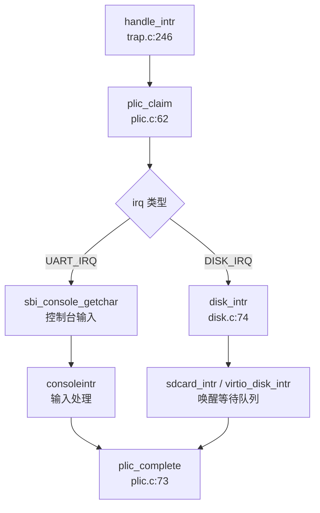

### 驱动框架与设备发现

**设备发现机制：硬编码地址，无 Device Tree 解析**

xv6-k210 **未实现** Device Tree (DTS) 解析机制。所有外设的物理地址均在 `include/memlayout.h` 中硬编码定义，通过条件编译区分 QEMU 和 K210 平台：

```c
// include/memlayout.h
#ifdef QEMU
#define UART                    0x10000000L
#define VIRTIO0                 0x10001000
#else
#define UART                    0x38000000L     // K210 UARTHS
#define GPIOHS                  0x38001000
#define SPI0                    0x52000000
#define DMAC                    0x50000000
#endif

#define UART_V                  (UART + VIRT_OFFSET)    // 虚拟地址转换
```

**驱动初始化流程**（`kernel/main.c:40-60`）：

```c
void main(unsigned long hartid, unsigned long dtb_pa) {
    if (hartid == 0) {
        consoleinit();      // 控制台初始化
        kvminithart();      // 启用分页
        plicinit();         // 中断控制器初始化
        #ifndef QEMU
        fpioa_pin_init();   // K210 引脚复用配置
        dmac_init();        // DMA 控制器初始化
        #endif 
        disk_init();        // 块设备初始化
        binit();            // 缓冲区缓存
    }
    // ...
}
```

**驱动框架特征**：
- **无统一 Driver Trait**：作为 C 语言编写的 OS，xv6-k210 未采用 Rust 式的 Trait 驱动框架
- **直接函数调用**：各驱动模块通过 `xxx_init()`、`xxx_read()`、`xxx_write()` 等标准接口暴露功能
- **条件编译隔离**：通过 `#ifdef QEMU` / `#ifndef QEMU` 在编译时选择不同平台的驱动实现

---

### 组件化设计与配置机制

**构建配置系统**

项目使用 Makefile + Cargo 混合构建系统：

1. **Makefile 平台选择**（`Makefile:1-30`）：
```makefile
platform	:= k210
# platform	:= qemu

ifeq ($(platform), qemu)
CFLAGS += -D QEMU
endif

ifeq ($(platform), k210)
    SBI := ./sbi/sbi-k210
else
    SBI := ./sbi/sbi-qemu
endif
```

2. **Rust Bootloader 配置**：
   - `bootloader/SBI/rustsbi-k210/.cargo/config.toml`：
     ```toml
     [build]
     target = "riscv64gc-unknown-none-elf"
     ```
   - `bootloader/SBI/rustsbi-k210/Cargo.toml` 依赖：
     ```toml
     k210-hal = { git = "https://github.com/riscv-rust/k210-hal" }
     embedded-hal = "1.0.0-alpha.1"
     ```

3. **条件编译宏**：
   - `QEMU`：定义后启用 VirtIO 驱动，禁用 K210 特有硬件（SPI、DMAC）
   - `DEBUG` 系列：如 `__DEBUG_sdcard` 控制调试输出

**组件化程度评估**：
- ✅ **平台抽象层**：通过 `memlayout.h` 和条件编译实现 QEMU/K210 双平台支持
- 🔸 **有限模块化**：驱动代码集中在 `kernel/hal/`，无动态加载机制
- ❌ **无运行时配置**：所有驱动在编译时静态链接，不支持模块热插拔

---

### 字符设备驱动（UART/Console）

**✅ 已实现：双阶段 UART 驱动架构**

xv6-k210 采用 **Bootloader (Rust) + Kernel (C)** 双层 UART 驱动设计：

#### 1. Bootloader 阶段（Rust）

**文件**：`bootloader/SBI/rustsbi-k210/src/serial.rs`

```rust
// Trait 定义
trait SerialPair: core::fmt::Write {
    fn getchar(&mut self) -> Option<u8>;
    fn putchar(&mut self, c: u8);
}

// 初始化
pub fn init(ser: k210_hal::serial::Serial<k210_hal::pac::UARTHS>) {
    let (tx, rx) = ser.split();
    *UARTHS.lock() = Some(Box::new(Serial(tx, rx)));
}
```

**关键特性**：
- 使用 `k210-hal` crate 提供的硬件抽象
- 通过 `lazy_static!` 和 `spin::Mutex` 实现多核安全
- 支持 `println!` 宏输出

#### 2. Kernel 阶段（C）

**文件**：`kernel/console.c` + `kernel/hal/plic.c`

**MMU 前后地址切换机制**：
```c
// include/memlayout.h
#define UART            0x38000000L           // 物理地址 (MMU 前)
#define UART_V          (UART + VIRT_OFFSET)  // 虚拟地址 (MMU 后，0x38000000 + 0x3F00000000)

// kernel/console.c:45
void consputc(int c) {
    if(c == BACKSPACE){
        sbi_console_putchar('\b');  // 通过 SBI 调用
        sbi_console_putchar(' ');
        sbi_console_putchar('\b');
    } else {
        sbi_console_putchar(c);
    }
}
```

**MMU 切换分析**：
- **MMU 启用前**：Bootloader 直接使用物理地址 `0x38000000` 访问 UARTHS
- **MMU 启用后**：Kernel 通过 `UART_V` 虚拟地址访问，但实际输出委托给 SBI
- **中断驱动输入**：UART 中断通过 PLIC 路由到 `handle_intr()` → `sbi_console_getchar()`

**控制台输入处理链**（`kernel/trap/trap.c:246-325`）：
```c
int handle_intr(uint64 scause) {
    if (INTR_SOFTWARE == scause && sbi_xv6_is_ext().value) {
        int irq = plic_claim();
        switch (irq) {
        case UART_IRQ: 
            c = sbi_console_getchar();  // 通过 SBI 读取
            if (-1 != c) 
                consoleintr(c);         // 输入处理
            break;
        // ...
        }
        plic_complete(irq);
    }
}
```

**实现状态**：
- ✅ **输出**：完整实现，支持转义字符处理（退格、换行）
- ✅ **输入**：中断驱动，通过 PLIC + SBI 协同处理
- ✅ **多核安全**：使用 `spinlock` 保护控制台缓冲区

---

### 块设备驱动（VirtIO-Blk 等）

**✅ 已实现：双后端块设备抽象**

xv6-k210 通过 `kernel/hal/disk.c` 提供统一的块设备接口，支持 QEMU VirtIO 和 K210 SD 卡两种后端：

#### 1. 统一接口层（`kernel/hal/disk.c`）

```c
void disk_init(void) {
    #ifdef QEMU
    virtio_disk_init();
    #else 
    sdcard_init();
    #endif
}

int disk_read(struct buf *b) {
    #ifdef QEMU
    return virtio_disk_read(b);
    #else 
    return sdcard_read(b);
    #endif
}
```

#### 2. VirtIO-Blk 后端（QEMU）

**文件**：`kernel/hal/virtio_disk.c`

**核心数据结构**：
```c
struct disk {
    char pages[2 * PGSIZE];          // 连续物理内存
    struct virtq_desc *desc;         // 描述符环
    struct virtq_avail *avail;       // 可用环
    struct struct virtq_used *used;  // 已用环
    struct spinlock vdisk_lock;
    struct wait_queue queue;
} __attribute__ ((aligned (PGSIZE))) disk;
```

**初始化流程**（`virtio_disk_init()`）：
1. 协商 VirtIO 特性（禁用 RO、SCSI、MQ 等）
2. 设置驱动状态：`ACKNOWLEDGE` → `DRIVER` → `FEATURES_OK` → `DRIVER_OK`
3. 初始化描述符环（32 个描述符）
4. 配置 PLIC 中断（`VIRTIO0_IRQ`）

**读写实现**：
```c
static int virtio_disk_rw(struct buf *bufs[], int nbuf, int write) {
    int ndesc = nbuf + 2;
    int idx[ndesc];
    alloc_descs(idx, ndesc);  // 分配描述符链
    
    // 构建 VirtIO 块请求
    disk.ops[idx[0]].type = write ? VIRTIO_BLK_T_OUT : VIRTIO_BLK_T_IN;
    disk.ops[idx[0]].sector = bufs[0]->sectorno;
    
    // 提交到可用环
    disk.avail->ring[disk.avail->idx % NUM] = idx[0] & (NUM - 1);
    disk.avail->idx++;
    
    *R(VIRTIO_MMIO_QUEUE_NOTIFY) = 0;  // 通知设备
    // ... 等待完成中断
}
```

**实现状态**：
- ✅ **读操作**：`virtio_disk_read()` 完整实现
- 🔸 **写操作**：`disk_write()` 中 `virtio_disk_rw()` 被注释，**实际未启用**
- ✅ **中断处理**：`virtio_disk_intr()` 唤醒等待进程

#### 3. SD 卡后端（K210）

**文件**：`kernel/hal/sdcard.c`（1076 行）

**硬件接口**：
- **SPI 模式**：通过 `kernel/hal/spi.c` 驱动 SPI0 控制器
- **DMA 传输**：使用 `kernel/hal/dmac.c` 实现 DMA 读写
- **GPIO 片选**：`GPIOHS pin 7` 控制 SD 卡 CS

**SD 卡初始化流程**（`sdcard_init()`）：
```c
void sdcard_init(void) {
    sd_lowlevel_init();       // GPIO + SPI 初始化
    SD_CS_HIGH();
    
    // CMD0: 复位 SD 卡
    sd_send_cmd(SD_CMD0, 0, 0x95);
    sd_end_cmd();
    
    // CMD8: 检查电压
    verify_operation_condition();
    
    // ACMD41: 等待就绪
    set_SDXC_capacity();
    
    // CMD58: 读取 OCR，判断 SDHC/SDSC
    check_block_size();
}
```

**读写实现**：
- **CMD17**：单块读（`sdcard_read()`）
- **CMD24**：单块写（`sdcard_write()` 被注释，**未实现**）
- **DMA 优化**：`sd_read_data_dma()` 使用 DMAC 通道 0

**实现状态**：
- ✅ **初始化**：完整支持 SDHC/SDSC 卡检测
- ✅ **读操作**：支持单块/多块读
- ❌ **写操作**：`disk_write()` 中 SD 卡写被注释
- ✅ **中断驱动**：`dmac_intr()` 唤醒等待队列

#### 4. 缓冲区缓存层

**文件**：`kernel/fs/bio.c`

**LRU 缓存策略**：
```c
struct buf {
    int dev;
    uint sectorno;
    char data[BSIZE];
    int refcnt;        // 引用计数
    int dirty;         // 脏标志
    struct d_list list; // LRU 链表
};

void binit(void) {
    dlist_init(&lru_head);  // LRU 链表头
    // 初始化 BNUM 个缓冲区
}
```

**写回机制**：
- **延迟写**：`bwrite()` 标记 `dirty` 后立即返回
- **后台写回**：`disk_write_start()` 在空闲时批量提交

---

### 网络设备驱动

**❌ 未实现**

经搜索确认：
- 无 VirtIO-Net 驱动代码
- 无 `smoltcp`、`lwIP` 等 TCP/IP 协议栈
- `include/hal/virtio.h:21` 仅注释说明 `VIRTIO_MMIO_DEVICE_ID` 中"1 is net, 2 is disk"
- `include/errno.h` 中虽有 `ENONET` 错误码，但无实际网络功能

**结论**：xv6-k210 **不支持网络功能**，所有网络相关代码仅为预留定义。

---

### 中断控制器驱动

**✅ 已实现：PLIC 中断控制器驱动**

**文件**：`kernel/hal/plic.c` + `include/hal/plic.h`

#### 1. 中断号定义

```c
// include/hal/plic.h
#ifdef QEMU
#define UART_IRQ    10 
#define DISK_IRQ    1
#else           // k210 
#define UART_IRQ    33      // IRQN_UARTHS_INTERRUPT
#define DISK_IRQ    27      // IRQN_DMA0_INTERRUPT
#endif
```

#### 2. PLIC 初始化

**全局初始化**（`plicinit()`）：
```c
void plicinit(void) {
    // 启用 UART 和 DISK 中断
    writed(1, PLIC_V + DISK_IRQ * sizeof(uint32));
    writed(1, PLIC_V + UART_IRQ * sizeof(uint32));
}
```

**每 Hart 初始化**（`plicinithart()`）：
```c
void plicinithart(void) {
    int hart = cpuid();
    #ifdef QEMU
    // S-Mode 中断使能
    *(uint32*)PLIC_SENABLE(hart) = (1 << UART_IRQ) | (1 << DISK_IRQ);
    *(uint32*)PLIC_SPRIORITY(hart) = 0;  // 优先级阈值
    #else
    // M-Mode 中断使能（K210 使用 M-Mode 处理外部中断）
    uint32 *hart_m_enable = (uint32*)PLIC_MENABLE(hart);
    *(hart_m_enable) = readd(hart_m_enable) | (1 << DISK_IRQ);
    // 禁用 S-Mode 外部中断
    *(uint32*)PLIC_SENABLE(hart) = 0;
    #endif
}
```

#### 3. 中断处理流程

**中断声明与完成**：
```c
int plic_claim(void) {
    int hart = cpuid();
    #ifndef QEMU
    return *(uint32*)PLIC_MCLAIM(hart);  // M-Mode 读取
    #else
    return *(uint32*)PLIC_SCLAIM(hart);  // S-Mode 读取
    #endif
}

void plic_complete(int irq) {
    int hart = cpuid();
    *(uint32*)PLIC_MCLAIM(hart) = irq;   // 写入相同值完成中断
}
```

**中断分发**（`kernel/trap/trap.c:handle_intr()`）：


**平台差异处理**：
- **QEMU**：使用 S-Mode 中断（`PLIC_SCLAIM/PLIC_SCLAIM`）
- **K210**：使用 M-Mode 中断 + 软件委托（`sbi_xv6_is_ext()` 判断）

---

### 目标平台适配情况

**支持平台**：

| 平台 | 目标三元组 | 启动镜像 | 关键驱动 |
|------|-----------|---------|---------|
| **K210** | `riscv64gc-unknown-none-elf` | `sbi/sbi-k210` | SD 卡、UARTHS、GPIOHS、DMAC、SPI0 |
| **QEMU** | `riscv64gc-unknown-none-elf` | `sbi/sbi-qemu` | VirtIO-Blk、NS16550A UART |

**平台适配机制**：

1. **链接脚本分离**：
   - `linker/k210.ld`：K210 内存布局（RAM: 0x80000000-0x80600000）
   - `linker/qemu.ld`：QEMU 内存布局

2. **入口代码分离**：
   - `kernel/entry_k210.S`：K210 启动代码
   - `kernel/entry_qemu.S`：QEMU 启动代码

3. **驱动条件编译**：
   ```c
   #ifndef QEMU
   #include "hal/sdcard.h"
   #include "hal/dmac.h"
   #include "hal/fpioa.h"
   #else
   #include "hal/virtio.h"
   #endif
   ```

4. **引脚复用配置（K210 特有）**：
   - `kernel/hal/fpioa.c`（83.7KB）：配置 224 个引脚功能
   - 示例：`UARTHS_TX` → `io5`, `UARTHS_RX` → `io4`

**未识别的顶层目录**：
- `sbi/`：包含预编译的 SBI 固件（`sbi-k210`, `sbi-qemu`）
- `debug/`：OpenOCD 调试配置
- `tools/`：K210 烧录工具 `kflash.py`

---

### 其他外设支持

#### 1. DMA 控制器（DMAC）

**文件**：`kernel/hal/dmac.c`（425 行）

**功能**：
- ✅ **通道管理**：支持 6 个 DMA 通道
- ✅ **内存到外设传输**：用于 SPI SD 卡读写
- ✅ **中断完成通知**：`dmac_intr()` 唤醒等待进程

**初始化**：
```c
void dmac_init(void) {
    dmac_enable();
    // 配置通道优先级
    // 注册中断处理
}
```

#### 2. SPI 控制器

**文件**：`kernel/hal/spi.c`（726 行）

**功能**：
- ✅ **主模式配置**：`spi_init()` 设置工作模式、帧格式、波特率
- ✅ **标准/DMA 传输**：`spi_send_data_standard()` / `spi_send_data_no_cmd_dma()`
- ✅ **多设备支持**：SPI0、SPI1、SPI2 三控制器

#### 3. GPIOHS（高速 GPIO）

**文件**：`kernel/hal/gpiohs.c`（204 行）

**功能**：
- ✅ **输入/输出模式**：`gpiohs_set_drive_mode()`
- ✅ **SD 卡片选控制**：`SD_CS_HIGH()` / `SD_CS_LOW()` 使用 `gpiohs pin 7`

#### 4. 系统控制器（SYSCTL）

**文件**：`kernel/hal/sysctl.c`（328 行）

**功能**：
- ✅ **时钟配置**：设置 PLL、外设时钟分频
- ✅ **电源管理**：外设复位控制

#### 5. 未实现外设

| 外设 | 状态 | 说明 |
|------|------|------|
| **VirtIO-Net** | ❌ 未实现 | 仅 `virtio.h` 有设备 ID 定义 |
| **GPU/Framebuffer** | ❌ 未实现 | 无显示驱动 |
| **USB** | ❌ 未实现 | 无相关代码 |
| **I2C** | ❌ 未实现 | `plic.h` 有中断定义但无驱动 |
| **I2S** | ❌ 未实现 | 音频接口未实现 |
| **定时器** | ✅ 已实现 | `kernel/timer.c` 使用 CLINT MTIME |

---

### 本章总结

**驱动架构特点**：
1. **静态编译模型**：无设备树、无动态加载，所有驱动在编译时确定
2. **双平台抽象**：通过 `#ifdef QEMU` 实现 QEMU/K210 代码复用
3. **分层设计**：
   - Bootloader (Rust)：硬件初始化 + 早期串口
   - Kernel (C)：完整驱动栈 + 中断处理
4. **中断驱动 I/O**：UART 和 SD 卡均使用中断 + 等待队列机制

**实现完整性**：
| 子系统 | 状态 | 备注 |
|--------|------|------|
| UART 控制台 | ✅ 完整 | 双阶段驱动，中断输入 |
| VirtIO-Blk | 🔸 部分 | 读完整，写被注释 |
| SD 卡 | 🔸 部分 | 读完整，写未实现 |
| PLIC 中断 | ✅ 完整 | 支持 QEMU/K210 差异 |
| 网络 | ❌ 无 | 未实现 |
| GPU/输入 | ❌ 无 | 仅键盘输入通过 UART |

**与文档对比**：
- README 提及"Steady keyboard input(k210)" ✅ 已验证
- 文档提及 SD 卡驱动 ✅ 已实现但写功能缺失
- 无网络功能文档声称，代码确认未实现