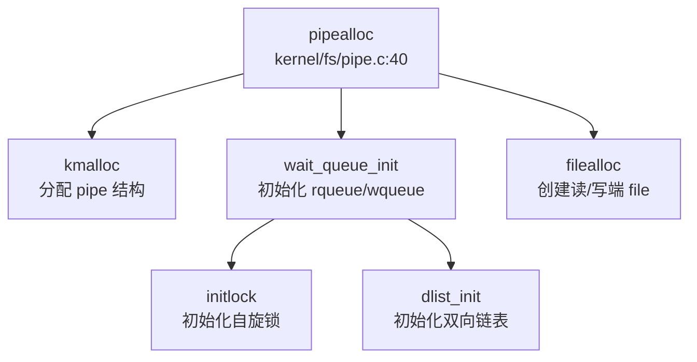
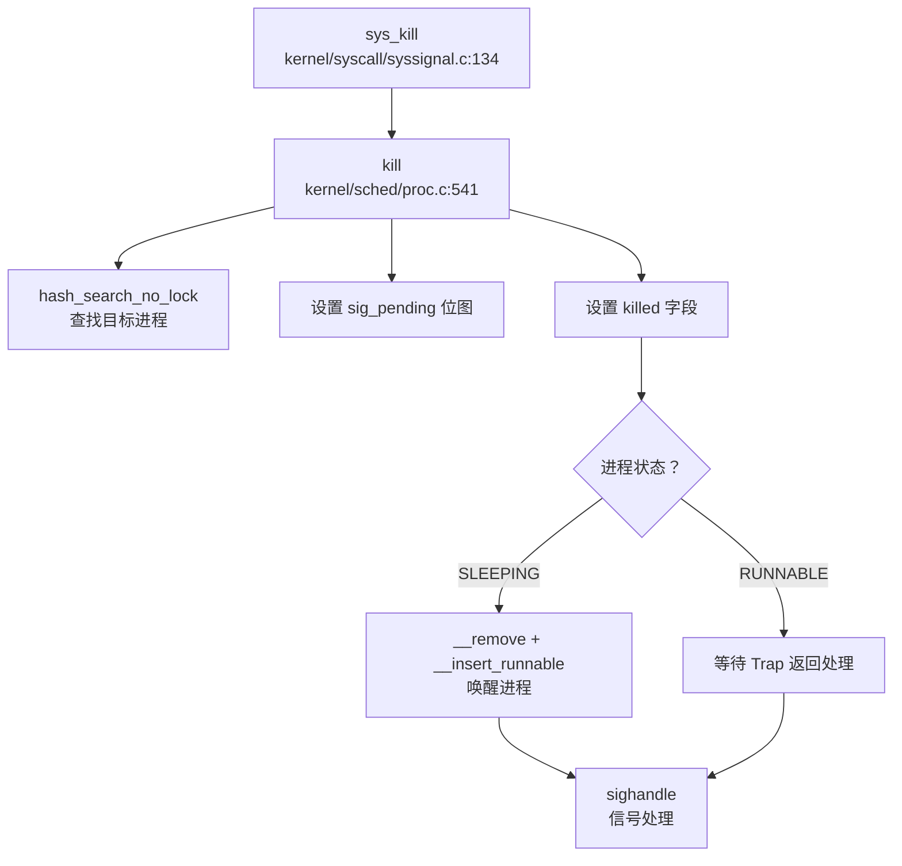

## 第 8 章：同步互斥与进程间通信

xv6-k210 实现了经典的类 Unix 同步原语与 IPC 机制，包括 **SpinLock（自旋锁）**、**SleepLock（睡眠锁）**、**WaitQueue（等待队列）**、**Pipe（管道）** 和 **Signal（信号）**。本章将深入分析其原子操作实现、睡眠/唤醒不变量、IPC 缓冲区形态，并明确区分真实实现与桩函数。

---

### 同步与互斥原语（锁与原子操作）

#### SpinLock 实现：基于 GCC 原子内置函数

xv6-k210 的自旋锁实现在 `kernel/sync/spinlock.c`，采用 **GCC `__sync_*` 原子内置函数**，在 RISC-V 架构下编译为 `amoswap.w` 原子交换指令。

**核心数据结构**（`include/sync/spinlock.h`）：
```c
struct spinlock {
  uint locked;       // 锁状态：0=未锁定，1=已锁定
  char *name;        // 锁名称（用于调试）
  struct cpu *cpu;   // 持有锁的 CPU
};
```

**acquire() 实现**（`kernel/sync/spinlock.c:24-45`）：
```c
void acquire(struct spinlock *lk)
{
    push_off();  // 禁用中断，避免死锁

// RISC-V: amoswap.w.aq a5, a5, (s1)
    // 原子交换：将 lk->locked 设为 1，返回旧值
    while(__sync_lock_test_and_set(&lk->locked, 1) != 0)
        ;

// 内存屏障：确保临界区的内存访问在锁获取之后
    __sync_synchronize();

lk->cpu = mycpu();  // 记录持有锁的 CPU
}
```

**release() 实现**（`kernel/sync/spinlock.c:49-74`）：
```c
void release(struct spinlock *lk)
{
    lk->cpu = 0;

// 内存屏障：确保临界区的存储在锁释放前对其他 CPU 可见
    __sync_synchronize();

// RISC-V: amoswap.w zero, zero, (s1)
    // 原子释放：将 lk->locked 设为 0
    __sync_lock_release(&lk->locked);

pop_off();  // 恢复中断状态
}
```

**关键特性**：
- ✅ **原子操作**：使用 `__sync_lock_test_and_set` / `__sync_lock_release`，非自定义汇编
- ✅ **内存屏障**：`__sync_synchronize()` 发出 RISC-V `fence` 指令，防止重排序
- ✅ **中断保护**：`push_off()` / `pop_off()` 禁用/恢复中断，避免死锁
- ✅ **持有检测**：`holding()` 函数可检查当前 CPU 是否持有锁

---

#### SleepLock 实现：基于 SpinLock + sleep/wakeup

SleepLock 允许进程在锁不可用时进入睡眠状态，而非忙等待。实现在 `kernel/sync/sleeplock.c`。

**核心数据结构**（`include/sync/sleeplock.h`）：
```c
struct sleeplock {
  struct spinlock lk;  // 保护 sleeplock 的自旋锁
  char *name;          // 锁名称
  int locked;          // 锁状态
  int pid;             // 持有锁的进程 PID
};
```

**acquiresleep() 实现**（`kernel/sync/sleeplock.c:21-31`）：
```c
void acquiresleep(struct sleeplock *lk)
{
    acquire(&lk->lk);  // 获取内部自旋锁
    while (lk->locked) {
        sleep(lk, &lk->lk);  // 锁被占用时睡眠
    }
    lk->locked = 1;
    lk->pid = myproc()->pid;
    release(&lk->lk);
}
```

**releasesleep() 实现**（`kernel/sync/sleeplock.c:33-41`）：
```c
void releasesleep(struct sleeplock *lk)
{
    acquire(&lk->lk);
    lk->locked = 0;
    lk->pid = 0;
    wakeup(lk);  // 唤醒等待该锁的进程
    release(&lk->lk);
}
```

**关键特性**：
- ✅ **双层锁设计**：外层 SleepLock 提供睡眠语义，内层 SpinLock 保护数据结构
- ✅ **睡眠/唤醒**：通过 `sleep(lk, &lk->lk)` 将进程挂起到等待队列
- ✅ **持有者追踪**：`lk->pid` 记录持有锁的进程 ID，用于调试和持有检测

---

### 等待队列实现机制

#### WaitQueue 数据结构：基于双向链表的 FIFO 队列

WaitQueue 实现在 `include/sync/waitqueue.h`，使用双向链表（`dlist`）实现 FIFO 队列。

**核心数据结构**：
```c
struct wait_queue {
    struct spinlock lock;      // 保护队列的自旋锁
    struct d_list head;        // 双向链表头
};

struct wait_node {
    void *chan;                // 等待通道（用于 wakeup）
    struct d_list list;        // 链表节点
};
```

**关键操作**（内联函数）：
```c
// 初始化
static inline void wait_queue_init(struct wait_queue *wq, char *str)
{
    initlock(&wq->lock, str);
    dlist_init(&wq->head);
}

// 添加节点到队尾
static inline void wait_queue_add(struct wait_queue *wq, struct wait_node *node)
{
    dlist_add_before(&wq->head, &node->list);
}

// 从队列删除节点
static inline void wait_queue_del(struct wait_node *node)
{
    dlist_del(&node->list);
}

// 检查是否为队首节点
static inline int wait_queue_is_first(struct wait_queue *wq, struct wait_node *node)
{
    return wq->head.next == &node->list;
}
```

**设计特点**：
- ✅ **FIFO 顺序**：新节点添加到队尾，队首节点优先获取资源
- ✅ **自旋锁保护**：所有队列操作需持有 `wq->lock`
- ✅ **通道唤醒**：`wakeup(chan)` 遍历所有睡眠进程，匹配 `p->chan == chan` 并唤醒

---

### 进程间通信（Pipe/Signal）

#### Pipe 实现：环形缓冲区 + WaitQueue 同步

xv6-k210 的 Pipe 实现在 `kernel/fs/pipe.c`，采用 **环形缓冲区（Ring Buffer）** 设计，支持动态扩容，并使用 **WaitQueue** 实现读写阻塞/唤醒。

**核心数据结构**（`include/fs/pipe.h`）：
```c
#define PIPE_SIZE 512

struct pipe {
    struct spinlock lock;           // 保护 pipe 的自旋锁
    struct wait_queue wqueue;       // 写等待队列
    struct wait_queue rqueue;       // 读等待队列
    uint nread;                     // 已读取字节数
    uint nwrite;                    // 已写入字节数
    uint8 readopen;                 // 读端是否打开
    uint8 writeopen;                // 写端是否打开
    uint8 writing;                  // 是否有进程正在写入
    uint8 size_shift;               // 缓冲区大小移位（0=512B, 5=16KB）
    char *pdata;                    // 缓冲区指针（可扩展）
    char data[PIPE_SIZE];           // 默认缓冲区
};

#define PIPESIZE(pi) (PIPE_SIZE << (pi->size_shift))
```

**pipealloc() 初始化**（`kernel/fs/pipe.c:40-85`）：
```c
int pipealloc(struct file **pf0, struct file **pf1)
{
    struct pipe *pi = kmalloc(sizeof(struct pipe));

pi->readopen = 1;
    pi->writeopen = 1;
    pi->nwrite = 0;
    pi->nread = 0;
    pi->pdata = pi->data;      // 指向默认缓冲区
    pi->size_shift = 0;        // 初始大小 512 字节

initlock(&pi->lock, "pipe");
    wait_queue_init(&pi->wqueue, "pipewritequeue");
    wait_queue_init(&pi->rqueue, "pipereadqueue");

// 创建两个 file 结构：一个读端，一个写端
    f0->type = FD_PIPE;
    f0->readable = 1;
    f0->writable = 0;
    f0->pipe = pi;

f1->type = FD_PIPE;
    f1->readable = 0;
    f1->writable = 1;
    f1->pipe = pi;
}
```

**pipelock/pipeunlock：FIFO 队列管理**（`kernel/fs/pipe.c:96-127`）：
```c
static void pipelock(struct pipe *pi, struct wait_node *wait, int who)
{
    struct wait_queue *q = (who == PIPE_READER) ? &pi->rqueue : &pi->wqueue;

acquire(&q->lock);
    wait_queue_add(q, wait);  // 加入等待队列

// 只有队首节点才能继续，否则睡眠
    while (!wait_queue_is_first(q, wait)) {
        sleep(wait->chan, &q->lock);
    }
    release(&q->lock);
}

static void pipeunlock(struct pipe *pi, struct wait_node *wait, int who)
{
    struct wait_queue *q = (who == PIPE_READER) ? &pi->rqueue : &pi->wqueue;

acquire(&q->lock);
    wait_queue_del(wait);  // 从队列移除

// 唤醒下一个等待者
    if (!wait_queue_empty(q)) {
        wait = wait_queue_next(q);
        wakeup(wait->chan);
    }
    release(&q->lock);
}
```

**pipewrite：环形缓冲写入**（`kernel/fs/pipe.c:240-299`）：
```c
int pipewrite(struct pipe *pi, uint64 addr, int n)
{
    struct wait_node wait;
    wait.chan = &wait;
    pipelock(pi, &wait, PIPE_WRITER);  // 阻塞其他写者

// 动态扩容：如果写入数据 > 512B 且缓冲区为空，扩展到 16KB
    if (!pi->size_shift && n > PIPE_SIZE && pi->nread == pi->nwrite) {
        char *bigger = allocpage_n(4);
        if (bigger) {
            pi->nwrite = pi->nread = 0;
            pi->pdata = bigger;
            pi->size_shift = 5;  // 2^5 * 512 = 16KB
        }
    }

for (i = 0; i < n; ) {
        // 等待缓冲区有空间
        if ((m = pipewritable(pi)) < 0) {
            i = m;
            goto out;
        }

// 环形缓冲写入：pi->pdata + pi->nwrite % PIPESIZE(pi)
        // ... 写入逻辑 ...
        pi->nwrite += count;
    }

pipewakeup(pi, PIPE_READER);  // 唤醒读者
    pipeunlock(pi, &wait, PIPE_WRITER);
}
```

**piperead：环形缓冲读取**（`kernel/fs/pipe.c:301-348`）：
```c
int piperead(struct pipe *pi, uint64 addr, int n)
{
    struct wait_node wait;
    wait.chan = &wait;
    pipelock(pi, &wait, PIPE_READER);  // 阻塞其他读者

while (tot < n) {
        // 等待缓冲区有数据
        if ((m = pipereadable(pi, tot > 0)) < 0) {
            if (tot == 0) tot = m;
            goto out;
        }

// 环形缓冲读取：pi->pdata + pi->nread % PIPESIZE(pi)
        // ... 读取逻辑 ...
        pi->nread += count;
        tot += count;
    }

pipewakeup(pi, PIPE_WRITER);  // 唤醒写者
    pipeunlock(pi, &wait, PIPE_READER);
}
```

**关键特性**：
- ✅ **环形缓冲区**：使用 `nread % PIPESIZE` 和 `nwrite % PIPESIZE` 实现循环索引
- ✅ **动态扩容**：首次写入 > 512B 且缓冲区为空时，扩展到 16KB（`size_shift = 5`）
- ✅ **双等待队列**：`rqueue` 管理读者，`wqueue` 管理写者，独立阻塞/唤醒
- ✅ **FIFO 顺序**：`pipelock` 确保同类型操作（读/写）按到达顺序执行
- ✅ **写者互斥**：`pi->writing` 标志防止多个写者同时写入

**调用链图**（pipealloc 初始化流程）：


---

#### Signal IPC：信号发送与处理

xv6-k210 实现了完整的信号机制，支持进程间信号发送（`sys_kill`）和信号处理（`sighandle`）。

**kill() 实现**（`kernel/sched/proc.c:541-580`）：
```c
int kill(int pid, int sig)
{
    struct proc *tmp;

__enter_hash_cs
    tmp = hash_search_no_lock(pid);  // 查找目标进程
    if (NULL == tmp) {
        __leave_hash_cs
        return -ESRCH;
    }

// 设置待处理信号位
    int bit = sig % (sizeof(unsigned long) * 8);
    int i = sig / (sizeof(unsigned long) * 8);
    tmp->sig_pending.__val[i] |= 1ul << bit;

// 设置 killed 字段（记录最高优先级信号）
    if (0 == tmp->killed || sig < tmp->killed) {
        tmp->killed = sig;
    }

// 如果目标进程在睡眠，立即唤醒
    __enter_proc_cs
    if (SLEEPING == tmp->state) {
        __remove(tmp);
        tmp->timer = TIMER_IRQ;
        tmp->chan = NULL;
        __insert_runnable(PRIORITY_IRQ, tmp);
    }
    __leave_proc_cs

__leave_hash_cs
    return 0;
}
```

**sys_kill 系统调用**（`kernel/syscall/syssignal.c:134-142`）：
```c
uint64 sys_kill(void)
{
    int pid, sig;
    argint(0, &pid);
    argint(1, &sig);
    return kill(pid, sig);
}
```

**sighandle() 信号处理**（`kernel/sched/signal.c:175-240`）：
```c
void sighandle(void)
{
    struct proc *p = myproc();

if (p->killed) {
        signum = p->killed;

// 清除已处理信号位
        int i = signum / (sizeof(unsigned long) * 8);
        int bit = signum % (sizeof(unsigned long) * 8);
        p->sig_pending.__val[i] &= ~(1ul << bit++);
        p->killed = 0;

// 查找下一个待处理信号
        for (; i < SIGSET_LEN; i++) {
            while (bit < len) {
                if (p->sig_pending.__val[i] & (1ul << bit)) {
                    p->killed = i * len + bit;
                    goto start_handle;
                }
                bit++;
            }
        }
    }

start_handle:
    sigact = __search_sig(p, signum);  // 查找信号处理函数

// 分配信号处理帧
    frame = kmalloc(sizeof(struct sig_frame));
    tf = kmalloc(sizeof(struct trapframe));

// 保存原 trapframe，设置新的 trapframe 跳转到信号处理函数
    frame->tf = p->trapframe;
    tf->epc = (uint64)(SIG_TRAMPOLINE + ((uint64)sig_handler - (uint64)sig_trampoline));
    tf->a0 = signum;
    tf->a1 = (uint64)sigact->sigact.__sigaction_handler.sa_handler;
    p->trapframe = tf;

// 将信号帧加入链表
    frame->next = p->sig_frame;
    p->sig_frame = frame;
}
```

**信号处理时机**：
- 信号在 **Trap 返回用户态前** 处理（`trap_return` 路径）
- `kill()` 设置 `sig_pending` 位图和 `killed` 字段
- 如果目标进程睡眠，`kill()` 直接调用 `__remove` + `__insert_runnable` 唤醒
- `sighandle()` 在 Trap 返回前检查 `p->killed`，如有信号则修改 `p->trapframe` 跳转到信号处理函数

**调用链图**（kill 信号发送流程）：


---

### 关键代码片段

#### 1. SpinLock 原子操作（`kernel/sync/spinlock.c:24-74`）
```c
void acquire(struct spinlock *lk)
{
    push_off();
    while(__sync_lock_test_and_set(&lk->locked, 1) != 0)
        ;
    __sync_synchronize();
    lk->cpu = mycpu();
}

void release(struct spinlock *lk)
{
    lk->cpu = 0;
    __sync_synchronize();
    __sync_lock_release(&lk->locked);
    pop_off();
}
```

#### 2. Pipe 环形缓冲读写（`kernel/fs/pipe.c:240-348`）
```c
// 写入：环形索引 pi->nwrite % PIPESIZE(pi)
char *paddr = pi->pdata + pi->nwrite % PIPESIZE(pi);
copyin_nocheck(paddr, addr + i, count);
pi->nwrite += count;

// 读取：环形索引 pi->nread % PIPESIZE(pi)
char *paddr = pi->pdata + pi->nread % PIPESIZE(pi);
copyout_nocheck(addr + i, paddr, count);
pi->nread += count;
```

#### 3. sleep/wakeup 核心逻辑（`kernel/sched/proc.c:392-403, 618-640`）
```c
void wakeup(void *chan)
{
    __enter_proc_cs
    int flag = __wakeup_no_lock(chan);  // 遍历 proc_sleep 链表
    __leave_proc_cs

// 发送 IPI 唤醒空闲 CPU
    if (flag && avail) {
        sbi_send_ipi(1 << id, 0);
    }
}

void sleep(void *chan, struct spinlock *lk)
{
    struct proc *p = myproc();
    p->chan = chan;
    __remove(p);       // 从 runnable 移除
    __insert_sleep(p); // 加入 sleep 链表
    sched();           // 切换到调度器
    p->chan = NULL;
}
```

---

### 未实现/桩函数功能列表

根据代码验证，以下 IPC 机制 **未实现**：

| 功能 | 状态 | 证据 |
|------|------|------|
| **Futex** | ❌ 未实现 | `include/sysnum.h` 无 `SYS_futex`；`grep "futex"` 无结果 |
| **消息队列 (msgget)** | ❌ 未实现 | `include/sysnum.h` 无 `SYS_msgget`；`grep "sys_msgget"` 无结果 |
| **信号量 (semget)** | ❌ 未实现 | `include/sysnum.h` 无 `SYS_semget`；`grep "sys_semget"` 无结果 |
| **共享内存 (shmget)** | ❌ 未实现 | `include/sysnum.h` 无 `SYS_shmget`；`grep "sys_shmget"` 无结果 |
| **sys_getuid** | 🔸 桩函数 | `kernel/syscall/sysproc.c:273` 仅返回 0，无实际逻辑 |
| **sys_prlimit64** | 🔸 桩函数 | `kernel/syscall/sysproc.c:277` 仅返回 0，注释说明"may be implemented later" |

**注意**：
- `include/resource.h` 中有 `ru_msgsnd` 统计字段，但仅为结构体占位，无实际消息队列实现
- 所有信号相关系统调用（`sys_rt_sigaction`、`sys_rt_sigprocmask`、`sys_rt_sigreturn`）均 **✅ 已实现**
- `sys_pipe2` 已注册到系统调用表（`kernel/syscall/syscall.c:192`），对应 `SYS_pipe2 = 59`

---

### 总结

xv6-k210 的同步与 IPC 机制呈现以下特点：

1. **同步原语完整**：SpinLock 使用 GCC 原子内置函数（`__sync_lock_test_and_set`），SleepLock 基于 SpinLock + sleep/wakeup 实现，WaitQueue 使用双向链表实现 FIFO 队列。

2. **Pipe 实现精细**：采用环形缓冲区设计，支持动态扩容（512B → 16KB），使用双 WaitQueue（rqueue/wqueue）管理读写阻塞，`pipelock/pipeunlock` 保证 FIFO 顺序。

3. **Signal 机制完善**：`kill()` 发送信号并唤醒睡眠进程，`sighandle()` 在 Trap 返回前处理信号，支持信号处理函数注册（`sys_rt_sigaction`）和信号掩码（`sys_rt_sigprocmask`）。

4. **高级 IPC 缺失**：Futex、消息队列、信号量、共享内存均未实现，仅保留基础 Pipe 和 Signal 作为 IPC 手段。
