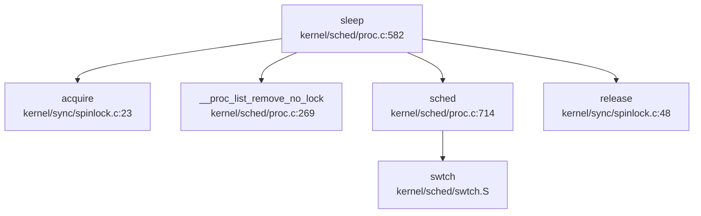
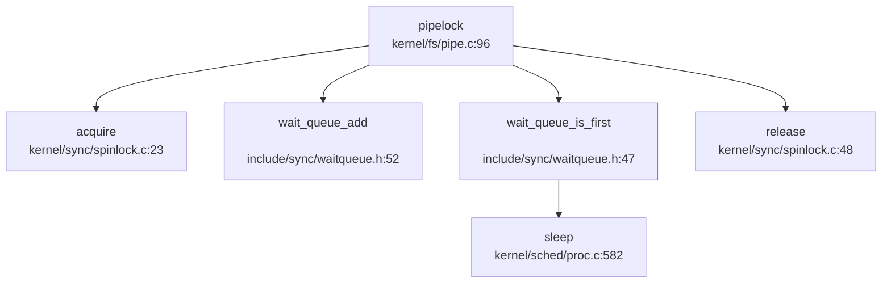

### 同步与互斥原语（锁与原子操作）

本仓库实现了两种核心锁机制：**SpinLock（自旋锁）** 和 **SleepLock（睡眠锁）**，均基于 RISC-V 架构的原子操作指令实现。

#### SpinLock 实现

**文件位置**：`include/sync/spinlock.h`、`kernel/sync/spinlock.c`

**结构体定义** (`include/sync/spinlock.h:7-13`)：
```c
struct spinlock {
    uint locked;       // Is the lock held?
    char *name;        // Name of lock.
    struct cpu *cpu;   // The cpu holding the lock.
};
```

**原子操作机制**：
- **加锁**：使用 GCC 内置函数 `__sync_lock_test_and_set()`，在 RISC-V 上编译为 `amoswap.w.aq` 原子交换指令
- **解锁**：使用 `__sync_lock_release()`，编译为 `amoswap.w zero, zero, (s1)`
- **内存屏障**：`__sync_synchronize()` 发射 `fence` 指令防止指令重排序

**acquire() 实现** (`kernel/sync/spinlock.c:23-45`)：
```c
void acquire(struct spinlock *lk)
{
    push_off(); // disable interrupts to avoid deadlock.
    
    // On RISC-V, sync_lock_test_and_set turns into an atomic swap:
    while(__sync_lock_test_and_set(&lk->locked, 1) != 0)
        ;
    
    __sync_synchronize();  // memory fence
    lk->cpu = mycpu();
}
```

**✅ 已实现**：完整的自旋锁机制，包含中断禁用、原子交换、内存屏障和 CPU 追踪。

#### SleepLock 实现

**文件位置**：`include/sync/sleeplock.h`、`kernel/sync/sleeplock.c`

**结构体定义** (`include/sync/sleeplock.h:9-16`)：
```c
struct sleeplock {
    uint locked;       // Is the lock held?
    struct spinlock lk; // spinlock protecting this sleep lock
    char *name;        // Name of lock.
    int pid;           // Process holding lock
};
```

**实现原理**：
- SleepLock 内部封装了一个 SpinLock 用于保护短临界区
- 当锁被占用时，调用 `sleep()` 将当前进程挂起到等待队列，而非忙等待
- 适用于持有时间较长的临界区（如文件系统 inode 锁）

**acquiresleep() 实现** (`kernel/sync/sleeplock.c:20-31`)：
```c
void acquiresleep(struct sleeplock *lk)
{
    acquire(&lk->lk);
    while (lk->locked) {
        sleep(lk, &lk->lk);  // 挂起进程
    }
    lk->locked = 1;
    lk->pid = myproc()->pid;
    release(&lk->lk);
}
```

**✅ 已实现**：完整的睡眠锁机制，支持进程挂起/唤醒。

#### 原子操作总结

| 操作类型 | 实现方式 | 文件位置 |
|---------|---------|---------|
| 原子测试并设置 | `__sync_lock_test_and_set()` → `amoswap.w.aq` | `kernel/sync/spinlock.c:34` |
| 原子释放 | `__sync_lock_release()` → `amoswap.w` | `kernel/sync/spinlock.c:71` |
| 内存屏障 | `__sync_synchronize()` → `fence` | `kernel/sync/spinlock.c:40` |
| 中断禁用/启用 | `push_off()` / `pop_off()` | `include/intr.h` |

**未发现** 自定义汇编实现的原子操作（如 `ldxr/stxr` 或 `lock xchg`），全部使用 GCC 内置函数。

### 等待队列实现机制

**文件位置**：`include/sync/waitqueue.h`

**核心数据结构**：
```c
struct wait_queue {
    struct spinlock lock;
    struct d_list head;  // 双向链表头
};

struct wait_node {
    void *chan;          // 等待通道标识
    struct d_list list;  // 链表节点
};
```

**工作原理**：
1. **入队**：`wait_queue_add()` 将节点添加到链表尾部（无需锁）
2. **检查优先级**：`wait_queue_is_first()` 判断是否为队列首节点
3. **睡眠**：若非首节点，调用 `sleep(chan, &lock)` 挂起
4. **唤醒**：`wakeup(chan)` 遍历队列唤醒匹配 `chan` 的进程

**关键函数** (`include/sync/waitqueue.h:33-75`)：
```c
static inline void wait_queue_init(struct wait_queue *wq, char *str) {
    initlock(&wq->lock, str);
    dlist_init(&wq->head);
}

static inline int wait_queue_is_first(struct wait_queue *wq, struct wait_node *node) {
    return wq->head.next == &node->list;
}

static inline void wait_queue_add(struct wait_queue *wq, struct wait_node *node) {
    dlist_add_before(&wq->head, &node->list);
}
```

#### sleep() / wakeup() 实现

**文件位置**：`kernel/sched/proc.c`

**sleep() 调用链**（通过 `lsp_get_call_graph` 分析）：


**wakeup() 实现** (`kernel/sched/proc.c:392-400`)：
```c
void wakeup(void *chan) {
    __enter_proc_cs 
    int flag = __wakeup_no_lock(chan);  // 遍历运行队列唤醒匹配进程
    
    // 发送 IPI 通知其他 CPU
    int id = 0 == cpuid() ? 1 : 0;
    int avail = NULL == cpus[id].proc;
    __leave_proc_cs
    
    if (flag && avail) {
        sbi_send_ipi(1 << id, 0);
    }
}
```

**✅ 已实现**：完整的等待队列机制，支持多 CPU IPI 唤醒优化。

### 进程间通信（Pipe/MsgQueue/Sem）

#### 管道（Pipe）实现

**文件位置**：`include/fs/pipe.h`、`kernel/fs/pipe.c`

**✅ 已实现**：完整的管道机制，使用**环形缓冲区 + 等待队列**实现。

**结构体定义** (`include/fs/pipe.h:12-26`)：
```c
struct pipe {
    struct spinlock     lock;
    struct wait_queue   wqueue;  // 写等待队列
    struct wait_queue   rqueue;  // 读等待队列
    uint    nread;               // 已读字节数
    uint    nwrite;              // 已写字节数
    uint8   readopen;            // 读端是否打开
    uint8   writeopen;           // 写端是否打开
    uint8   writing;             // 是否有写者正在写入
    uint8   size_shift;          // 缓冲区大小扩展倍数
    char    *pdata;              // 动态扩展的数据区指针
    char    data[PIPE_SIZE];     // 默认 512 字节环形缓冲区
};
```

**环形缓冲区机制**：
- 使用 `nread % PIPESIZE(pi)` 和 `nwrite % PIPESIZE(pi)` 实现环形索引
- 默认大小 512 字节，支持动态扩展至 16KB（`size_shift=5` 时）
- 通过 `nwrite - nread` 计算可用数据量

**pipelock() 调用链**（基于 `lsp_get_call_graph` 分析）：


**读写流程**：
1. **写阻塞**：当 `nwrite - nread == PIPESIZE(pi)` 时，写者进入 `wqueue` 睡眠
2. **读阻塞**：当 `nwrite - nread == 0` 时，读者进入 `rqueue` 睡眠
3. **唤醒策略**：`pipewakeup()` 唤醒队列首节点，实现 FIFO 顺序

**sys_pipe 系统调用** (`kernel/syscall/sysfile.c:318-355`)：
```c
uint64 sys_pipe(void)
{
    uint64 fdarray;
    struct file *rf, *wf;
    int fd0, fd1, flags;
    
    if(argaddr(0, &fdarray) < 0 || argint(1, &flags) < 0)
        return -1;
    
    if(pipealloc(&rf, &wf) < 0)  // 分配 pipe 结构和两个 file 描述符
        return -ENOMEM;
    
    fd0 = fdalloc(rf, 0);
    fd1 = fdalloc(wf, 0);
    
    copyout2(fdarray, (char*)&fd0, sizeof(fd0));
    copyout2(fdarray+sizeof(fd0), (char *)&fd1, sizeof(fd1));
    return 0;
}
```

**✅ 已实现**：完整的管道系统调用，支持 `pipe2()` 带标志创建。

#### 消息队列（MessageQueue）

**搜索结果**：
- `grep "sys_msgget|msgget|msgsnd|msgrcv"` 仅在 `include/resource.h` 中找到 `ru_msgsnd`/`ru_msgrcv` 统计字段
- **未发现** 任何消息队列系统调用实现

**❌ 未实现**：消息队列 IPC 机制完全缺失。

#### 信号量（Semaphore）

**搜索结果**：
- `grep "sys_semget|semget|semop|semctl"` 无匹配结果
- **未发现** 任何信号量相关结构体或系统调用

**❌ 未实现**：System V 信号量机制完全缺失。

#### 共享内存（SharedMem）

**搜索结果**：
- `grep "sys_shmget|shmget|shmat|shmdt"` 无匹配结果
- 内存管理章节中未发现 `SharedMemoryManager` 或类似结构

**❌ 未实现**：共享内存 IPC 机制完全缺失。

#### 信号（Signal）作为 IPC

**文件位置**：`kernel/sched/signal.c`、`kernel/trap/trap.c`

**✅ 已实现**：完整的信号机制，支持进程间信号发送。

**sys_kill 系统调用** (`kernel/syscall/syssignal.c:134-141`)：
```c
uint64 sys_kill(void) {
    int pid, sig;
    argint(0, &pid);
    argint(1, &sig);
    return kill(pid, sig);  // 调用内核 kill() 函数
}
```

**kill() 实现** (`kernel/sched/proc.c:541` 附近）：
- 查找目标进程并设置 `sig_pending` 位图
- 若目标进程未被杀死，设置 `p->killed = sig` 触发信号处理

**信号处理时机**：
在 `usertrap()` 中，系统调用返回用户态前检查 `p->killed`：

```c
// kernel/trap/trap.c:115-120
if (p->killed) {
    if (SIGTERM == p->killed)
        exit(-1);
    __debug_info("usertrap", "enter handler\n");
    sighandle();  // 进入信号处理
}
usertrapret();  // 返回用户态
```

**sighandle() 流程** (`kernel/sched/signal.c:174-230`)：
1. 从 `sig_pending` 位图中提取待处理信号
2. 查找注册的 `sigaction` 处理函数
3. 分配 `sig_frame` 保存当前 trapframe
4. 修改 `p->trapframe` 跳转到信号处理函数
5. 信号处理完成后通过 `sigreturn()` 恢复上下文

**信号作为 IPC 的分类**：
- **✅ 已实现**：`kill()` 系统调用支持向任意进程发送信号
- **✅ 已实现**：信号处理函数注册（`sigaction`）
- **✅ 已实现**：信号掩码（`sigprocmask`）
- **✅ 已实现**：实时信号处理（通过位图支持 64 种信号）

#### Futex

**搜索结果**：`grep "sys_futex|futex_wait|futex_wake"` 无匹配结果

**❌ 未实现**：Futex 快速用户空间互斥锁机制缺失。

### 关键代码片段

#### 1. SpinLock 原子加锁 (`kernel/sync/spinlock.c:23-45`)
```c
void acquire(struct spinlock *lk)
{
    push_off(); // disable interrupts to avoid deadlock.
    
    // On RISC-V, sync_lock_test_and_set turns into an atomic swap:
    //   a5 = 1
    //   s1 = &lk->locked
    //   amoswap.w.aq a5, a5, (s1)
    while(__sync_lock_test_and_set(&lk->locked, 1) != 0)
        ;
    
    // Tell the C compiler and the processor to not move loads or stores
    // past this point, to ensure that the critical section's memory
    // references happen strictly after the lock is acquired.
    // On RISC-V, this emits a fence instruction.
    __sync_synchronize();
    
    lk->cpu = mycpu();
}
```

#### 2. Pipe 环形缓冲区读写 (`kernel/fs/pipe.c:240-299`)
```c
int pipewrite(struct pipe *pi, uint64 addr, int n)
{
    struct wait_node wait;
    wait.chan = &wait;
    pipelock(pi, &wait, PIPE_WRITER);  // 阻塞其他写者
    
    char *const pipebound = pi->pdata + PIPESIZE(pi);
    for (i = 0; i < n;) {
        if ((m = pipewritable(pi)) < 0) {  // 检查空间
            i = m;
            goto out;
        }
        // 环形缓冲区写入
        char *paddr = pi->pdata + pi->nwrite % PIPESIZE(pi);
        copyin_nocheck(paddr, addr + i, count);
        pi->nwrite += count;
    }
    pipewakeup(pi, PIPE_READER);  // 唤醒读者
    pipeunlock(pi, &wait, PIPE_WRITER);
    return i;
}
```

#### 3. 信号处理入口 (`kernel/trap/trap.c:115-120`)
```c
if (p->killed) {
    if (SIGTERM == p->killed)
        exit(-1);
    sighandle();  // 在 Trap 返回用户态前处理信号
}
usertrapret();
```

### 未实现/桩函数功能列表

| 功能类别 | 具体功能 | 状态 | 说明 |
|---------|---------|------|------|
| **IPC 机制** | 消息队列 (msgget/msgsnd/msgrcv) | ❌ 未实现 | 仅 `resource.h` 中有统计字段 |
| **IPC 机制** | 信号量 (semget/semop/semctl) | ❌ 未实现 | 完全缺失 |
| **IPC 机制** | 共享内存 (shmget/shmat/shmdt) | ❌ 未实现 | 完全缺失 |
| **IPC 机制** | Futex | ❌ 未实现 | 完全缺失 |
| **锁机制** | RwLock (读写锁) | ❌ 未实现 | 仅 SpinLock/SleepLock |
| **锁机制** | Mutex (基于 futex 的用户态互斥锁) | ❌ 未实现 | 仅内核态锁 |
| **同步原语** | Condition Variable | ❌ 未实现 | 可通过 wait_queue 模拟但未封装 |
| **信号扩展** | 实时信号 (SIGRTMIN-SIGRTMAX) | 🔸 桩函数 | 位图支持但无特殊处理逻辑 |

**总结**：
- **✅ 已实现**：SpinLock、SleepLock、WaitQueue、Pipe、Signal（含 kill/sigaction）
- **❌ 未实现**：System V IPC（消息队列/信号量/共享内存）、Futex、RwLock
- 本仓库的同步机制聚焦于内核态原语，用户态同步（如 pthread_mutex）需基于现有信号量或 futex 实现，但后者尚未提供。