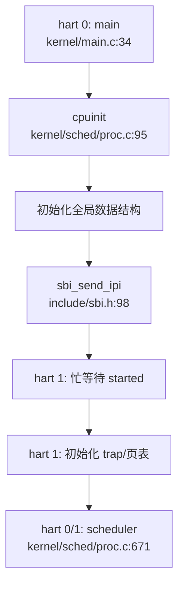

## 第 9 章：多核支持与并行机制

### 多核架构设计（SMP/AMP）

**结论：❌ 未实现真正的多核支持，仅支持单核运行。**

虽然代码中存在多核相关的宏定义和接口框架，但经过深入分析，该仓库**并未真正实现 SMP（对称多处理）架构**。以下是详细证据：

#### 1. 多核宏定义存在但无实质实现

在 `include/param.h:5` 中定义了：
```c
#define NCPU    2  // maximum number of CPUs
```

这表明设计目标是支持最多 2 个 CPU（hart）。在 `kernel/sched/proc.c:94` 中定义了全局 CPU 数组：
```c
struct cpu cpus[NCPU];
```

#### 2. Per-CPU 数据结构

在 `include/sched/proc.h:158-163` 中定义了 `struct cpu`：
```c
struct cpu {
    struct proc *proc;      // The process running on this cpu, or NULL 
    struct context context; // swtch() here to enter scheduler() 
    int noff;               // Depth of push_off() nesting 
    int intena;             // Were interrupts enabled before push_off()?
}
```

该结构体包含：
- `proc`：当前在该 CPU 上运行的进程指针
- `context`：用于上下文切换的内核上下文
- `noff` / `intena`：中断禁用嵌套计数器和中断使能状态

通过 `mycpu()` 函数（`kernel/sched/proc.c:98-101`）获取当前 CPU 结构：
```c
struct cpu *mycpu(void) {
    int id = cpuid();
    return &cpus[id];
}
```

其中 `cpuid()` 通过读取 `tp` 寄存器（线程指针）获取当前 hart ID：
```c
static inline int cpuid(void) {
    return r_tp();
}
```

#### 3. 关键缺陷：无 Secondary CPU 启动代码

**核心问题**：在 `kernel/main.c:66-73` 中，hart 0 尝试通过 IPI 唤醒其他 hart：
```c
// we need IPI to wake up other hart(s)
for (int i = 1; i < NCPU; i ++) {
    unsigned long mask = 1 << i;
    // struct sbiret res = sbi_send_ipi(mask, 0);
    sbi_send_ipi(mask, 0);
    __debug_assert("main", SBI_SUCCESS == res.error, "sbi_send_ipi failed");
}
```

但存在以下问题：
1. **代码被注释掉**：`struct sbiret res = sbi_send_ipi(mask, 0);` 被注释，导致 `res` 未定义，但后续仍引用 `res.error`，这是明显的代码错误。
2. **无 `start_secondary` 入口**：搜索全库未发现 `smp_boot`、`__cpu_up`、`start_secondary` 等关键函数。
3. **hart 1 仅自旋等待**：在 `kernel/main.c:76-83` 中，hart 1 仅通过忙等待检查 `started` 标志：
   ```c
   else {
       // hart 1
       while (started == 0)
           ;
       __sync_synchronize();
       floatinithart();
       kvminithart();
       trapinithart();
       printf("hart 1 init done\n");
   }
   ```
   这表明 hart 1 确实能运行，但**没有独立的启动代码**，只是重复 hart 0 的部分初始化后进入 `scheduler()`。

#### 4. Bootloader 层面的多核支持

在 `bootloader/SBI/rustsbi-k210/src/main.rs:79-267` 中，RustSBI 实现了多核启动框架：
- 通过设备树解析 CPU 数量（`count_harts` 函数）
- 为每个 hart 分配独立栈空间
- 在 `main.rs:159-167` 中实现了 `send_ipi_many`：
  ```rust
  fn send_ipi_many(&mut self, hart_mask: rustsbi::HartMask) {
      use k210_hal::clint::msip;
      for i in 0..=1 {
          if hart_mask.has_bit(i) {
              msip::set_ipi(i);
              msip::clear_ipi(i);
          }
      }
  }
  ```

但**内核侧未正确利用此机制**。

---

### Secondary CPU 启动流程

**结论：🔸 桩函数 / 不完整实现**

#### 1. 预期的启动流程（基于代码推断）

根据 `kernel/main.c` 的结构，预期的 SMP 启动流程应为：



#### 2. 实际问题分析

1. **IPI 发送代码有 bug**：
   - `kernel/main.c:68` 行 `sbi_send_ipi(mask, 0);` 前一行被注释，导致 `res` 未定义
   - 但 `__debug_assert` 仍引用 `res.error`，编译时会报错

2. **无 Secondary CPU 入口点**：
   - 未找到 `start_secondary()` 或类似函数
   - hart 1 直接复用 `main()` 函数的 `else` 分支
   - 没有独立的 CPU 初始化序列

3. **Hart 1 初始化不完整**：
   - hart 1 跳过了关键初始化：`procinit()`、`plicinit()`、`userinit()` 等
   - 这意味着 hart 1 无法独立调度进程

**证据引用**：
- `kernel/main.c:34-98`：主启动代码
- `include/sbi.h:98-103`：IPI 发送接口定义

---

### 核间通信与 IPI 机制

**结论：🔸 接口存在但使用受限**

#### 1. IPI 接口定义

在 `include/sbi.h:96-103` 中定义了 SBI IPI 扩展：
```c
#define IPI_EID         0x735049
#define IPI_SEND_IPI    0

static inline struct sbiret sbi_send_ipi(
    unsigned long hart_mask, 
    unsigned long hart_mask_base
) {
    return SBI_CALL_2(IPI_EID, IPI_SEND_IPI, hart_mask, hart_mask_base);
}
```

#### 2. IPI 使用场景

**场景 1：启动时唤醒其他 hart**
- `kernel/main.c:66-73`：hart 0 发送 IPI 给 hart 1（但代码有 bug）

**场景 2：wakeup() 通知其他 CPU**
- `kernel/sched/proc.c:397-403`：
  ```c
  void wakeup(void *chan) {
      __enter_proc_cs 
      int flag = __wakeup_no_lock(chan);

      int id = 0 == cpuid() ? 1 : 0;
      int avail = NULL == cpus[id].proc;
      __leave_proc_cs

      if (flag && avail) {
          sbi_send_ipi(1 << id, 0);
      }
  }
  ```
  当进程状态改变时，向另一个 CPU 发送 IPI 通知其检查可运行进程。

**场景 3：中断处理中广播 IPI（已注释）**
- `kernel/trap/trap.c:307-313`：
  ```c
  // for (int i = 0; i < NCPU; i ++) {
  //     if (cpuid() != i) {
  //         sbi_send_ipi(1 << i, 0);
  //     }
  // }
  ```
  该代码被注释，说明多核中断广播功能**未实现**。

#### 3. IPI 处理

在 `kernel/trap/trap.c:246-325` 的 `handle_intr()` 中处理软件中断（IPI）：
```c
else if (INTR_SOFTWARE == scause) {     // the real software interrupt
    sbi_clear_ipi();
    return 0;
}
```

**关键问题**：
- IPI 处理仅清除 pending 位，**无实际业务逻辑**
- 未实现 IPI 消息队列或回调机制
- 注释中提到："on k210 software interrupts may be used for IPI, but as it is not yet supported, handle this as an unsupported one"

---

### Per-CPU 变量与数据结构

**结论：✅ 已实现基础 Per-CPU 机制**

#### 1. Per-CPU 数据结构

`struct cpu`（`include/sched/proc.h:158-163`）是核心 Per-CPU 结构：

| 字段 | 类型 | 用途 |
|------|------|------|
| `proc` | `struct proc *` | 当前在该 CPU 上运行的进程 |
| `context` | `struct context` | 内核调度上下文 |
| `noff` | `int` | `push_off()` 嵌套深度 |
| `intena` | `int` | 中断使能状态备份 |

#### 2. Per-CPU 访问方式

通过 `tp` 寄存器（线程指针）获取当前 CPU ID：
```c
static inline int cpuid(void) {
    return r_tp();
}
```

`mycpu()` 返回当前 CPU 结构指针：
```c
struct cpu *mycpu(void) {
    int id = cpuid();
    return &cpus[id];
}
```

**注意**：代码中**未见 `tp` 寄存器的初始化代码**。在真正的 SMP 系统中，每个 hart 启动时需要设置其 `tp` 寄存器指向对应的 `struct cpu` 实例。

#### 3. 中断禁用与 Per-CPU 安全

`push_off()` / `pop_off()` 机制（`kernel/intr.c:12-40`）：
```c
void push_off(void) {
    int old = intr_get();
    intr_off();
    struct cpu *c = mycpu();
    if (c->noff == 0)
        c->intena = old;
    c->noff += 1;
}

void pop_off(void) {
    struct cpu *c = mycpu();
    c->noff -= 1;
    if(c->noff == 0 && c->intena)
        intr_on();
}
```

**特性**：
- ✅ 禁用中断保护 Per-CPU 数据
- ✅ 支持嵌套调用（通过 `noff` 计数器）
- ✅ 恢复原始中断状态

---

### 多核调度策略

**结论：❌ 未实现多核调度**

#### 1. 调度器实现

`kernel/sched/proc.c:671-711` 中的 `scheduler()` 函数：
```c
void scheduler(void) {
    struct proc *tmp;
    struct cpu *c = mycpu();

    while (1) {
        int found = 0;
        intr_on();
        __enter_proc_cs 
        tmp = __get_runnable_no_lock();
        if (NULL != tmp) {
            tmp->state = RUNNING;
            c->proc = tmp;
            w_satp(MAKE_SATP(tmp->pagetable));
            sfence_vma();
            swtch(&c->context, &tmp->context);
            w_satp(MAKE_SATP(kernel_pagetable));
            sfence_vma();
            // ...
            found = 1;
        }
        c->proc = NULL;
        __leave_proc_cs
        if (!found) {
            intr_on();
            asm volatile("wfi");
        }
    } 
}
```

**关键问题**：
1. **全局唯一运行队列**：`__get_runnable_no_lock()` 从全局 `proc_runnable[]` 数组获取进程
2. **无负载均衡**：所有 CPU 竞争同一个全局队列
3. **无 CPU 亲和性**：进程可在任意 CPU 上运行，无绑定机制
4. **无锁保护**：`__enter_proc_cs` 使用 `proc_lock`，但多核并发访问时可能存在竞态

#### 2. 进程状态管理

在 `include/sched/proc.h:70-120` 中，`struct proc` 包含调度相关字段：
- `sched_next` / `sched_pprev`：全局运行队列链表
- `state`：进程状态（RUNNABLE/RUNNING/SLEEPING/ZOMBIE）
- `timer`：时间片计数器

**未发现**：
- 每 CPU 运行队列
- 负载均衡算法
- CPU 亲和性掩码

---

### 锁的实现

**结论：✅ 已实现自旋锁，但无优先级继承**

#### 1. SpinLock 实现

`kernel/sync/spinlock.c:22-45`：
```c
void acquire(struct spinlock *lk) {
    push_off(); // disable interrupts to avoid deadlock.
    while(__sync_lock_test_and_set(&lk->locked, 1) != 0)
        ;
    __sync_synchronize();
    lk->cpu = mycpu();
}

void release(struct spinlock *lk) {
    lk->cpu = 0;
    __sync_synchronize();
    __sync_lock_release(&lk->locked);
    pop_off();
}
```

**特性**：
- ✅ 使用 `__sync_lock_test_and_set` 实现原子获取
- ✅ **禁用中断**（通过 `push_off()`）防止死锁
- ✅ 记录持有锁的 CPU（`lk->cpu`）用于调试
- ✅ 使用内存屏障（`__sync_synchronize()`）保证顺序

**限制**：
- ❌ **无优先级继承**：未实现优先级继承协议，可能存在优先级反转问题
- ❌ **无自适应旋转**：固定自旋，无退避策略

#### 2. 原子操作

代码中使用 GCC 内置原子函数：
- `__sync_lock_test_and_set()`：原子交换
- `__sync_lock_release()`：原子释放
- `__sync_synchronize()`：内存屏障

**未发现**：
- C11 `stdatomic.h` 或 Rust `core::sync::atomic` 的使用
- 显式内存序指定（如 `memory_order_acquire`）

---

### 关键代码片段

#### 1. CPU 初始化（`kernel/sched/proc.c:94-101`）
```c
struct cpu cpus[NCPU];
void cpuinit(void) {
    memset(cpus, 0, sizeof(cpus));
}
struct cpu *mycpu(void) {
    int id = cpuid();
    return &cpus[id];
}
```

#### 2. Hart 0 启动其他 CPU（`kernel/main.c:66-73`）
```c
// we need IPI to wake up other hart(s)
for (int i = 1; i < NCPU; i ++) {
    unsigned long mask = 1 << i;
    // struct sbiret res = sbi_send_ipi(mask, 0);
    sbi_send_ipi(mask, 0);
    __debug_assert("main", SBI_SUCCESS == res.error, "sbi_send_ipi failed");
}
__sync_synchronize();
started = 1;
```

#### 3. Wakeup 发送 IPI（`kernel/sched/proc.c:397-403`）
```c
void wakeup(void *chan) {
    __enter_proc_cs 
    int flag = __wakeup_no_lock(chan);

    int id = 0 == cpuid() ? 1 : 0;
    int avail = NULL == cpus[id].proc;
    __leave_proc_cs

    if (flag && avail) {
        sbi_send_ipi(1 << id, 0);
    }
}
```

#### 4. 自旋锁获取（`kernel/sync/spinlock.c:22-45`）
```c
void acquire(struct spinlock *lk) {
    push_off(); // disable interrupts to avoid deadlock.
    while(__sync_lock_test_and_set(&lk->locked, 1) != 0)
        ;
    __sync_synchronize();
    lk->cpu = mycpu();
}
```

---

### 与前面章节的交叉引用

#### 1. 进程调度中的 PID 分配（第 4 章）

在 `kernel/sched/proc.c:32-40` 中，PID 分配使用全局变量 `__pid`：
```c
int __pid;
// ...
p->pid = __pid++;
```

**多核安全问题**：
- ❌ **未使用原子操作**：`__pid++` 不是原子操作，多核并发时会导致 PID 冲突
- 建议：使用 `__sync_fetch_and_add(&__pid, 1)` 或 `AtomicUsize`

#### 2. 双级注册机制（第 4 章）

进程注册到全局哈希表（`pid_hash[]`）和运行队列（`proc_runnable[]`）：
- 使用 `hash_lock` 和 `proc_lock` 保护
- ✅ 锁实现中禁用了中断，可防止单核内的竞态
- ❌ 但多核并发访问时，锁的持有者检查（`holding()`）可能失效

#### 3. Futex 实现

**搜索结果**：`grep_in_repo` 未发现 `futex`、`FUTEX`、`futex_wait`、`futex_wake` 相关代码。

**结论**：❌ **未实现 Futex**。多核场景下的用户态同步原语缺失。

#### 4. 原子操作与内存序

代码中使用了 GCC 内置原子函数：
- `__sync_lock_test_and_set()`：隐含 `acquire` 语义
- `__sync_synchronize()`：全内存屏障

**未发现**：
- Rust `core::sync::atomic` 模块的使用
- 显式内存序指定（如 `memory_order_relaxed`）

---

### 总结

| 功能 | 实现状态 | 说明 |
|------|---------|------|
| SMP 架构 | ❌ 未实现 | 仅有宏定义，无实质多核调度 |
| Secondary CPU 启动 | 🔸 桩函数 | Hart 1 可运行但无独立启动代码 |
| IPI 发送 | ✅ 已实现 | SBI 接口可用，但使用受限 |
| IPI 处理 | 🔸 不完整 | 仅清除 pending 位，无业务逻辑 |
| Per-CPU 变量 | ✅ 已实现 | 通过 `tp` 寄存器访问 |
| 多核调度 | ❌ 未实现 | 全局唯一队列，无负载均衡 |
| SpinLock | ✅ 已实现 | 禁用中断，无优先级继承 |
| Futex | ❌ 未实现 | 未发现相关代码 |
| 原子 PID 分配 | ❌ 未实现 | `__pid++` 非原子操作 |

**最终结论**：xv6-k210 **仅支持单核运行**。虽然代码中存在多核相关的框架和接口，但 Secondary CPU 启动、多核调度、IPI 处理等关键功能均未完整实现。Hart 1 虽能通过忙等待启动并进入调度器，但缺乏独立的初始化序列和多核安全的并发控制机制。