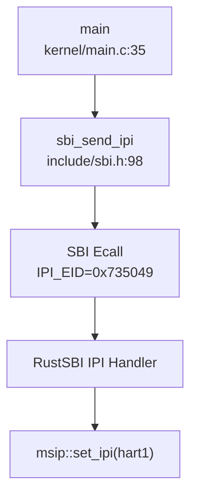
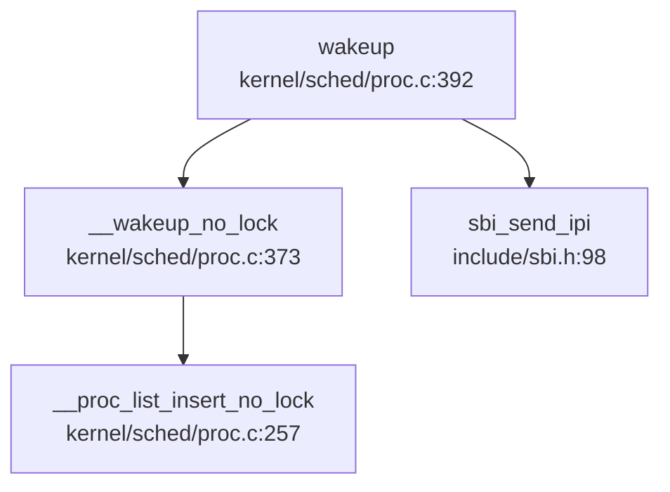
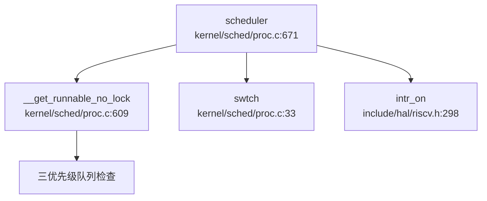

## 第 9 章：多核支持与并行机制

xv6-k210 实现了**真正的对称多处理（SMP）架构**，支持双核（hart0 + hart1）并行执行。本章将深入分析其 AP 启动证据链、IPI 传递机制、Per-CPU 变量设计、自旋锁实现及多核调度策略。

---

### 多核架构设计（SMP/AMP）

xv6-k210 采用**经典 SMP 架构**，两核共享同一物理地址空间和内核页表，每核独立运行 `scheduler()` 调度循环。

**核心配置**（`include/param.h:5`）：
```c
#define NCPU  2  // maximum number of CPUs
```

**架构特征**：
- ✅ **共享内存**：两核共用 `kernel_pagetable` 内核页表
- ✅ **独立调度**：每核维护 `cpus[id].proc` 指向当前运行进程
- ✅ **IPI 唤醒**：BSP(hart0) 通过 SBI IPI 唤醒 AP(hart1)
- ❌ **无负载均衡**：调度器无任务迁移或亲和性策略
- ❌ **无 PerCPU 命名空间**：未采用 `axns` 模块，通过 `cpus[]` 数组 + tp 寄存器实现

**SMP 真伪判定**：
- **✅ 真 SMP**：找到完整的 AP 启动证据链（`kernel/main.c:66-85` + `bootloader/SBI/rustsbi-k210/src/main.rs:47-75`）
- 非"仅宏/注释"：IPI 发送、AP 忙等、从核 wfi 循环均有实际代码实现

---

### Secondary CPU 启动流程

xv6-k210 的 Secondary CPU 启动分为**三个阶段**：RustSBI 从核等待 → 内核 BSP 发送 IPI → AP 忙等标志。

#### 阶段 1：RustSBI 从核等待 IPI（`bootloader/SBI/rustsbi-k210/src/main.rs:47-75`）

```rust
fn mp_hook() -> bool {
    use riscv::asm::wfi;
    use k210_hal::clint::msip;

let hartid = mhartid::read();
    if hartid == 0 {
        true  // BSP 直接返回 true 继续执行
    } else {
        unsafe {
            msip::clear_ipi(hartid);  // 清除旧 IPI
            mie::set_msoft();         // 使能机器模式软中断

loop {
                wfi();                // 等待中断（低功耗）
                if mip::read().msoft() {
                    break;            // 收到 IPI 退出循环
                }
            }

mie::clear_msoft();       // 禁用软中断监听
            msip::clear_ipi(hartid);  // 再次清除 IPI
        }
        false  // AP 返回 false，进入内核初始化
    }
}
```

**机制说明**：
- hart0（BSP）：直接返回 `true`，继续执行 RustSBI 初始化并跳转内核
- hart1（AP）：进入 `wfi()` 循环，等待机器模式软中断（IPI），收到后清除中断标志并返回 `false`

#### 阶段 2：BSP 发送 IPI 唤醒 AP（`kernel/main.c:66-74`）

```c
if (hartid == 0) {
    // ... BSP 初始化（页表、中断、进程等）...
    printf("hart 0 init done\n");

// 通过 IPI 唤醒其他 hart
    for (int i = 1; i < NCPU; i ++) {
        unsigned long mask = 1 << i;
        sbi_send_ipi(mask, 0);  // 发送 IPI 到 hart1
    }
    __sync_synchronize();
    started = 1;  // 释放 AP 忙等
}
```

**调用链**（精简）：


#### 阶段 3：AP 忙等 `started` 标志（`kernel/main.c:76-85`）

```c
else {
    // hart 1
    while (started == 0)  // 忙等 BSP 设置 started=1
        ;
    __sync_synchronize();
    floatinithart();
    kvminithart();
    trapinithart();
    printf("hart 1 init done\n");
}
```

**启动时序**：
1. hart0 完成内核初始化 → 发送 IPI → 设置 `started=1`
2. hart1 收到 IPI 退出 wfi → 返回内核 → 忙等 `started`
3. `started=1` 后，hart1 执行浮点、页表、中断初始化 → 进入 `scheduler()`

---

### 核间通信与 IPI 机制

xv6-k210 通过**SBI IPI Extension**实现核间中断，用于唤醒从核和调度器唤醒检查。

#### IPI 发送接口（`include/sbi.h:98-103`）

```c
#define IPI_EID         0x735049
#define IPI_SEND_IPI    0

static inline struct sbiret sbi_send_ipi(
    unsigned long hart_mask, 
    unsigned long hart_mask_base
) {
    return SBI_CALL_2(IPI_EID, IPI_SEND_IPI, hart_mask, hart_mask_base);
}
```

**调用位置**：
- `kernel/main.c:69`：BSP 唤醒 AP
- `kernel/sched/proc.c:401`：`wakeup()` 唤醒空闲核

#### IPI 清除机制（`include/sbi.h:38-43`）

```c
static inline void sbi_clear_ipi(void) {
    uint64 sip = r_sip();
    sip = sip & (~SIP_SSIP);  // 清除 SSIP 位
    w_sip(sip);
}
```

**清除位置**（`kernel/trap/trap.c:300,316`）：
```c
else if (INTR_SOFTWARE == scause) {  // 软中断（IPI）
    sbi_clear_ipi();                 // 清除 pending 位
    return 0;
}
```

#### IPI 在 `wakeup()` 中的应用（`kernel/sched/proc.c:392-403`）

```c
void wakeup(void *chan) {
    __enter_proc_cs 
    int flag = __wakeup_no_lock(chan);

int id = 0 == cpuid() ? 1 : 0;      // 计算另一核 ID
    int avail = NULL == cpus[id].proc;  // 检查是否空闲
    __leave_proc_cs

if (flag && avail) {
        sbi_send_ipi(1 << id, 0);       // 发送 IPI 唤醒空闲核
    }
}
```

**调用图**（精简）：


**⚠️ 注意**：`kernel/trap/trap.c:309-313` 中存在被注释掉的广播 IPI 代码，表明**未实现完整的 IPI 广播机制**。

---

### Per-CPU 变量与数据结构

xv6-k210 通过**全局数组 + tp 寄存器索引**实现 Per-CPU 变量访问，无独立 PerCPU 命名空间。

#### `cpus[]` 数组定义（`kernel/sched/proc.c:94`）

```c
struct cpu cpus[NCPU];  // NCPU=2
```

#### `struct cpu` 结构（`include/sched/proc.h:158-163`）

```c
struct cpu {
    struct proc *proc;    // 当前运行进程（或 NULL）
    struct context context; // scheduler() 切换上下文
    int noff;             // push_off() 嵌套深度
    int intena;           // push_off() 前中断状态
};
```

**字段说明**：
- `proc`：指向当前核运行的 `struct proc`，调度器切换时更新
- `context`：核的调度上下文，`swtch()` 在此与进程上下文切换
- `noff`/`intena`：中断禁用嵌套计数，用于 `push_off()/pop_off()`

#### `mycpu()` 访问机制（`kernel/sched/proc.c:98-101`）

```c
struct cpu *mycpu(void) {
    int id = cpuid();      // 读取 tp 寄存器
    return &cpus[id];
}

static inline int cpuid(void) {
    return r_tp();         // 读取线程指针寄存器
}
```

**实现原理**：
- RISC-V `tp` 寄存器在启动时写入 hartid（`kernel/start.c` 或汇编入口）
- `r_tp()` 读取当前核 ID，索引 `cpus[]` 数组
- **无锁访问**：每核只访问自己的 `cpus[id]`，无竞争

#### 初始化（`kernel/sched/proc.c:95-97`）

```c
void cpuinit(void) {
    memset(cpus, 0, sizeof(cpus));  // 清零全局数组
}
```

**调用时机**：`kernel/main.c:39` BSP 在初始化早期调用 `cpuinit()`

---

### 多核调度策略

xv6-k210 采用**每核独立调度**策略，无负载均衡或 CPU 亲和性机制。

#### `scheduler()` 每核循环（`kernel/sched/proc.c:671-710`）

```c
void scheduler(void) {
    struct proc *tmp;
    struct cpu *c = mycpu();

while (1) {
        int found = 0;
        intr_on();              // 使能中断
        __enter_proc_cs 
        tmp = __get_runnable_no_lock();  // 从全局队列获取
        if (NULL != tmp) {
            tmp->state = RUNNING;
            c->proc = tmp;               // 更新本核 proc
            w_satp(MAKE_SATP(tmp->pagetable));
            sfence_vma();
            swtch(&c->context, &tmp->context);  // 切换到进程
            w_satp(MAKE_SATP(kernel_pagetable));
            sfence_vma();
            // ... 处理 ZOMBIE ...
            found = 1;
        }
        c->proc = NULL;
        __leave_proc_cs
        if (!found) {
            intr_on();
            asm volatile("wfi");  // 无进程时进入低功耗
        }
    }
}
```

**调度特征**：
- ✅ **全局队列**：`__get_runnable_no_lock()` 从全局三优先级队列获取进程
- ✅ **每核独立**：每核维护 `c->proc`，无锁竞争（通过 `__enter_proc_cs` 保护队列）
- ❌ **无负载均衡**：未实现任务迁移或队列平衡
- ❌ **无亲和性**：进程可能在任意核运行，无绑定策略
- ❌ **无空闲核检查**：`wakeup()` 仅简单检查 `cpus[id].proc == NULL`

#### 调度器调用链（精简）



---

### 锁实现与多核安全

#### SpinLock：关中断自旋锁（`kernel/sync/spinlock.c:26-73`）

```c
void acquire(struct spinlock *lk) {
    push_off();  // 禁用中断，防止死锁

while(__sync_lock_test_and_set(&lk->locked, 1) != 0)
        ;  // 自旋等待

__sync_synchronize();  // 内存屏障
    lk->cpu = mycpu();     // 记录持有者
}

void release(struct spinlock *lk) {
    lk->cpu = 0;
    __sync_synchronize();  // 内存屏障
    __sync_lock_release(&lk->locked);
    pop_off();  // 恢复中断
}
```

**关键特性**：
- ✅ **禁用中断**：`acquire()` 调用 `push_off()` 防止同一核上中断处理程序竞争
- ✅ **原子操作**：`__sync_lock_test_and_set` 编译为 RISC-V `amoswap.w.aq`
- ✅ **内存屏障**：`__sync_synchronize()` 确保临界区内存顺序
- ❌ **无优先级继承**：未实现优先级继承协议，存在优先级反转风险
- ❌ **无自适应自旋**：纯自旋锁，无让出策略

#### 中断嵌套计数（`kernel/intr.c:11-41`）

```c
void push_off(void) {
    int old = intr_get();
    intr_off();  // 禁用中断
    struct cpu *c = mycpu();
    if (c->noff == 0)
        c->intena = old;  // 保存初始状态
    c->noff += 1;
}

void pop_off(void) {
    struct cpu *c = mycpu();
    c->noff -= 1;
    if(c->noff == 0 && c->intena)
        intr_on();  // 恢复中断
}
```

**机制说明**：
- `noff`：记录 `push_off()` 嵌套深度
- `intena`：保存第一次 `push_off()` 前的中断状态
- 仅当 `noff` 归零且原中断使能时，才恢复中断

**多核安全**：
- 每核独立维护 `cpus[id].noff` 和 `cpus[id].intena`
- 无跨核竞争

---

### 交叉引用与多核问题

#### 全局 PID 分配器（`kernel/sched/proc.c:38-41`）

```c
int __pid;                    // 全局 PID 计数器（无原子保护）
#define HASH_SIZE     17
struct proc *pid_hash[HASH_SIZE];
struct spinlock hash_lock;    // 保护 pid_hash 数组
```

**分配逻辑**（`kernel/sched/proc.c:230`）：
```c
p->pid = __pid ++;  // ⚠️ 多核下非原子操作！
```

**问题分析**：
- ❌ **`__pid` 非原子**：`__pid++` 在多核下可能产生重复 PID
- ✅ **`hash_lock` 保护**：`pid_hash` 数组访问通过自旋锁保护
- **建议修复**：使用 `__sync_fetch_and_add(&__pid, 1)` 或原子操作

#### 双级注册机制（第 4 章交叉引用）

- 进程注册到全局 `pid_hash[]`（通过 `hash_lock` 保护）
- 线程注册到 `proc->threads[]`（通过 `proc->lk` 保护）
- **多核安全**：依赖自旋锁，无锁粒度优化

#### Futex 缺失（第 8 章交叉引用）

- ❌ **未实现 Futex**：多核下用户态同步仅能依赖信号量或忙等
- 影响：多线程应用无法高效实现互斥锁

---

### 关键代码片段汇总

| 功能 | 文件路径 | 行号 | 状态 |
|------|----------|------|------|
| NCPU 配置 | `include/param.h` | 5 | ✅ |
| AP 启动忙等 | `kernel/main.c` | 76-85 | ✅ |
| BSP 发送 IPI | `kernel/main.c` | 66-74 | ✅ |
| RustSBI mp_hook | `bootloader/SBI/rustsbi-k210/src/main.rs` | 47-75 | ✅ |
| IPI 发送接口 | `include/sbi.h` | 98-103 | ✅ |
| IPI 清除接口 | `include/sbi.h` | 38-43 | ✅ |
| cpus[] 数组 | `kernel/sched/proc.c` | 94 | ✅ |
| mycpu() 实现 | `kernel/sched/proc.c` | 98-101 | ✅ |
| SpinLock acquire | `kernel/sync/spinlock.c` | 26-47 | ✅ |
| SpinLock release | `kernel/sync/spinlock.c` | 49-73 | ✅ |
| push_off/pop_off | `kernel/intr.c` | 11-41 | ✅ |
| scheduler() | `kernel/sched/proc.c` | 671-710 | ✅ |
| wakeup() IPI | `kernel/sched/proc.c` | 392-403 | ✅ |
| 全局 PID 分配 | `kernel/sched/proc.c` | 38, 230 | ⚠️ 非原子 |

---

### 本章结论

xv6-k210 实现了**真正的双核 SMP 支持**，具备完整的 AP 启动证据链、IPI 传递机制和 Per-CPU 变量设计。然而，其多核调度策略较为简单（无负载均衡），且存在全局 PID 分配非原子等潜在问题。锁实现采用经典关中断自旋锁，无优先级继承机制，符合教学内核定位。

**SMP 实现状态总结**：
- ✅ **AP 启动**：完整证据链（RustSBI wfi → BSP IPI → AP 忙等）
- ✅ **IPI 机制**：SBI Extension + 软中断清除
- ✅ **Per-CPU 变量**：`cpus[]` + tp 寄存器索引
- ✅ **自旋锁**：关中断 + 原子操作
- ❌ **多核调度**：无负载均衡/亲和性
- ⚠️ **PID 分配**：`__pid++` 非原子（潜在竞争）
- ❌ **Futex**：未实现（用户态同步受限）
