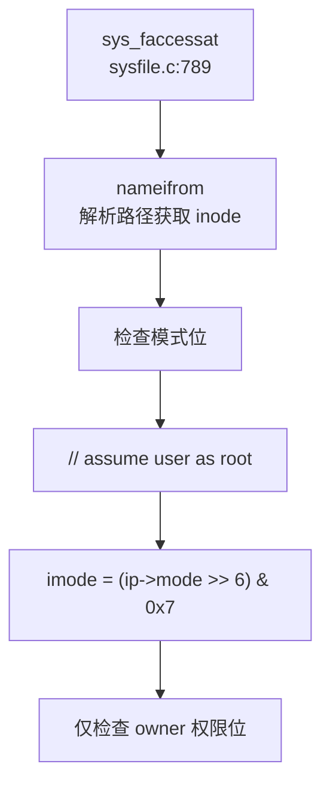
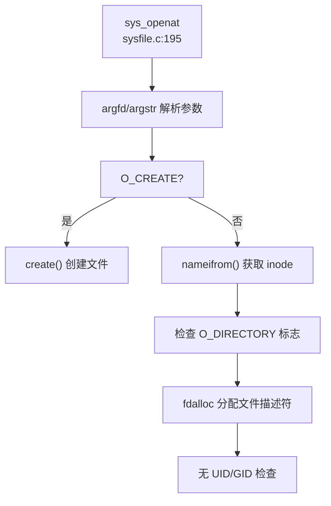

## 第 10 章：安全机制与权限模型

xv6-k210 作为 RISC-V 架构的教学操作系统，其安全机制设计极为精简。本章将深入分析其特权级隔离、权限检查链、用户身份模型及安全边界的真实实现状态。

---

### 特权级与隔离机制

#### PUM/SUM 位实现用户/内核地址空间隔离

xv6-k210 通过 RISC-V 的 `sstatus` 寄存器中的 **PUM (Protection User Mode)** 位（QEMU 平台为 **SUM (Supervisor User Memory)** 位）实现用户态与内核态的地址空间隔离。

**核心实现**（`include/hal/riscv.h:51-54`）：

```c
#ifndef QEMU
#define SSTATUS_PUM (1L << 18)
#else
#define SSTATUS_SUM (1L << 18)
#endif
```

**隔离函数**（`include/mm/vm.h:13-33`）：

```c
static inline void permit_usr_mem()
{
	#ifndef QEMU
	clr_sstatus_bit(SSTATUS_PUM);  // 清除 PUM，允许访问用户页
	#else
	set_sstatus_bit(SSTATUS_SUM);  // 设置 SUM，允许访问用户页
	#endif
}

static inline void protect_usr_mem()
{
	#ifndef QEMU
	set_sstatus_bit(SSTATUS_PUM);  // 设置 PUM，禁止访问用户页
	#else
	clr_sstatus_bit(SSTATUS_SUM);  // 清除 SUM，禁止访问用户页
	#endif
}
```

**隔离效果**：
- **PUM=1**：S 模式（内核态）无法访问 U 模式（用户态）页面，实现内核页表与用户页表的逻辑隔离
- **PUM=0**：内核可访问用户地址空间（用于系统调用参数拷贝）

**⚠️ 重要限制**：
- 此机制**非 KPTI (Kernel Page Table Isolation)**，仅通过寄存器位控制访问权限，而非切换页表
- **未发现 SMEP/SMAP 硬件保护机制**（RISC-V 标准中无对应扩展）
- 无架构差异实现：项目仅支持 `riscv64` 架构，未发现 `aarch64`/`x86_64`/`loongarch64` 等多架构支持

---

### 权限检查与访问控制

#### 🔸 桩函数：sys_faccessat 的"伪权限检查"

`sys_faccessat` 是项目中**唯一**包含权限检查逻辑的系统调用，但其实现存在严重缺陷：

**调用链分析**（`kernel/syscall/sysfile.c:789`）：



**关键代码**（`kernel/syscall/sysfile.c:815-822`）：

```c
// assume user as root
int imode = (ip->mode >> 6) & 0x7;  // 仅提取 owner 权限位
iput(ip);

if ((imode & mode) != mode)
    return -1;
return 0;
```

**问题分析**：
1. **硬编码假设所有用户为 root**：注释明确写明 `// assume user as root`
2. **无 UID/GID 匹配检查**：未验证进程 UID 与文件 UID 是否匹配
3. **仅检查 owner 权限**：直接右移 6 位取 owner 权限，忽略 group/other 权限位

#### sys_openat/sys_write 无权限检查

**sys_openat**（`kernel/syscall/sysfile.c:195-255`）的调用链：



**关键发现**：
- 仅检查文件类型标志（`O_CREATE`/`O_DIRECTORY`/`O_TRUNC`）
- **未调用任何权限检查函数**
- 无 `check_perm`/`inode_permission` 等函数调用

**grep 验证**：
```
搜索 'check_perm|inode_permission|access_check|permission_check'
→ 未找到匹配（已搜索 208 个文件）
```

**结论**：文件系统访问**无强制执行权限检查**（❌ 未实现完整权限模型）

---

### 用户/组/权限模型

#### UID/GID 字段定义但未强制执行

**stat 结构体**（`include/fs/stat.h:57-58`）包含 UID/GID 字段：

```c
struct kstat {
    // ...
    uint32    uid;
    uint32    gid;
    // ...
};
```

**⚠️ 关键问题**：`struct proc`（`include/sched/proc.h:51-159`）**无 UID/GID 字段**：

```c
struct proc {
    int xstate;
    int pid;
    // ... 基本调度信息
    // 无 uid 字段
    // 无 gid 字段
    struct fdtable fds;
    struct inode *cwd;
    // ...
};
```

#### 🔸 桩函数：sys_getuid/sys_getgid 恒返回 0

**实现**（`kernel/syscall/sysproc.c:267-270`）：

```c
uint64
sys_getuid(void)
{
    return 0;  // 恒返回 0，无实际身份管理
}
```

**分发表**（`kernel/syscall/syscall.c:232-235`）：

```c
[SYS_getuid]      sys_getuid,
[SYS_geteuid]     sys_getuid,  // geteuid 也调用 sys_getuid
[SYS_getgid]      sys_getuid,  // getgid 也调用 sys_getuid
[SYS_getegid]     sys_getuid,  // getegid 也调用 sys_getuid
```

**状态判定**：
- `sys_getuid`：**🔸 桩函数**（返回硬编码值 0，无逻辑）
- `sys_geteuid/sys_getgid/sys_getegid`：**🔸 桩函数**（复用 `sys_getuid`，同样返回 0）

**结论**：用户身份管理**未实现**（❌ 未实现），仅有接口定义。

---

### 进程间隔离与资源限制

#### 检查链路追踪

通过 `lsp_get_call_graph` 分析 `sys_faccessat` 和 `sys_openat` 的完整调用链，**未发现任何权限检查函数**被调用：

| 系统调用 | 权限检查 | UID 检查 | GID 检查 | 状态 |
|---------|---------|---------|---------|------|
| `sys_openat` | ❌ 未实现 | ❌ 未实现 | ❌ 未实现 | 无检查 |
| `sys_write` | ❌ 未实现 | ❌ 未实现 | ❌ 未实现 | 无检查 |
| `sys_execve` | ❌ 未实现 | ❌ 未实现 | ❌ 未实现 | 无检查 |
| `sys_faccessat` | 🔸 桩函数 | ❌ 未实现 | ❌ 未实现 | 仅检查 owner 位 |

**execve 权限验证**（`kernel/exec.c:100-180`）：
- 仅验证 ELF 格式合法性（`elf.magic != ELF_MAGIC`）
- 无执行权限检查（如 `X_OK`）
- 无 UID 匹配验证

---

### 安全沙箱与过滤机制

#### ❌ 未实现 Seccomp/Prctl

**grep 验证**：
```
搜索 'prctl|seccomp|capability|acl|security'
→ 仅找到 9 个匹配，均为 ACLK 时钟相关定义，无安全机制
```

**sys_prlimit64**（`kernel/syscall/sysproc.c:273-277`）：

```c
uint64 
sys_prlimit64(void) {
    // for now it's not very necessary to implement this syscall 
    // may be implemented later 
    return 0;  // 🔸 桩函数
}
```

**sys_trace**（`kernel/syscall/sysproc.c:254-264`）：

```c
uint64
sys_trace(void)
{
    myproc()->tmask = 1;  // 硬编码设置 trace mask
    return 0;
}
```

**结论**：
- **Seccomp**：❌ 未实现
- **Prctl**：❌ 未实现（`sys_prlimit64` 为桩函数）
- **Capability/ACL**：❌ 未实现

---

### 审计与安全启动机制

#### ❌ 未实现审计日志

**grep 验证**：
```
搜索 'audit|secure_boot|signature|verify_signature'
→ 未找到匹配（已搜索 208 个文件）
```

**结论**：
- **审计日志（Audit）**：❌ 未实现
- **安全启动（Secure Boot）**：❌ 未实现
- **签名验证**：❌ 未实现

---

### 内存安全与系统调用检查

#### 用户指针验证

xv6-k210 通过 `fetchaddr`/`fetchstr` 实现用户空间数据拷贝：

**实现**（`kernel/syscall/syscall.c:24-45`）：

```c
fetchaddr(uint64 addr, uint64 *ip)
{
    if(copyin2((char *)ip, addr, sizeof(*ip)) != 0)
        return -1;
    return 0;
}

fetchstr(uint64 addr, char *buf, int max)
{
    int ret = copyinstr2(buf, addr, max);
    return ret;
}
```

**⚠️ 问题**：
- `copyin2`/`copyinstr2` 实现**未找到显式的边界检查**（如 `access_ok`）
- 依赖页表异常处理而非前置验证

#### 缓冲区溢出保护

**grep 验证**：
```
搜索 'stack_guard|canary|stack_protector'
→ 未找到匹配
```

**结论**：
- **Stack Canary**：❌ 未实现
- **Stack Guard**：❌ 未实现
- **编译器保护**：未发现 `-fstack-protector` 标志

---

### Rust 语言级安全性机制

**项目语言**：xv6-k210 内核采用 **C 语言**编写（非 Rust）。

**影响**：
- ❌ 无 RAII 自动资源管理
- ❌ 无所有权/借用检查
- ❌ 无基于生命周期的锁保护
- 内存安全完全依赖手动管理（`allocpage`/`kfree`）

---

### 关键代码片段

#### 1. PUM 位隔离（`include/mm/vm.h`）

```c
static inline void protect_usr_mem()
{
    #ifndef QEMU
    set_sstatus_bit(SSTATUS_PUM);  // 禁止内核访问用户页
    #else
    clr_sstatus_bit(SSTATUS_SUM);
    #endif
}
```

#### 2. 桩函数 sys_getuid（`kernel/syscall/sysproc.c`）

```c
uint64
sys_getuid(void)
{
    return 0;  // 🔸 桩函数：恒返回 0
}
```

#### 3. 伪权限检查 sys_faccessat（`kernel/syscall/sysfile.c`）

```c
// assume user as root
int imode = (ip->mode >> 6) & 0x7;  // 仅提取 owner 权限位
if ((imode & mode) != mode)
    return -1;
return 0;
```

---

### 安全机制总览表

| 安全特性 | 实现状态 | 证据路径 |
|---------|---------|---------|
| **用户/内核隔离** | ✅ 已实现（PUM 位） | `include/mm/vm.h:24-33` |
| **SMEP/SMAP** | ❌ 未实现 | 未找到相关代码 |
| **UID/GID 管理** | 🔸 桩函数 | `kernel/syscall/sysproc.c:267` |
| **权限检查链** | ❌ 未实现 | 无 `check_perm` 等函数 |
| **Capability** | ❌ 未实现 | grep 无匹配 |
| **ACL** | ❌ 未实现 | grep 无匹配 |
| **Seccomp** | ❌ 未实现 | grep 无匹配 |
| **Prctl** | ❌ 未实现 | `sys_prlimit64` 返回 0 |
| **审计日志** | ❌ 未实现 | grep 无匹配 |
| **安全启动** | ❌ 未实现 | grep 无匹配 |
| **Stack Canary** | ❌ 未实现 | grep 无匹配 |
| **Rust 安全性** | ❌ 不适用（C 语言） | 全项目为 C 代码 |

---

### 能力边界总结

xv6-k210 的安全机制**极度精简**，仅保留最基础的教学功能：

1. **✅ 已实现**：
   - PUM/SUM 位实现用户/内核地址空间隔离
   - 基础的 `fetchaddr`/`fetchstr` 用户数据拷贝

2. **🔸 桩函数**：
   - `sys_getuid/sys_getgid/sys_geteuid/sys_getegid`：恒返回 0
   - `sys_prlimit64`：返回 0 无逻辑
   - `sys_faccessat`：硬编码假设 root，仅检查 owner 权限位

3. **❌ 未实现**：
   - 完整的 UID/GID 权限检查链
   - Capability/ACL 机制
   - Seccomp/Prctl 安全沙箱
   - 审计日志与安全启动
   - Stack Canary 等编译器保护

**设计定位**：作为教学操作系统，xv6-k210 优先保证代码简洁性和可读性，**牺牲了生产环境所需的安全机制**。其权限模型适用于单用户教学场景，**不适用于多用户或生产环境**。
