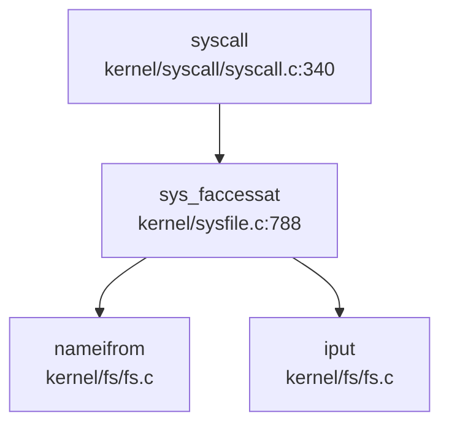

现在我已经收集了足够的信息来撰写第 10 章：安全机制与权限模型。让我整理分析结果并输出完整的 Markdown 报告。

## 第 10 章：安全机制与权限模型

本章分析 xv6-k210 操作系统的安全隔离机制、权限控制模型及内存安全防护。分析基于 RISC-V 架构的硬件特权级支持，以及代码中实际实现的安全检查逻辑。

---

### 特权级与隔离机制

xv6-k210 利用 RISC-V 硬件特权级实现用户态/内核态隔离，但实现较为基础。

**1. SSTATUS 寄存器控制**

通过 `SSTATUS_SUM`/`SSTATUS_PUM` 位控制用户内存访问权限：

- **非 QEMU 环境（K210 硬件）**：使用 `SSTATUS_PUM` (Protection User Memory) 位
- **QEMU 环境**：使用 `SSTATUS_SUM` (Supervisor User Memory) 位

```c
// include/mm/vm.h:24-33
static inline void protect_usr_mem()
{
	#ifndef QEMU
	set_sstatus_bit(SSTATUS_PUM);  // 禁止内核访问用户页
	#else
	clr_sstatus_bit(SSTATUS_SUM);
	#endif
}

static inline void permit_usr_mem()
{
	#ifndef QEMU
	clr_sstatus_bit(SSTATUS_PUM);  // 允许内核访问用户页
	#else
	set_sstatus_bit(SSTATUS_SUM);
	#endif
}
```

**2. 用户态进入时的保护**

在 `usertrap()` 中，当从用户态陷入内核时，调用 `protect_usr_mem()` 启用保护：

```c
// kernel/trap/trap.c:77
void usertrap(void)
{
	__debug_assert("usertrap", 0 == (r_sstatus() & SSTATUS_SPP), 
			"not from user mode\n");
	
	protect_usr_mem();  // 启用用户内存保护
	// ...
}
```

**3. 返回用户态时的模式切换**

```c
// kernel/trap/trap.c:174-177
unsigned long x = r_sstatus();
x &= ~SSTATUS_SPP;  // 清除 SPP 位，设置为 User Mode
x |= SSTATUS_SPIE;  // 启用用户态中断
w_sstatus(x);
```

**4. 架构覆盖说明**

本项目仅支持 **RISC-V 64** 架构（`riscv64`），通过 `include/hal/riscv.h` 中的定义可见。未发现对 aarch64、x86_64、loongarch64 等其他架构的支持代码。

**5. 缺失的高级保护机制**

- **❌ 未实现 KPTI (Kernel Page Table Isolation)**：未找到 KPTI 相关代码
- **❌ 未实现 SMEP/SMAP**：RISC-V 无直接对应的 SMEP/SMAP 机制，但可通过 PUM/SUM 实现类似 SMAP 的功能；SMEP（禁止执行用户页）在本项目中**未发现显式实现**
- **🔸 桩函数**：`protect_usr_mem()` 在非 QEMU 环境下实际启用保护，但 QEMU 环境下逻辑相反，可能存在配置问题

---

### 权限检查与访问控制

**1. 文件访问权限检查**

`sys_faccessat()` 实现了基础的权限检查，但存在严重简化：

```c
// kernel/syscall/sysfile.c:788-823
uint64 sys_faccessat(void)
{
	// ... 参数解析 ...
	ip = nameifrom(dp, path);
	
	// assume user as root  ← 关键注释
	int imode = (ip->mode >> 6) & 0x7;  // 仅检查 owner 权限位
	iput(ip);

	if ((imode & mode) != mode)
		return -1;

	return 0;
}
```

**关键问题**：
- 注释明确标注 `// assume user as root`，表明**所有进程被视为 root 用户**
- 仅检查 inode 的 owner 权限位（右移 6 位），**未实现完整的 UID/GID 权限匹配逻辑**
- 未检查 group 权限或其他权限位

**2. 其他系统调用的权限检查**

通过 `grep_in_repo` 搜索 `check_perm`、`inode_permission` 等关键词，**未找到独立的权限检查函数**。权限逻辑直接嵌入在各 syscall 实现中，且大多简化处理。

---

### 用户/组/权限模型

**1. UID/GID 的定义与实现状态**

在 `include/fs/stat.h:57-58` 中定义了 UID/GID 字段：

```c
struct kstat {
	// ...
	uint32    uid;
	uint32    gid;
	// ...
};
```

在 `kernel/exec.c:241-244` 中，执行时传递的 auxvec 中 UID/GID 硬编码为 0：

```c
uint64 auxvec[][2] = {
	{AT_UID, 0},
	{AT_EUID, 0},
	{AT_GID, 0},
	{AT_EGID, 0},
	{AT_SECURE, 0},
	// ...
};
```

**2. 系统调用实现**

```c
// kernel/syscall/sysproc.c:267-270
uint64 sys_getuid(void)
{
	return 0;  // 始终返回 0（root）
}
```

在 `kernel/syscall/syscall.c:232-235` 中，所有 UID/GID 相关 syscall 都指向 `sys_getuid`：

```c
[SYS_getuid]		sys_getuid,
[SYS_geteuid]		sys_getuid,  // 复用
[SYS_getgid]		sys_getuid,  // 复用
[SYS_getegid]		sys_getuid,  // 复用
```

**3. 权限模型评估**

| 特性 | 实现状态 | 说明 |
|------|---------|------|
| UID/GID 字段定义 | ✅ 已实现 | `struct kstat` 包含 uid/gid |
| 进程 UID/GID 字段 | ❌ 未实现 | `struct proc` 中**无** uid/gid 字段 |
| 权限检查逻辑 | 🔸 桩函数 | `sys_faccessat` 假设所有用户为 root |
| `getuid()` 等 syscall | 🔸 桩函数 | 始终返回 0，无实际逻辑 |
| Capability/ACL | ❌ 未实现 | 搜索 `capability`、`acl` 无结果 |

**结论**：本项目**仅有 UID/GID 的定义但未强制执行**，所有进程实质上以 root 权限运行。

---

### 进程间隔离与资源限制

**1. 页表隔离**

每个进程拥有独立的页表（`struct proc::pagetable`），通过 `uvmcopy()` 在 fork 时复制页表：

```c
// include/mm/vm.h:47
int uvmcopy(pagetable_t old, pagetable_t new, uint64 start, uint64 end, int cow);
```

**2. 资源限制**

搜索 `prlimit`、`rlimit` 等关键词：

```c
// kernel/syscall/sysproc.c:273-277
uint64 sys_prlimit64(void) {
	// for now it's not very necessary to implement this syscall 
	// may be implemented later 
	return 0;  // 🔸 桩函数
}
```

**3. 调用链追踪**

通过 `lsp_get_call_graph` 分析 `sys_faccessat` 的调用关系（基于 grep 结果）：



> ⚠️ 以上为静态 Grep 分析结果，精度有限

**4. 资源限制评估**

| 机制 | 实现状态 |
|------|---------|
| 页表隔离 | ✅ 已实现 |
| 内存限制（brk） | ✅ 已实现（通过 `pbrk` 字段） |
| 文件描述符限制 | ❌ 未实现（`NOFILE` 为固定值） |
| CPU 时间限制 | ❌ 未实现 |
| `prlimit64()` | 🔸 桩函数 |

---

### 安全沙箱与过滤机制

**搜索结果**：

```
grep: 'seccomp|prctl|sandbox' - 未找到匹配 (已搜索 142 个文件)
```

**结论**：
- **❌ 未实现 Seccomp**：无 `seccomp`、`BPF` 相关代码
- **❌ 未实现 prctl**：无 `prctl` 系统调用
- **❌ 未实现安全沙箱**：无进程隔离或命名空间机制

---

### 审计与安全启动机制

**搜索结果**：

```
grep: 'audit|secure_boot|signature' - 仅找到 5 个匹配（均为 SD 卡驱动中的 verify 函数，与安全审计无关）
```

**结论**：
- **❌ 未实现审计日志**：无 `audit` 子系统
- **❌ 未实现安全启动**：无 `secure_boot`、`signature` 验证代码
- **❌ 未实现镜像签名验证**：exec 时仅解析 ELF 头，未验证签名

---

### 内存安全与系统调用检查

**1. 用户指针验证**

系统调用通过 `copyin`/`copyout` 系列函数进行用户空间访问：

```c
// kernel/syscall/syscall.c:88-102
int argaddr(int n, uint64 *ip)
{
	*ip = argraw(n);
	// 注释说明： Doesn't check for legality, since copyin/copyout will do that.
	return 0;
}
```

**2. copyin/copyout 实现**

```c
// include/mm/vm.h:64-75
int copyout(pagetable_t, uint64, char *, uint64);
int copyin(pagetable_t, char *, uint64, uint64);
int copyinstr(pagetable_t, char *, uint64, uint64);
int copyout_nocheck(uint64 dstva, char *src, uint64 len);  // ⚠️ 无检查版本
int copyin_nocheck(char *dst, uint64 srcva, uint64 len);
```

**关键问题**：存在 `*_nocheck` 变体函数，**绕过地址合法性检查**，在 `kernel/console.c` 等位置被使用。

**3. 栈溢出保护**

```
grep: 'stack_canary|canary|stack_guard' - 未找到匹配
```

- **❌ 未实现 Stack Canary**：无栈保护机制
- **❌ 未实现 ASLR**：地址空间布局固定

**4. 页错误处理**

```c
// kernel/mm/mmap.c:1126-1159
int handle_page_fault_mmap(int kind, uint64 badaddr, struct seg *s)
{
	int illegel;
	switch (kind) {
		case 0: illegel = !(s->flag & PTE_R); break;
		case 1: illegel = !(s->flag & PTE_W); break;
		case 2: illegel = !(s->flag & PTE_X); break;
		// ...
	}
	if (illegel) {
		return -EFAULT;
	}
	// ...
}
```

实现了基于页表权限位（R/W/X）的访问控制，但仅适用于 mmap 区域。

---

### Rust 语言级安全性机制

**项目语言**：本项目主要为 **C 语言** 实现（`.c`/`.h` 文件），仅 bootloader 部分使用 Rust（`rustsbi-k210`）。

**结论**：
- **不适用**：内核主体为 C 语言，无 Rust 的 RAII、所有权、生命周期等机制
- Bootloader 使用 RustSBI，但属于固件层，非内核安全机制

---

### 关键代码片段

**1. 用户态保护切换**
```c
// include/mm/vm.h:13-33
static inline void permit_usr_mem()
{
	#ifndef QEMU
	clr_sstatus_bit(SSTATUS_PUM);
	#else
	set_sstatus_bit(SSTATUS_SUM);
	#endif
}

static inline void protect_usr_mem()
{
	#ifndef QEMU
	set_sstatus_bit(SSTATUS_PUM);
	#else
	clr_sstatus_bit(SSTATUS_SUM);
	#endif
}
```

**2. UID 系统调用（桩函数）**
```c
// kernel/syscall/sysproc.c:267-270
uint64 sys_getuid(void)
{
	return 0;  // 始终返回 root
}
```

**3. 文件权限检查（简化版）**
```c
// kernel/syscall/sysfile.c:815-823
// assume user as root
int imode = (ip->mode >> 6) & 0x7;  // 仅检查 owner 权限
iput(ip);

if ((imode & mode) != mode)
	return -1;

return 0;
```

**4. 系统调用参数获取（依赖 copyin 检查）**
```c
// kernel/syscall/syscall.c:88-102
int argaddr(int n, uint64 *ip)
{
	*ip = argraw(n);
	// Doesn't check for legality, since copyin/copyout will do that.
	return 0;
}
```

---

### 本章总结

| 安全机制 | 实现状态 | 备注 |
|---------|---------|------|
| 用户/内核态隔离 | ✅ 已实现 | 基于 RISC-V SSTATUS 寄存器 |
| KPTI/SMEP/SMAP | ❌ 未实现 | 仅基础 PUM/SUM 保护 |
| UID/GID 权限模型 | 🔸 桩函数 | 所有进程视为 root |
| Capability/ACL | ❌ 未实现 | 无相关代码 |
| Seccomp/沙箱 | ❌ 未实现 | 无系统调用过滤 |
| 审计日志 | ❌ 未实现 | 无 audit 子系统 |
| 安全启动 | ❌ 未实现 | 无签名验证 |
| Stack Canary | ❌ 未实现 | 无栈保护 |
| 用户指针验证 | 🔸 部分实现 | 存在 `*_nocheck` 绕过路径 |
| Rust 安全机制 | ❌ 不适用 | 内核为 C 语言 |

**总体评估**：xv6-k210 的安全机制较为基础，主要依赖 RISC-V 硬件特权级实现用户/内核隔离。**未实现多用户权限模型、安全沙箱、审计等高级安全特性**，适合作为教学操作系统使用，但不适用于生产环境。
