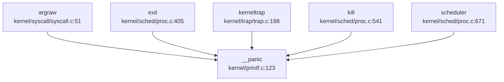

现在我已经收集了足够的信息。让我输出完整的第 12 章 Markdown 报告。

## 第 12 章：调试机制与错误处理

## 日志与打印系统

xv6-k210 实现了基于 C 语言的控制台打印系统，核心实现在 `kernel/printf.c` 中。

### printf 实现

`printf()` 函数是内核打印的核心入口，支持以下格式说明符：

- `%d`：十进制整数
- `%x`：十六进制整数
- `%p`：指针地址（64 位）
- `%s`：字符串
- `%%`：百分号本身

```c
// kernel/printf.c:69-120
void printf(char *fmt, ...)
{
    va_list ap;
    int i, c;
    int locking;
    char *s;

    locking = pr.locking;
    if(locking)
        acquire(&pr.lock);
    
    va_start(ap, fmt);
    for(i = 0; (c = fmt[i] & 0xff) != 0; i++){
        if(c != '%'){
            consputc(c);
            continue;
        }
        c = fmt[++i] & 0xff;
        // ... 格式化处理
    }
    if(locking)
        release(&pr.lock);
}
```

**关键特性**：
- **自旋锁保护**：使用 `pr.lock` 防止多核并发打印时输出交错
- **UART 输出**：最终通过 `consputc()` 将字符发送到串口控制台

### 调试宏系统

项目定义了完整的调试宏体系，位于 `include/utils/debug.h`：

```c
// include/utils/debug.h:28-37
#define __debug_info(func, ...) \
    __debug_msg(__INFO(__module_name__)": "func": "__VA_ARGS__) 
#define __debug_warn(func, ...) \
    __debug_msg(__WARN(__module_name__)": "func": "__VA_ARGS__) 
#define __debug_error(func, ...) do {\
    __debug_msg(__ERROR(__module_name__)": "func": "__VA_ARGS__);\
    printf("%s: line %d\n", __FILE__, __LINE__);\
} while (0)
```

**日志级别设计**：
| 宏 | 颜色 | 用途 |
|---|---|---|
| `__debug_info` | 绿色 | 正常调试信息 |
| `__debug_warn` | 黄色 | 警告信息 |
| `__debug_error` | 红色 | 严重错误信息 |

**条件编译**：所有调试宏仅在定义 `DEBUG` 宏时生效，否则被编译为空操作（`do {} while(0)`）。

### 模块级调试控制

支持通过 `__DEBUG_<module>` 宏实现模块级别的调试开关：

```c
// include/utils/debug.h:11-13
#ifndef __module_name__ 
    #define __module_name__  "xv6-k210"
#endif 
```

在特定模块（如 `kmalloc`）中可定义 `__DEBUG_kmalloc` 来单独启用该模块的调试输出。

## Panic 处理与栈回溯

### Panic 处理流程

内核 panic 处理由 `__panic()` 函数实现，位于 `kernel/printf.c:122-133`：

```c
// kernel/printf.c:122-133
void __panic(char *s)
{
    printf(__ERROR("panic")": ");
    printf(s);
    printf("\n");
    backtrace();          // 打印调用栈
    panicked = 1;         // 冻结 UART 输出
    intr_off();           // 关闭中断
    for(;;)
        ;                // 无限循环停机
}
```

**处理步骤**：
1. 输出红色 "panic" 前缀和错误消息
2. 调用 `backtrace()` 打印函数调用栈
3. 设置全局 `panicked` 标志，防止其他 CPU 继续输出
4. 关闭中断（`intr_off()`）
5. 进入无限循环，系统停机

### Panic 调用链分析

通过 LSP 调用图分析，`__panic` 的**入向调用**主要来自：



**主要触发场景**：
- 系统调用参数获取失败（`argraw` 中的 `panic("argraw")`）
- 进程退出时的异常情况
- 内核陷阱处理中的致命错误
- 调度器中的断言失败

**出向调用**：`__panic` → `backtrace` → `printf` → 停机循环

### 栈回溯 (Backtrace) 实现

✅ **已实现**基于 Frame Pointer 的栈回溯机制。

```c
// kernel/printf.c:135-145
void backtrace()
{
    uint64 *fp = (uint64 *)r_fp();
    uint64 *bottom = (uint64 *)PGROUNDUP((uint64)fp);
    printf("backtrace:\n");
    while (fp < bottom) {
        uint64 ra = *(fp - 1);
        printf("%p\n", ra - 4);
        fp = (uint64 *)*(fp - 2);
    }
}
```

**实现原理**：
- 使用 RISC-V 的帧指针寄存器（`fp`/`s0`）作为栈帧基址
- 栈帧布局：`[prev_fp] [return_addr] [local_vars]`
- 通过 `*(fp-2)` 获取上一帧的 `fp`，通过 `*(fp-1)` 获取返回地址
- 循环直到栈顶（`PGROUNDUP` 对齐的页边界）

**局限性**：
- ❌ **不支持 DWARF 解析**：未实现基于 ELF DWARF 调试信息的符号解析
- ❌ **无函数名显示**：仅打印返回地址（PC 值），不解析符号表
- ⚠️ **精度有限**：依赖编译器保留帧指针（需 `-fno-omit-frame-pointer`）

### 陷阱帧转储

提供 `trapframedump()` 函数用于打印完整的寄存器状态：

```c
// kernel/trap/trap.c:351-385
void trapframedump(struct trapframe *tf)
{
    printf("a0: %p\t", tf->a0);
    printf("a1: %p\t", tf->a1);
    // ... 打印所有通用寄存器
    printf("ra: %p\n", tf->ra);
    printf("sp: %p\t", tf->sp);
    printf("gp: %p\t", tf->gp);
    printf("tp: %p\t", tf->tp);
    printf("epc: %p\n", tf->epc);  // 异常程序计数器
}
```

**用途**：在异常处理或调试时输出完整的 CPU 上下文，便于定位问题。

## 错误码与 Result 设计

### 错误码定义

xv6-k210 使用标准的 POSIX 风格错误码，定义在 `include/errno.h` 中：

```c
// include/errno.h:3-38
#define EPERM      1   /* Operation not permitted */
#define ENOENT     2   /* No such file or directory */
#define ESRCH      3   /* No such process */
#define EINTR      4   /* Interrupted system call */
#define EIO        5   /* I/O error */
#define ENOMEM     12  /* Out of memory */
#define EACCES     13  /* Permission denied */
#define EINVAL     22  /* Invalid argument */
#define ENOSYS     38  /* Invalid system call number */
// ... 共约 100 个错误码
```

**关键错误码**：
| 错误码 | 值 | 含义 |
|---|---|---|
| `ENOSYS` | 38 | 未实现的系统调用 |
| `ENOMEM` | 12 | 内存不足 |
| `EINVAL` | 22 | 无效参数 |
| `ENOENT` | 2 | 文件/目录不存在 |

### 返回值约定

系统调用和内核函数遵循 C 语言传统错误处理模式：
- **成功**：返回 0 或正值（如读取的字节数）
- **失败**：返回 -1 或负的错误码（`-ENOMEM`, `-EINVAL` 等）

**示例**：
```c
// kernel/syscall/sysproc.c:267-270
uint64 sys_getuid(void)
{
    return 0;  // 桩函数：始终返回 0
}

uint64 sys_prlimit64(void) {
    return 0;  // 桩函数：无实际实现
}
```

### Result 类型

❌ **未发现** Rust 风格的 `Result<T, E>` 类型。项目主要使用 C 语言编写，错误处理通过返回值和全局 `errno`（如有）实现。

## 调试接口与交互式 Shell

### 用户态 Shell

✅ **已实现**交互式 Shell，位于 `xv6-user/sh.c`。

**支持的命令**（通过执行 `/bin` 目录下的程序实现）：
- `cd`：切换目录
- `ls`：列出目录内容
- `cat`：显示文件内容
- `mkdir`：创建目录
- `rm`：删除文件
- `mv`：移动/重命名文件
- `grep`：文本搜索
- `find`：文件查找
- `echo`：输出文本
- `forktest`：进程测试
- `usertests`：综合测试套件

**内置功能**：
- **环境变量**：支持 `export` 命令管理环境变量
- **管道**：支持 `|` 管道操作符
- **重定向**：支持 `>`、`<` 输入输出重定向
- **后台执行**：支持 `&` 后台运行

**快捷键支持**（据 README 文档）：
- `Ctrl-C`：中断当前命令
- `Ctrl-D`：退出 Shell

### 系统调用追踪 (strace)

✅ **已实现**内核级系统调用追踪功能。

**用户态工具**：`xv6-user/strace.c`

```c
// xv6-user/strace.c:33-37
if (trace() < 0) {
    fprintf(2, "%s: strace failed\n", argv[0]);
    exit(1);
}
execve(nargv[0], nargv, envp);
```

**内核实现**：
- **系统调用号**：`SYS_trace = 18`（`include/sysnum.h:11`）
- **处理函数**：`sys_trace()`（`kernel/syscall/sysproc.c:255-263`）
- **追踪掩码**：进程结构体中的 `tmask` 字段（`include/sched/proc.h:104`）

```c
// kernel/syscall/sysproc.c:255-263
uint64 sys_trace(void)
{
    myproc()->tmask = 1;  // 启用追踪（当前实现固定为 1）
    return 0;
}
```

**追踪输出**：
```c
// kernel/syscall/syscall.c:350-360
int trace = p->tmask;
if (trace) {
    printf("pid %d: %s(", p->pid, sysnames[num]);
}
p->trapframe->a0 = syscalls[num]();
if (trace) {
    printf(") -> %d\n", p->trapframe->a0);
}
```

**输出格式示例**：
```
pid 3: read(5, 0x12345, 100) -> 42
pid 3: write(1, 0x67890, 10) -> 10
```

**局限性**：
- ⚠️ **掩码功能未完全实现**：`sys_trace()` 中参数解析被注释掉，当前固定 `tmask = 1`，无法选择性地追踪特定系统调用
- ⚠️ **无时间戳**：输出不包含时间戳信息
- ⚠️ **无文件描述符解析**：不显示文件路径等详细信息

### 调试控制台/Monitor

❌ **未发现**内核级交互式调试 Monitor 或 Shell。

- 内核启动后直接进入调度器，无命令行接口
- 调试主要依赖串口打印输出
- 无类似 `monitor`、`debug` 等内置命令

## GDB Stub 支持情况

### 代码级验证

❌ **未实现** GDB Stub。

**搜索结果**：
- 搜索 `gdbstub|gdb.*stub|handle_gdb|gdb.*packet`：**0 个匹配**
- 无 GDB 数据包解析循环
- 无 GDB 协议处理函数

### 调试工具支持

项目提供 OpenOCD 配置文件用于硬件调试：

```
debug/
├── kendryte_openocd/
│   └── openocd (12.5MB)       # OpenOCD 可执行文件
├── openocd_cfg/
│   ├── ft2232c.cfg
│   ├── k210.cfg
│   └── openocd_ftdi.cfg
└── .gdbinit.tmpl-riscv        # GDB 初始化模板
```

**调试流程**：
1. 使用 OpenOCD 连接 K210 硬件（通过 FTDI 适配器）
2. GDB 通过 OpenOCD 远程调试目标
3. 支持断点、单步、寄存器查看等标准 GDB 功能

**配置文件示例**（据目录结构推断）：
- `k210.cfg`：K210 芯片特定配置
- `.gdbinit.tmpl-riscv`：RISC-V 架构的 GDB 初始化脚本

**注意**：这是**外部调试器支持**，而非内核内置的 GDB Stub。

## 断言与运行时检查

### 断言宏

✅ **已实现**两套断言机制：

```c
// include/utils/debug.h:44-57
#ifdef DEBUG 
    #define __debug_assert(func, cond, ...) do {\
        if (!(cond)) {\
            __debug_error(func, __VA_ARGS__);\
            panic("panic!\n");\
        }\
    } while (0)
#else 
    #define __debug_assert(func, cond, ...) \
        do {} while(0)
#endif 

// 永久断言（即使在 Release 模式也保留）
#define __assert(func, cond, ...) do {\
    if (!(cond)) {\
        __debug_error(func, "at %s: %d\n", __FILE__, __LINE__);\
        __debug_error(func, __VA_ARGS__);\
        panic("panic!\n");\
    }\
} while (0)
```

**区别**：
| 宏 | Debug 模式 | Release 模式 | 用途 |
|---|---|---|---|
| `__debug_assert` | 启用 | 禁用 | 调试期检查 |
| `__assert` | 启用 | 启用 | 关键不变量检查 |

### 使用示例

在代码中广泛使用断言进行运行时检查：

```c
// kernel/sched/signal.c:177-180
void sighandle(void) {
    struct proc *p = myproc();
    __debug_assert("sigdetect", NULL != p, "p == NULL\n");
    // ...
}
```

### 调试信息宏

提供分级别的调试输出宏：

```c
// include/utils/debug.h:28-37
#define __debug_info(func, ...)    // 信息级
#define __debug_warn(func, ...)    // 警告级
#define __debug_error(func, ...)   // 错误级（含文件行号）
```

**输出格式**（带 ANSI 颜色）：
- Info: `[xv6-k210: function]: message`（绿色）
- Warn: `[xv6-k210: function]: message`（黄色）
- Error: `[xv6-k210: function]: message`（红色）+ 文件行号

## 关键代码片段

### Panic 处理完整流程

```c
// kernel/printf.c:122-145
void __panic(char *s)
{
    printf(__ERROR("panic")": ");
    printf(s);
    printf("\n");
    backtrace();              // 打印调用栈
    panicked = 1;             // 冻结 UART
    intr_off();               // 关中断
    for(;;)
        ;                    // 停机
}

void backtrace()
{
    uint64 *fp = (uint64 *)r_fp();
    uint64 *bottom = (uint64 *)PGROUNDUP((uint64)fp);
    printf("backtrace:\n");
    while (fp < bottom) {
        uint64 ra = *(fp - 1);
        printf("%p\n", ra - 4);  // 打印返回地址
        fp = (uint64 *)*(fp - 2); // 移动到上一帧
    }
}
```

### 系统调用追踪实现

```c
// kernel/syscall/syscall.c:350-360
void syscall(void)
{
    struct proc *p = myproc();
    int num = p->trapframe->a7;
    
    if (num < NELEM(syscalls) && syscalls[num]) {
        // 追踪逻辑
        int trace = p->tmask;
        if (trace) {
            printf("pid %d: %s(", p->pid, sysnames[num]);
        }
        
        p->trapframe->a0 = syscalls[num]();
        
        if (trace) {
            printf(") -> %d\n", p->trapframe->a0);
        }
    }
}
```

### 调试宏定义

```c
// include/utils/debug.h:1-58
#ifndef __DEBUG_H 
#define __DEBUG_H 

#define __INFO(str) 	"[\e[32;1m"str"\e[0m]"
#define __WARN(str) 	"[\e[33;1m"str"\e[0m]"
#define __ERROR(str) 	"[\e[31;1m"str"\e[0m]"

#ifdef DEBUG 
#define __debug_msg(...) printf(__VA_ARGS__)
#else 
#define __debug_msg(...) do {} while(0)
#endif 

#define __debug_assert(func, cond, ...) do {\
    if (!(cond)) {\
        __debug_error(func, __VA_ARGS__);\
        panic("panic!\n");\
    }\
} while (0)

#endif 
```

---

## 本章总结

| 功能 | 实现状态 | 说明 |
|---|---|---|
| **日志系统** | ✅ 已实现 | `printf` + 分级调试宏（info/warn/error） |
| **Panic 处理** | ✅ 已实现 | 输出错误消息 + 栈回溯 + 停机 |
| **栈回溯** | ✅ 已实现（基础） | 基于 Frame Pointer，无符号解析 |
| **错误码** | ✅ 已实现 | 标准 POSIX 风格（约 100 个错误码） |
| **交互式 Shell** | ✅ 已实现（用户态） | 支持管道、重定向、环境变量 |
| **系统调用追踪** | ✅ 已实现（简化） | `strace` 工具 + 内核追踪，掩码功能未完善 |
| **GDB Stub** | ❌ 未实现 | 依赖外部 OpenOCD + GDB 硬件调试 |
| **断言机制** | ✅ 已实现 | `__debug_assert`（Debug 专用）+ `__assert`（永久） |
| **Perf/Ftrace** | ❌ 未实现 | 无性能分析工具支持 |

**设计特点**：
1. **简洁实用**：调试机制以串口打印为核心，适合嵌入式环境
2. **条件编译**：通过 `DEBUG` 宏控制调试代码，减少发布版本开销
3. **硬件调试依赖**：依赖 OpenOCD + GDB 进行源码级调试，而非内置 Stub
4. **追踪功能简化**：`strace` 功能可用，但掩码选择等高级功能未完善
