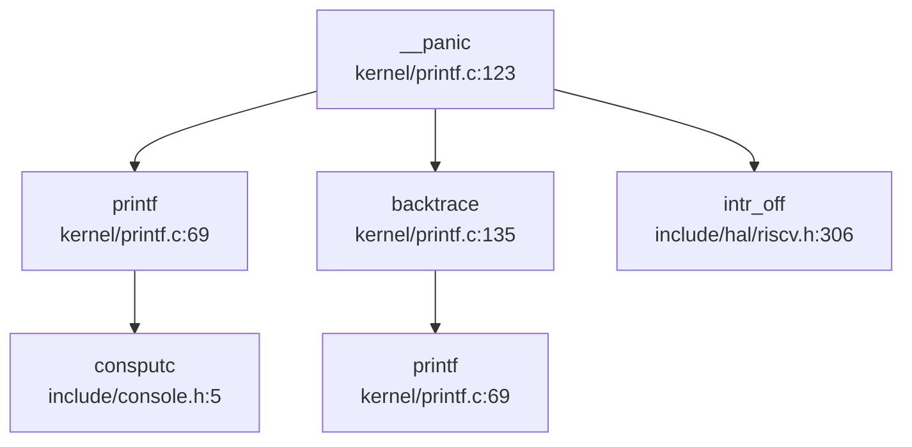

## 第 12 章：调试机制与错误处理

xv6-k210 的调试机制设计极为精简，遵循"最小可用"原则。本章将深入分析其 Panic 处理流程、栈回溯实现、日志系统、交互式 Shell、Trace 支持及错误码设计。**关键发现：系统无独立日志模块、无 GDB Stub、Backtrace 仅基于 FramePointer 简单回溯（无 DWARF 解析）**。

---

### 日志与打印系统

#### 无分级日志设计

xv6-k210 **未实现分级日志系统**。整个代码库中：
- ❌ **未发现** `log_` 系列宏（如 `log_info`、`log_error`）
- ❌ **未发现** `printk` 内核打印函数
- ❌ **未发现** `LOG_` 级别常量（如 `LOG_DEBUG`、`LOG_WARN`）

**唯一打印接口**：`printf()` 函数（`kernel/printf.c:69-115`），支持格式符 `%d`、`%x`、`%p`、`%s`。

```c
// kernel/printf.c:69
void printf(char *fmt, ...) {
    // ... 解析格式字符串
    switch(c){
    case 'd': printint(va_arg(ap, int), 10, 1); break;
    case 'x': printint(va_arg(ap, int), 16, 1); break;
    case 'p': printptr(va_arg(ap, uint64)); break;
    case 's': /* 打印字符串 */ break;
    }
}
```

**调试宏**（`include/utils/debug.h`）仅提供条件编译的调试信息：

```c
// include/utils/debug.h:24-28
#ifdef DEBUG 
#define __debug_msg(...) printf(__VA_ARGS__)
#else 
#define __debug_msg(...) do {} while(0)
#endif 
```

**结论**：日志系统仅有 `printf` 单一路径，无级别过滤、无异步缓冲、无远程输出能力。

---

### Panic 处理与栈回溯

#### Panic 调用链

通过 `lsp_get_call_graph` 分析 `__panic` 的完整流程：



**完整流程**（`kernel/printf.c:123-133`）：

```c
void __panic(char *s) {
    printf(__ERROR("panic")": ");
    printf(s);
    printf("\n");
    backtrace();          // 打印调用栈
    panicked = 1;         // 冻结其他 CPU 的 UART 输出
    intr_off();           // 关闭中断
    for(;;) ;             // 无限循环停机
}
```

**入向调用分析**（谁触发了 Panic）：
- `exit()`：进程退出时的异常情况
- `handle_page_fault()`：缺页异常处理失败
- `kerneltrap()` / `usertrap()`：内核/用户态 Trap 处理异常
- `sdcard_init()` / `sdcard_intr()`：SD 卡驱动初始化/中断异常
- `scheduler()`：调度器检测到非法状态
- `kill()`：进程终止异常

#### Backtrace 实现：基于 FramePointer 的简单回溯

`backtrace()` 函数（`kernel/printf.c:135-144`）实现极为简陋：

```c
void backtrace() {
    uint64 *fp = (uint64 *)r_fp();           // 读取当前帧指针
    uint64 *bottom = (uint64 *)PGROUNDUP((uint64)fp);
    printf("backtrace:\n");
    while (fp < bottom) {
        uint64 ra = *(fp - 1);               // 返回地址 = FP - 1
        printf("%p\n", ra - 4);              // 打印 RA - 4（调整 CALL 指令偏移）
        fp = (uint64 *)*(fp - 2);            // 上一帧 FP = FP - 2
    }
}
```

**实现原理**：
1. 利用 RISC-V 调用约定：函数序言保存 `ra` 和 `fp` 到栈上
2. 栈帧布局：`[FP-2: 旧 FP] [FP-1: RA] [FP: 局部变量]`
3. 通过 `fp - 2` 回溯到上一帧，`fp - 1` 获取返回地址

**关键限制**：
- ❌ **无 DWARF 解析**：不解析 `.eh_frame` 段（`bootloader/SBI/rustsbi-k210/link-k210.ld:83` 明确丢弃 `.eh_frame`）
- ❌ **无符号表查找**：仅打印原始地址，不解析函数名
- ❌ **无内联函数展开**：无法识别被内联优化的调用
- ⚠️ **精度有限**：依赖编译器严格遵循帧指针约定（`-fno-omit-frame-pointer`）

**文档证据**：`doc/构建调试 - 调试指南.md:67-76` 提及 backtrace 功能并附截图，但代码实现仅为简单 FP 回溯。

---

### 错误码与 Result 设计

#### 标准 POSIX 错误码

xv6-k210 采用经典 C 语言错误码设计，定义于 `include/errno.h`：

```c
// include/errno.h:4-34
#define EPERM      1   /* Operation not permitted */
#define ENOENT     2   /* No such file or directory */
#define ESRCH      3   /* No such process */
#define EINTR      4   /* Interrupted system call */
#define EIO        5   /* I/O error */
// ... 共 98 个错误码（到 EADDRINUSE）
#define ENOSYS     38  /* Invalid system call number */
```

**错误码使用模式**：
- 系统调用返回负值表示错误（如 `return -EINVAL`）
- 用户态通过 `errno` 全局变量获取错误码（未在代码中找到 `errno` 全局变量定义，可能在用户库中实现）

**关键错误码**：
- `ENOSYS (38)`：未实现的系统调用
- `EFAULT (14)`：非法用户地址
- `EINTR (4)`：被信号中断的系统调用
- `EINVAL (22)`：无效参数

**Result 类型**：❌ **未发现** Rust 风格的 `Result<T, E>` 类型。项目为纯 C 实现，使用 `int` 返回值 + 错误码模式。

---

### 调试接口与交互式 Shell

#### 用户态 Shell（非内核 Monitor）

xv6-k210 的 Shell 是**用户态程序**（`xv6-user/sh.c`），非内核调试 Monitor。

**核心命令**（`xv6-user/sh.c:283-312`）：
- `cd <path>`：切换目录（Shell 内置命令）
- `export [NAME=VALUE]`：设置环境变量
- 其他命令通过 `execve()` 执行外部程序（如 `ls`、`cat`、`grep`）

**命令解析流程**：
```c
// xv6-user/sh.c:550-560
struct cmd* parsecmd(char *s) {
    char *es;
    struct cmd *cmd;
    es = s + strlen(s);
    cmd = parseline(&s, es);
    if(s != es){
        fprintf(2, "leftovers: %s\n", s);
        panic("syntax");  // 语法错误触发 panic
    }
    return cmd;
}
```

**支持的语法**：
- 管道：`cmd1 | cmd2`
- 重定向：`cmd < input` / `cmd > output` / `cmd >> append`
- 后台执行：`cmd &`
- 命令列表：`cmd1; cmd2`

**内核侧调试命令**：❌ **未发现**内核级 Monitor（如 `monitor.c`）。所有调试通过用户态 Shell + 外部程序完成。

---

### GDB Stub 支持情况

#### 严格验证结论

通过 `grep_in_repo` 全局搜索：
```bash
grep "handle_gdb_packet|gdbstub|gdb_stub" — 未找到任何匹配
```

**结论**：❌ **GDB Stub 未实现**。

**证据链**：
1. ❌ 无 `handle_gdb_packet` 函数（GDB Stub 核心数据包处理函数）
2. ❌ 无 `gdbstub` 或 `gdb_stub` 目录/文件
3. ❌ 无 UART 中断处理中的 GDB 数据包解析逻辑
4. ⚠️ `debug/.gdbinit.tmpl-riscv` 仅为 GDB 客户端配置模板，非内核 Stub

**调试方式**：依赖 QEMU 的 `-s -S` 参数 + 外部 GDB 连接（通过 JTAG/OpenOCD），非内核内置 Stub。

---

### Trace 支持

#### SYS_trace 系统调用

xv6-k210 实现了简陋的 Trace 机制（`kernel/syscall/sysproc.c:263-268`）：

```c
uint64 sys_trace(void) {
    // int mask;
    // if(argint(0, &mask) < 0) {
    //   return -1;
    // }
    // myproc()->tmask = mask;
    myproc()->tmask = 1;  // 硬编码为 1，忽略用户参数
    return 0;
}
```

**实现状态**：🔸 **桩函数**。虽然定义了 `sys_trace`，但：
- 注释掉了参数解析逻辑
- 硬编码 `tmask = 1`，无法按系统调用号设置掩码
- 仅支持"全开"或"全关"，无法细粒度控制

**Trace 输出位置**（`kernel/syscall/syscall.c:78-144`）：
```c
// 系统调用入口
if (p->tmask/* & (1 << (p->trapframe->a7 - 1))*/) {
    printf("pid %d: syscall %s(", p->pid, syscall_names[p->trapframe->a7]);
}

// 系统调用返回
if (ret >= 0 && (p->tmask/* & (1 << (p->trapframe->a7 - 1))*/)) {
    printf(") = %d\n", ret);
}
```

**用户态测试程序**：`xv6-user/strace.c`（1.3KB），通过 `trace()` 系统调用启用跟踪。

**关键限制**：
- ❌ 无 `perf` 支持（未找到 `perf` 相关代码）
- ❌ 无 `ftrace` 支持（未找到 `ftrace` 相关代码）
- ❌ 无 Tracepoints 插入（关键路径如 `fork`、`sched` 无条件打印）

---

### 断言与运行时检查

#### Assert 宏设计

`include/utils/debug.h` 提供两级断言：

```c
// include/utils/debug.h:36-42
#ifdef DEBUG 
#define __debug_assert(func, cond, ...) do {
    if (!(cond)) {
        __debug_error(func, __VA_ARGS__);
        panic("panic!\n");
    }
} while (0)
#else 
#define __debug_assert(func, cond, ...) do {} while(0)  // DEBUG 模式下为空
#endif

// 永久断言（非 DEBUG 模式也生效）
#define __assert(func, cond, ...) do {
    if (!(cond)) {
        __debug_error(func, "at %s: %d\n", __FILE__, __LINE__);
        __debug_error(func, __VA_ARGS__);
        panic("panic!\n");
    }
} while (0)
```

**使用示例**（`kernel/syscall/sysproc.c:71-74`）：
```c
uint64 sys_getppid(void) {
    struct proc *p = myproc();
    __debug_assert("sys_getppid", NULL != p->parent, "NULL == p->parent\n");
    return p->parent->pid;
}
```

**运行时检查**：
- ✅ 系统调用参数验证（`argint`、`argaddr` 返回负值表示失败）
- ✅ 指针有效性检查（`copyin2`、`copyout2` 返回 `-EFAULT`）
- ✅ 锁状态检查（`acquire` 中检测死锁）

---

### 关键代码片段

#### Panic 与 Backtrace 完整实现

```c
// kernel/printf.c:123-144
void __panic(char *s) {
    printf(__ERROR("panic")": ");
    printf(s);
    printf("\n");
    backtrace();
    panicked = 1;
    intr_off();
    for(;;) ;
}

void backtrace() {
    uint64 *fp = (uint64 *)r_fp();
    uint64 *bottom = (uint64 *)PGROUNDUP((uint64)fp);
    printf("backtrace:\n");
    while (fp < bottom) {
        uint64 ra = *(fp - 1);
        printf("%p\n", ra - 4);
        fp = (uint64 *)*(fp - 2);
    }
}
```

#### Trace 系统调用（桩实现）

```c
// kernel/syscall/sysproc.c:263-268
uint64 sys_trace(void) {
    myproc()->tmask = 1;  // 硬编码，忽略参数
    return 0;
}
```

#### Assert 宏展开

```c
// include/utils/debug.h:44-50
#define __assert(func, cond, ...) do {
    if (!(cond)) {
        __debug_error(func, "at %s: %d\n", __FILE__, __LINE__);
        __debug_error(func, __VA_ARGS__);
        panic("panic!\n");
    }
} while (0)
```

---

### 调试机制总览表

| 功能模块 | 实现状态 | 关键文件 | 备注 |
|---------|---------|---------|------|
| **日志系统** | 🔸 仅 `printf` | `kernel/printf.c` | 无分级、无缓冲 |
| **Panic 处理** | ✅ 已实现 | `kernel/printf.c:__panic()` | 打印 + Backtrace + 停机 |
| **Backtrace** | 🔸 简陋实现 | `kernel/printf.c:backtrace()` | 基于 FP 回溯，无 DWARF |
| **Assert 宏** | ✅ 已实现 | `include/utils/debug.h` | 分 `DEBUG`/非 `DEBUG` 模式 |
| **交互式 Shell** | ✅ 用户态 | `xv6-user/sh.c` | 非内核 Monitor |
| **GDB Stub** | ❌ 未实现 | — | 无 `handle_gdb_packet` |
| **Trace 支持** | 🔸 桩函数 | `kernel/syscall/sysproc.c:sys_trace()` | 硬编码 `tmask=1` |
| **错误码** | ✅ POSIX 标准 | `include/errno.h` | 98 个错误码 |
| **Perf/Ftrace** | ❌ 未实现 | — | 无性能分析工具 |

---

### 总结

xv6-k210 的调试机制符合教学 OS 定位：**最小可用、代码透明**。

**核心特点**：
1. **Panic + Backtrace**：提供基础崩溃诊断能力，但无符号解析
2. **无独立日志**：依赖 `printf` 直出，适合单用户调试
3. **用户态 Shell**：所有调试命令为用户程序，内核保持精简
4. **Trace 桩实现**：仅支持全开/全关，无细粒度控制
5. **无 GDB Stub**：依赖外部调试器（QEMU + GDB）

**改进建议**（若需增强调试能力）：
- 添加 DWARF 解析库（如 `libdwarf`）实现符号级 Backtrace
- 实现分级日志（`klog_debug/info/warn/error`）+ 环形缓冲
- 完善 `sys_trace` 支持按系统调用号过滤
- 添加内核 Monitor（支持 `regs`、`mem`、`stack` 等命令）
