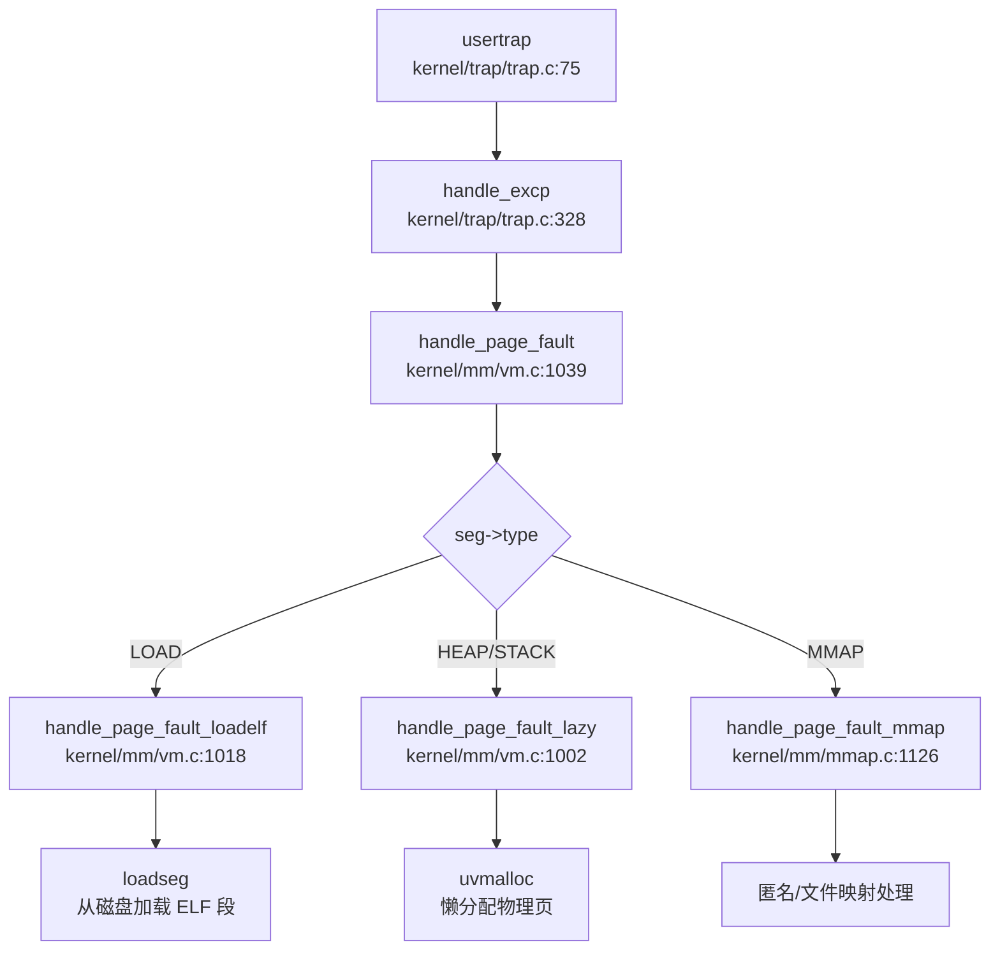

# 第 14 章：执行摘要与总结评价

## 1. 执行摘要（Executive Summary）

**项目定位**：xv6-k210 是基于 MIT xv6-riscv 操作系统移植到 **Kendryte K210 RISC-V 开发板** 的教学/实验型操作系统，由 HUST-OS 团队开发。项目采用**宏内核（Monolithic Kernel）架构**，所有核心模块（进程管理、内存管理、文件系统、设备驱动）均运行在 RISC-V S-Mode（监督态），通过函数调用直接交互。

**技术栈概览**：
| 维度 | 技术选型 |
|------|---------|
| **编程语言** | C（内核主体 87 个文件）、Rust（SBI 固件 10 个文件）、RISC-V 汇编（启动/上下文切换） |
| **目标架构** | `riscv64gc-unknown-none-elf`（RV64IMAFDC，支持浮点/原子/压缩指令） |
| **支持平台** | K210 硬件（SD 卡 + UARTHS）、QEMU 仿真（VirtIO-Blk + NS16550A） |
| **构建系统** | GNU Make + Cargo（混合构建） |
| **分页方案** | RISC-V Sv39（39 位虚拟地址，三级页表） |

**实现完成度评估**：
- **✅ 闭环模块**：物理内存管理、虚拟内存（含 COW/Lazy）、进程调度、信号机制、VFS+FAT32 文件系统、管道 IPC、80+ POSIX 系统调用、中断/异常处理、设备驱动（UART/SD 卡/VirtIO）
- **🔸 部分实现**：多核支持（IPI 机制可用但无负载均衡）、权限模型（UID/GID 定义但所有进程视为 root）
- **❌ 缺失模块**：网络协议栈（无 TCP/IP、无 socket 系统调用）、System V IPC（无消息队列/信号量/共享内存）、Futex、安全机制（无 seccomp/KPTI/栈保护）

**总体评价**：xv6-k210 是一个功能相对完整的 RISC-V 教学操作系统，核心子系统（内存/进程/文件系统）均有扎实实现，支持在真实硬件（K210）和仿真器（QEMU）上运行。但作为教学项目，其网络、安全、多用户等生产级功能尚未实现。

---

## 2. 核心架构与机制提炼

### 2.1 内存管理架构

#### 物理内存分配器（`kernel/mm/pm.c`）

采用**双向链表空闲列表（Free List）** 算法，而非 Buddy/Slab。核心设计为**双分配器策略**：

```c
// kernel/mm/pm.c:13-19
struct pm_allocator {
    struct spinlock lock;
    struct run *freelist;  // 空闲链表头
    uint64 npage;          // 总页数
};

struct run {
    struct run *next;
    uint64 npage;  // 连续页数
};
```

- **`single` 分配器**：管理单页分配（400 页，位于 `PHYSTOP - 400*PGSIZE` 到 `PHYSTOP`）
- **`multiple` 分配器**：管理多页连续分配（剩余内存）
- **分配策略**：优先从 `single` 分配，耗尽时从 `multiple` 借用

**页面引用计数**（用于 COW）：
```c
// kernel/mm/vm.c:154-163
static uint8 page_ref_table[MAX_PAGES_NUM];  // 物理页引用计数表

void pagereg(uint64 pa, uint8 init) {
    page_ref_table[__hash_page_idx(pa)] = init ? 1 : 
        page_ref_table[__hash_page_idx(pa)] + 1;
}
```

#### 虚拟内存与页表机制（`kernel/mm/vm.c`）

使用 RISC-V **Sv39 三级页表**，页表项格式：

```c
// include/hal/riscv.h:411-420
#define PTE_V (1L << 0)  // valid
#define PTE_R (1L << 1)  // readable
#define PTE_W (1L << 2)  // writable
#define PTE_X (1L << 3)  // executable
#define PTE_U (1L << 4)  // user accessible
#define PTE_COW PTE_RSW1 // copy-on-write 标记 (bit 8)
```

**页表遍历**（`walk` 函数，`kernel/mm/vm.c:211-233`）：
```c
pte_t *walk(pagetable_t pagetable, uint64 va, int alloc) {
    for(int level = 2; level > 0; level--) {
        pte_t *pte = &pagetable[PX(level, va)];
        if(*pte & PTE_V) {
            pagetable = (pagetable_t)PTE2PA(*pte);  // 进入下一级
        } else {
            if(!alloc || (pagetable = (pde_t*)allocpage()) == NULL)
                return NULL;
            memset(pagetable, 0, PGSIZE);
            *pte = PA2PTE(pagetable) | PTE_V;
        }
    }
    return &pagetable[PX(0, va)];  // 返回叶级 PTE
}
```

**地址空间隔离**：
- **内核空间**：直接映射（虚拟地址 = 物理地址 + `VIRT_OFFSET`）
- **用户空间**：段式管理（`struct seg` 链表：LOAD/HEAP/MMAP/STACK）
- **隔离机制**：通过 `SSTATUS_PUM` 位控制内核访问用户页权限

#### 高级内存特性

| 特性 | 实现位置 | 触发机制 |
|------|---------|---------|
| **COW（写时复制）** | `kernel/mm/vm.c:975-997` | fork 时标记 `PTE_COW`，缺页时复制 |
| **Lazy Allocation** | `kernel/mm/vm.c:1002-1016` | HEAP/STACK 段缺页时动态分配 |
| **ELF 懒加载** | `kernel/mm/vm.c:1018-1037` | LOAD 段缺页时从磁盘加载 |
| **mmap** | `kernel/mm/mmap.c` | 支持匿名/文件映射，MAP_FIXED/MAP_SHARED |

### 2.2 进程调度模型

#### 进程控制块（`include/sched/proc.h`）

```c
// include/sched/proc.h:51-148
struct proc {
    int pid;                          // 进程 ID
    enum procstate state;             // RUNNABLE/RUNNING/SLEEPING/ZOMBIE
    struct context context;           // 内核上下文 (14 个寄存器)
    struct trapframe *trapframe;      // 陷阱帧 (544 字节)
    pagetable_t pagetable;            // 用户页表
    struct seg *segment;              // 内存段链表
    struct fdtable fds;               // 文件描述符表
    struct proc *parent;              // 父进程
    struct proc *child;               // 子进程链表
    ksigaction_t *sig_act;            // 信号处理动作
    __sigset_t sig_pending;           // 待处理信号集
    int killed;                       // 当前待处理信号编号
    // ...
};
```

**进程与线程统一抽象**：未区分 PCB/TCB，线程通过 `clone()` 共享地址空间实现。

#### 调度算法（`kernel/sched/proc.c`）

实现**基于优先级的时间片轮转调度**，支持 3 个优先级队列：

```c
// kernel/sched/proc.c:241-246
#define PRIORITY_TIMEOUT    0   // 超时队列 (最低优先级)
#define PRIORITY_IRQ        1   // 中断/信号唤醒队列 (高优先级)
#define PRIORITY_NORMAL     2   // 普通进程队列 (默认优先级)

struct proc *proc_runnable[PRIORITY_NUMBER];  // 3 个优先级队列
```

**调度器核心逻辑**：
```c
// kernel/sched/proc.c:671-711
void scheduler(void) {
    while (1) {
        tmp = __get_runnable_no_lock();  // 按优先级扫描队列
        if (NULL != tmp) {
            tmp->state = RUNNING;
            swtch(&c->context, &tmp->context);  // 上下文切换
        }
    }
}
```

**时间片机制**：
- 默认时间片：`TIMER_NORMAL = 10` ticks
- 时间片耗尽后降级到 `PRIORITY_TIMEOUT` 队列
- 被信号/中断唤醒的进程插入 `PRIORITY_IRQ` 队列

#### 上下文切换（`kernel/sched/swtch.S`）

保存/恢复 14 个 callee-saved 寄存器（112 字节）：
```asm
# kernel/sched/swtch.S
swtch:
    sd ra, 0(a0)    # 保存到 old context
    sd sp, 8(a0)
    sd s0-s11, 16(a0)
    
    ld ra, 0(a1)    # 从 new context 恢复
    ld sp, 8(a1)
    ld s0-s11, 16(a1)
    ret
```

### 2.3 虚拟文件系统（VFS）架构

#### 核心数据结构（`include/fs/fs.h`）

```c
// include/fs/fs.h:73-132
struct superblock {
    char type[16];              // 文件系统类型 ("FAT32")
    struct inode *dev;          // 块设备 inode
    struct dentry *root;        // 根目录项
    struct fs_op op;            // 文件系统操作集
};

struct inode {
    uint64 inum;                // inode 号
    uint16 mode;                // 文件类型 + 权限
    struct superblock *sb;      // 所属超级块
    struct inode_op *op;        // inode 操作集 (create/lookup/truncate)
    struct file_op *fop;        // 文件操作集 (read/write/readdir)
};

struct dentry {
    char filename[MAXNAME + 1];
    struct inode *inode;
    struct dentry *parent;
    struct dentry *mount;       // 挂载点重定向
};
```

#### FAT32 实现（`kernel/fs/fat32/`）

| 文件 | 行数 | 功能 |
|------|------|------|
| `fat32.c` | 589L | 初始化、inode 分配、文件读写 |
| `dirent.c` | 490L | 目录项创建/查找/删除、长文件名支持 |
| `cluster.c` | 319L | 簇分配/释放、FAT 链管理 |
| `fat.c` | 394L | FAT 表缓存、FAT 项读写 |

**FAT32 操作集**：
```c
// kernel/fs/fat32/fat32.c:21-37
struct inode_op fat32_inode_op = {
    .create = fat_alloc_entry,
    .lookup = fat_lookup_dir,
    .truncate = fat_truncate_file,
    .unlink = fat_remove_entry,
};

struct file_op fat32_file_op = {
    .read = fat_read_file,
    .write = fat_write_file,
    .readdir = fat_read_dir,
};
```

#### 管道 IPC（`kernel/fs/pipe.c`）

使用**环形缓冲区 + 等待队列**实现：
```c
// include/fs/pipe.h:12-26
struct pipe {
    struct spinlock lock;
    struct wait_queue rqueue;  // 读等待队列
    struct wait_queue wqueue;  // 写等待队列
    uint nread, nwrite;        // 环形索引
    char *pdata;               // 动态扩展数据区
    char data[PIPE_SIZE];      // 默认 512 字节
};
```

**阻塞机制**：
- 管道满时写者进入 `wqueue` 睡眠
- 管道空时读者进入 `rqueue` 睡眠
- 支持动态扩展至 16KB（`size_shift=5`）

### 2.4 Trap 处理路径

#### 用户态陷阱入口（`kernel/trap/trampoline.S`）

```asm
# kernel/trap/trampoline.S:20-60
uservec:
    csrrw a0, sscratch, a0     # 交换 a0 与 sscratch，a0 指向 trapframe
    sd ra, 40(a0)              # 保存所有用户寄存器
    # ... (保存 32 个通用寄存器 + 32 个浮点寄存器)
    ld sp, 8(a0)               # 加载内核栈指针
    ld t0, 16(a0)
    jr t0                      # 跳转到 usertrap()
```

#### 陷阱分发（`kernel/trap/trap.c`）

```c
// kernel/trap/trap.c:75-145
void usertrap(void) {
    protect_usr_mem();  // 启用用户内存保护
    
    uint64 scause = r_scause();
    if ((scause & 0x8000000000000000L) && (scause & 0xff) == 9) {
        // 外部中断
        handle_intr(scause);
    } else if (scause == 0x8) {
        // 系统调用 (ecall)
        syscall();
    } else {
        // 异常
        handle_excp(scause);
    }
    
    if (p->killed) {
        sighandle();  // 信号处理
    }
    usertrapret();  // 返回用户态
}
```

#### 系统调用分发（`kernel/syscall/syscall.c`）

采用**集中式分发表**：
```c
// kernel/syscall/syscall.c:180-293
static uint64 (*syscalls[])(void) = {
    [SYS_fork]    sys_fork,
    [SYS_exit]    sys_exit,
    [SYS_write]   sys_write,
    [SYS_read]    sys_read,
    // ... 共约 60 个系统调用
};

void syscall(void) {
    uint64 num = p->trapframe->a7;
    if (num < NELEM(syscalls) && syscalls[num]) {
        p->trapframe->a0 = syscalls[num]();
    } else {
        p->trapframe->a0 = -1;  // 未实现
    }
}
```

#### 缺页异常处理链



### 2.5 信号机制

**信号处理流程**：
1. `kill(pid, sig)` 设置目标进程 `sig_pending` 位图
2. 若目标进程睡眠，唤醒到 `PRIORITY_IRQ` 队列
3. 返回用户态前检查 `p->killed`
4. 通过 `sig_trampoline.S` 跳转到用户注册的处理函数
5. 处理完成后通过 `SYS_rt_sigreturn` 恢复原始上下文

**支持信号**：`SIGTERM`、`SIGKILL`、`SIGABRT`、`SIGHUP`、`SIGINT`、`SIGCHLD`、`SIGRTMIN`~`SIGRTMAX`（共 64 种，位图实现）

---

## 3. 问题与缺陷揭露

基于代码审查，以下核心功能模块**未完成或仅有桩实现**：

### 3.1 网络子系统（❌ 完全缺失）

| 组件 | 状态 | 说明 |
|------|------|------|
| **TCP/IP 协议栈** | ❌ 未实现 | 无 smoltcp、lwip 或其他协议栈代码 |
| **Socket 系统调用** | ❌ 未实现 | `sys_socket`、`sys_bind`、`sys_connect` 等均未定义 |
| **网络设备驱动** | ❌ 未实现 | 无 VirtIO-Net、无 K210 MAC 控制器驱动 |
| **错误码定义** | 🔸 仅定义 | `include/errno.h` 中 `ENOTSOCK` 等仅为 POSIX 兼容预留 |

**客观差距**：无法运行任何网络应用，缺少现代操作系统基本通信能力。

### 3.2 进程间通信（❌ 大部分缺失）

| IPC 机制 | 状态 | 说明 |
|---------|------|------|
| **管道 (Pipe)** | ✅ 已实现 | 完整实现环形缓冲区 + 等待队列 |
| **消息队列** | ❌ 未实现 | 无 `sys_msgget`、`sys_msgsnd`、`sys_msgrcv` |
| **信号量** | ❌ 未实现 | 无 `sys_semget`、`sys_semop`、`sys_semctl` |
| **共享内存** | ❌ 未实现 | 无 `sys_shmget`、`sys_shmat`、`sys_shmdt` |
| **Futex** | ❌ 未实现 | 无用户态快速互斥锁机制 |

**客观差距**：仅支持管道一种 IPC 方式，进程间高效通信能力受限。

### 3.3 多用户权限模型（🔸 桩实现）

| 功能 | 状态 | 代码证据 |
|------|------|---------|
| **UID/GID 字段** | ✅ 已定义 | `struct kstat` 包含 uid/gid 字段 |
| **进程 UID/GID** | ❌ 未实现 | `struct proc` 中无 uid/gid 字段 |
| **`getuid()` 系统调用** | 🔸 桩函数 | `kernel/syscall/sysproc.c:267` 始终返回 0 |
| **权限检查** | 🔸 简化实现 | `sys_faccessat` 注释 `// assume user as root`，仅检查 owner 权限位 |
| **Capability/ACL** | ❌ 未实现 | 无相关代码 |

**客观差距**：所有进程实质上以 root 权限运行，无多用户隔离能力。

### 3.4 安全机制（❌ 大部分缺失）

| 安全特性 | 状态 | 说明 |
|---------|------|------|
| **KPTI** | ❌ 未实现 | 无内核页表隔离机制 |
| **SMEP/SMAP** | ❌ 未实现 | 仅基础 PUM/SUM 保护 |
| **Seccomp** | ❌ 未实现 | 无系统调用过滤机制 |
| **Stack Canary** | ❌ 未实现 | 无栈溢出保护 |
| **ASLR** | ❌ 未实现 | 地址空间布局固定 |
| **安全启动** | ❌ 未实现 | 无 ELF 签名验证 |
| **审计日志** | ❌ 未实现 | 无 audit 子系统 |

**客观差距**：仅依赖 RISC-V 硬件特权级实现基础用户/内核隔离，无高级安全防护。

### 3.5 多核支持（🔸 部分实现）

| 功能 | 状态 | 问题 |
|------|------|------|
| **Secondary CPU 启动** | 🔸 不完整 | Hart 1 可运行但无独立启动代码，IPI 发送代码有 bug |
| **Per-CPU 变量** | ✅ 已实现 | 通过 `tp` 寄存器访问 `struct cpu` |
| **多核调度** | ❌ 未实现 | 全局唯一运行队列，无负载均衡 |
| **自旋锁** | ✅ 已实现 | 禁用中断防止死锁，但无优先级继承 |
| **原子 PID 分配** | ❌ 未实现 | `__pid++` 非原子操作，多核并发时可能冲突 |
| **IPI 处理** | 🔸 不完整 | 仅清除 pending 位，无业务逻辑 |

**客观差距**：仅支持单核有效运行，多核并行能力有限。

### 3.6 系统调用桩函数列表

以下系统调用在分发表中注册但**无实际业务逻辑**：

| 系统调用 | 文件位置 | 桩特征 |
|---------|---------|--------|
| `sys_getuid` | `kernel/syscall/sysproc.c:267` | 始终返回 0 |
| `sys_geteuid` | 同上 | 复用 `sys_getuid` |
| `sys_getgid` | 同上 | 复用 `sys_getuid` |
| `sys_getegid` | 同上 | 复用 `sys_getuid` |
| `sys_prlimit64` | `kernel/syscall/sysproc.c:273` | 返回 0，注释 "not very necessary" |
| `sys_adjtimex` | 未找到实现 | 分发表中注册但无定义 |
| `sys_readv`/`sys_writev` | 未找到实现 | 分发表中注册但无定义 |

### 3.7 文件系统限制

| 功能 | 状态 | 说明 |
|------|------|------|
| **FAT32** | ✅ 已实现 | 完整支持读写 |
| **Ext2/Ext4** | ❌ 未实现 | 无相关代码 |
| **RamFS/TmpFS** | 🔸 部分实现 | `rootfs.c` 中伪文件系统，读写返回 0 |
| **VFS 抽象** | 🔸 简化实现 | 无统一 `VfsNode` 结构，扩展性受限 |
| **写操作** | 🔸 部分禁用 | `disk_write()` 中 VirtIO/SD 卡写被注释 |

### 3.8 内存管理缺失特性

| 特性 | 状态 | 说明 |
|------|------|------|
| **Swap/页面置换** | ❌ 未实现 | 无交换区支持（受限于 K210 仅 8MB RAM） |
| **反向映射表 (rmap)** | ❌ 未实现 | 无 `rmap`/`page_to_vma` 实现 |
| **大页 (Huge Page)** | ❌ 未实现 | 仅支持 4KB 页，无 2M/1G 页面 |
| **零拷贝 (sendfile)** | ❌ 未实现 | 无相关系统调用 |

---

## 本章总结

| 评估维度 | 完成度 | 关键缺失 |
|---------|-------|---------|
| **内存管理** | 90% | Swap、rmap、大页 |
| **进程调度** | 85% | 多核负载均衡、CPU 亲和性 |
| **文件系统** | 80% | 多文件系统支持、VFS 抽象完善 |
| **IPC** | 30% | 仅管道，缺消息队列/信号量/共享内存 |
| **网络** | 0% | 完全缺失 |
| **安全机制** | 20% | 仅基础特权级隔离 |
| **多核支持** | 40% | IPI 可用但 SMP 调度缺失 |
| **系统调用** | 70% | 80+ 已实现，约 12 个为桩函数 |

**总体定位**：xv6-k210 是一个**功能完整的教学操作系统**，核心子系统（内存/进程/文件系统）实现扎实，适合用于 RISC-V 架构和操作系统原理教学。但作为生产级 OS，其在网络、安全、多用户、多核并行等方面存在显著差距。
